# 🗄️ نمودار ERD کلی دیتابیس

## معرفی

این نمودار نشان‌دهنده **ساختار کلی جداول دیتابیس MahERP** و روابط بین آن‌هاست.

---

## 📊 نمودار ERD کامل

```mermaid
erDiagram
    %% ========== Users & Authentication ==========
    AppUsers ||--o{ UserRole : has
    AppUsers ||--o{ UserPermission : has
    AppUsers ||--o{ BranchUser : "works in"
    AppUsers ||--o{ TeamMember : "member of"
    AppUsers ||--o{ Tasks : creates
    AppUsers ||--o{ TaskAssignment : "assigned to"
    AppUsers ||--o{ CoreNotification : receives
    
    %% ========== Permissions ==========
    Permission ||--o{ Permission : "parent-child"
    Permission ||--o{ RolePermission : "used in"
    Permission ||--o{ UserPermission : "assigned to"
    
    Role ||--o{ RolePermission : contains
    Role ||--o{ UserRole : "assigned via"
    
    %% ========== Organization Structure ==========
    Branch ||--o{ BranchUser : employs
    Branch ||--o{ BranchContact : has
    Branch ||--o{ BranchOrganization : has
    Branch ||--o{ Tasks : manages
    
    Team ||--o{ Team : "parent-child (sub-teams)"
    Team ||--|| AppUsers : "managed by"
    Team ||--o{ TeamMember : contains
    Team ||--o{ TeamPosition : has
    Team ||--o{ Tasks : owns
    
    TeamMember ||--|| AppUsers : is
    TeamMember ||--o| TeamPosition : "has position"
    
    TeamPosition ||--o{ TeamMember : fills
    
    %% ========== Contacts & Organizations (NEW) ==========
    Contact ||--o{ ContactPhone : has
    Contact ||--o{ ContactGroupMember : "member of"
    Contact ||--o{ BranchContact : "in branch"
    Contact ||--o{ OrganizationContact : "works at"
    Contact ||--o{ Tasks : "related to"
    
    Organization ||--o{ OrganizationDepartment : has
    Organization ||--o{ OrganizationContact : employs
    Organization ||--o{ OrganizationGroupMember : "member of"
    Organization ||--o{ BranchOrganization : "in branch"
    Organization ||--o{ Tasks : "related to"
    
    OrganizationDepartment ||--o{ DepartmentPosition : has
    DepartmentPosition ||--o{ DepartmentMember : fills
    
    ContactGroup ||--o{ ContactGroupMember : contains
    OrganizationGroup ||--o{ OrganizationGroupMember : contains
    
    %% ========== Tasks & Supervision (UPDATED) ==========
    Tasks ||--o{ TaskAssignment : "assigned via"
    Tasks ||--o{ TaskOperation : contains
    Tasks ||--o{ TaskComment : has
    Tasks ||--o{ TaskAttachment : has
    Tasks ||--o{ TaskReminder : has
    Tasks ||--o{ TaskWorkLog : tracks
    Tasks ||--o{ TaskViewer : "visible to (carbon copy)"
    Tasks ||--o{ CoreNotification : generates
    
    Tasks ||--o| ScheduledTaskCreation : "created by schedule 🆕"
    
    TaskAssignment ||--|| AppUsers : "assigned to"
    TaskAssignment ||--o| Team : "in team context"
    
    TaskViewer ||--|| AppUsers : "viewer user"
    TaskViewer ||--|| AppUsers : "added by user"
    
    TaskViewPermission ||--|| AppUsers : "grantee user"
    TaskViewPermission ||--o| AppUsers : "target user"
    TaskViewPermission ||--o| Team : "target team"
    
    TaskOperation ||--o{ TaskOperationWorkLog : tracks
    
    TaskCategory ||--o{ Tasks : categorizes
    TaskSchedule ||--o{ Tasks : "generates automatically"
    
    %% ========== Scheduled Task Creation (NEW) 🆕 ==========
    ScheduledTaskCreation ||--|| AppUsers : "created by"
    ScheduledTaskCreation ||--|| AppUsers : "modified by"
    ScheduledTaskCreation ||--o{ Tasks : "generates tasks 🆕"
    
    %% ========== Notifications ==========
    CoreNotification ||--o{ CoreNotificationDetail : "has details"
    CoreNotification ||--o{ CoreNotificationDelivery : "delivered via"
    
    NotificationTemplate ||--o{ NotificationTemplateRecipient : "sent to"
    NotificationTemplate ||--o{ NotificationTemplateVariable : uses
    NotificationTemplate ||--o{ NotificationTemplateHistory : tracks
    
    %% ========== Communication ==========
    EmailQueue ||--|| EmailLog : "logged as"
    SmsQueue ||--|| SmsLog : "logged as"
    
    EmailTemplate ||--o{ EmailTemplateRecipient : "sent to"
    SmsTemplate ||--o{ SmsTemplateRecipient : "sent to"
    
    SmsProvider ||--o{ SmsQueue : "sends via"
    
    %% ========== CRM ==========
    CRMInteraction ||--o{ CRMComment : has
    CRMInteraction ||--o{ CRMAttachment : has
    CRMInteraction ||--o{ CRMParticipant : involves
    CRMInteraction ||--o{ CRMTeam : "managed by"
```



---

## 🔍 تفکیک جداول بر اساس حوزه

### 👤 احراز هویت و کاربران (Authentication & Users)
```
- AppUsers (AspNetUsers)
- AppRoles (AspNetRoles)
- AspNetUserRoles
- AspNetUserClaims
- AspNetUserLogins
- AspNetUserTokens
```

### 🔐 مدیریت دسترسی (Access Control)
```
- Permission_Tbl
- Role_Tbl
- UserRole_Tbl
- RolePermission_Tbl
- UserPermission_Tbl
- PermissionLog_Tbl
- PermissionChangeLog_Tbl
```

### 🏢 ساختار سازمانی (Organization Structure)
```
- Branch_Tbl
- BranchUser_Tbl
- Team_Tbl
- TeamMember_Tbl
- TeamPosition_Tbl
- Contract_Tbl
```

### 👥 مدیریت افراد و سازمان‌ها (Contacts & Organizations) ⭐
```
- Contact_Tbl
- ContactPhone_Tbl
- ContactGroup_Tbl
- ContactGroupMember_Tbl
- BranchContact_Tbl
- BranchContactGroup_Tbl

- Organization_Tbl
- OrganizationDepartment_Tbl
- DepartmentPosition_Tbl
- DepartmentMember_Tbl
- OrganizationContact_Tbl
- OrganizationGroup_Tbl
- OrganizationGroupMember_Tbl
- BranchOrganization_Tbl
- BranchOrganizationGroup_Tbl

- Stakeholder_Tbl (⚠️ Obsolete)
```

### 📋 مدیریت تسک‌ها (Task Management)
```
- Tasks_Tbl
- TaskAssignment_Tbl
- TaskOperation_Tbl
- TaskOperationWorkLog_Tbl
- TaskComment_Tbl
- TaskAttachment_Tbl
- TaskReminder_Tbl
- TaskReminderSchedule_Tbl
- TaskMyDay_Tbl
- TaskCategory_Tbl
- BranchTaskCategory_Tbl
- TaskHistory_Tbl
- TaskWorkLog_Tbl
- TaskSchedule_Tbl
- TaskTemplate_Tbl
- TaskViewer_Tbl ⭐
- TaskViewPermission_Tbl ⭐

- ScheduledTaskCreation_Tbl 🆕 (جدیدترین)
```

### 💼 CRM
```
- CRMInteraction_Tbl
- CRMComment_Tbl
- CRMAttachment_Tbl
- CRMParticipant_Tbl
- CRMTeam_Tbl
- StakeholderCRM_Tbl
- TaskCRMDetails_Tbl
```

### 🔔 سیستم اعلان‌رسانی (Notifications)
```
- CoreNotification_Tbl
- CoreNotificationDetail_Tbl
- CoreNotificationDelivery_Tbl
- CoreNotificationSetting_Tbl

- NotificationTemplate_Tbl ⭐
- NotificationTemplateRecipient_Tbl
- NotificationTemplateVariable_Tbl
- NotificationTemplateHistory_Tbl
- NotificationScheduledMessage_Tbl
- NotificationModuleConfig_Tbl
- NotificationTypeConfig_Tbl
- NotificationBlacklist_Tbl
- UserNotificationPreference_Tbl
- NotificationDeliveryStats_Tbl
```

### 📧 سیستم ایمیل (Email)
```
- EmailQueue_Tbl
- EmailLog_Tbl
- EmailTemplate_Tbl
- EmailTemplateRecipient_Tbl
```

### 📱 سیستم پیامک (SMS)
```
- SmsQueue_Tbl
- SmsLog_Tbl
- SmsProvider_Tbl
- SmsTemplate_Tbl
- SmsTemplateRecipient_Tbl
```

### 📊 فعالیت‌ها (Activity Tracking)
```
- ActivityBase_Tbl
- ActivityTask_Tbl
- ActivityCRM_Tbl
- ActivityHistory_Tbl
- ActivityComment_Tbl
- ActivityAttachment_Tbl
- UserActivityLog_Tbl
```

### 🔧 دسترسی ماژول‌ها (Module Access)
```
- UserModulePermission_Tbl
- TeamModulePermission_Tbl
- BranchModulePermission_Tbl
- UserModulePreference_Tbl
```

### ⚙️ تنظیمات (Settings)
```
- Settings_Tbl
```

---

## 📈 آمار کلی

```
📁 تعداد کل جداول: 105+
🔗 تعداد Foreign Key ها: 200+
📊 جداول با حذف نرم (Soft Delete): 85+
🔐 جداول دارای Audit (CreateDate, ModifyDate): 90+
```

---

## 🎯 نکات کلیدی

### ✅ **استاندارد نام‌گذاری**
```
- همه جداول با پسوند "_Tbl" تمام می‌شوند
- Foreign Key ها: [EntityName]Id
- مثال: CreatorUserId, BranchId, TeamId
```

### ✅ **فیلدهای مشترک**
```csharp
// در اکثر جداول:
public string CreatorUserId { get; set; }
public DateTime CreateDate { get; set; }
public string? ModifierUserId { get; set; }
public DateTime? ModifyDate { get; set; }
public bool IsActive { get; set; }
```

### ✅ **حذف نرم (Soft Delete)**
```csharp
// بیشتر جداول:
public bool IsActive { get; set; } = true;

// Query:
.Where(x => x.IsActive)
```

### ✅ **پشتیبانی از تاریخ شمسی**
```csharp
// در جداول مهم:
public DateTime CreateDate { get; set; }          // میلادی
public string CreateDatePersian { get; set; }     // شمسی (1403/10/15)
```

---

## 🔗 روابط کلیدی

### 🔹 **User ↔ Permission**
```
User → UserRole → Role → RolePermission → Permission
User → UserPermission → Permission (دسترسی مستقیم)
```

### 🔹 **Task ↔ User**
```
Task → TaskAssignment → User (منتصب شده)
Task → CreatorUserId → User (سازنده)
Task → TaskViewer → User (ناظر رونوشتی) ⭐
```

### 🔹 **Task ↔ Contact/Organization**
```
Task → ContactId → Contact (مرتبط با فرد)
Task → OrganizationId → Organization (مرتبط با سازمان)
```

### 🔹 **Task ↔ Schedule** 🆕
```
Task → ScheduleId → ScheduledTaskCreation (ساخته شده از زمان‌بندی)
```

### 🔹 **Notification ↔ Delivery**
```
CoreNotification → CoreNotificationDelivery (چندکاناله: Email, SMS, Telegram)
```

---

## 🔄 مدل‌های قدیمی (Deprecated)

### ⚠️ **Stakeholder_Tbl**
```
Status: Obsolete ❌
Reason: جایگزین شده با Contact و Organization
Migration: داده‌ها migrate شده‌اند
Kept For: Backward Compatibility
```

---

## 📝 یادداشت‌ها

### 📌 **برای توسعه‌دهندگان جدید:**
1. ابتدا ساختار `AppUsers` و `Permission_Tbl` را بشناسید
2. سپس `Tasks_Tbl` و روابط آن را مطالعه کنید
3. در نهایت جداول ماژول مورد نظرتان را بررسی کنید

### 📌 **برای رفع خطا:**
- همیشه `IsActive = true` را در Query ها بررسی کنید
- Foreign Key های nullable را با دقت handle کنید
- در Migration ها، حتماً `OnDelete(DeleteBehavior.Restrict)` را در نظر بگیرید

---

**نسخه مستند:** 3.0.0  
**آخرین بروزرسانی:** آذر 1403  
**وضعیت:** ✅ Active & Updated

---

[🔙 بازگشت به فهرست](README.md)
