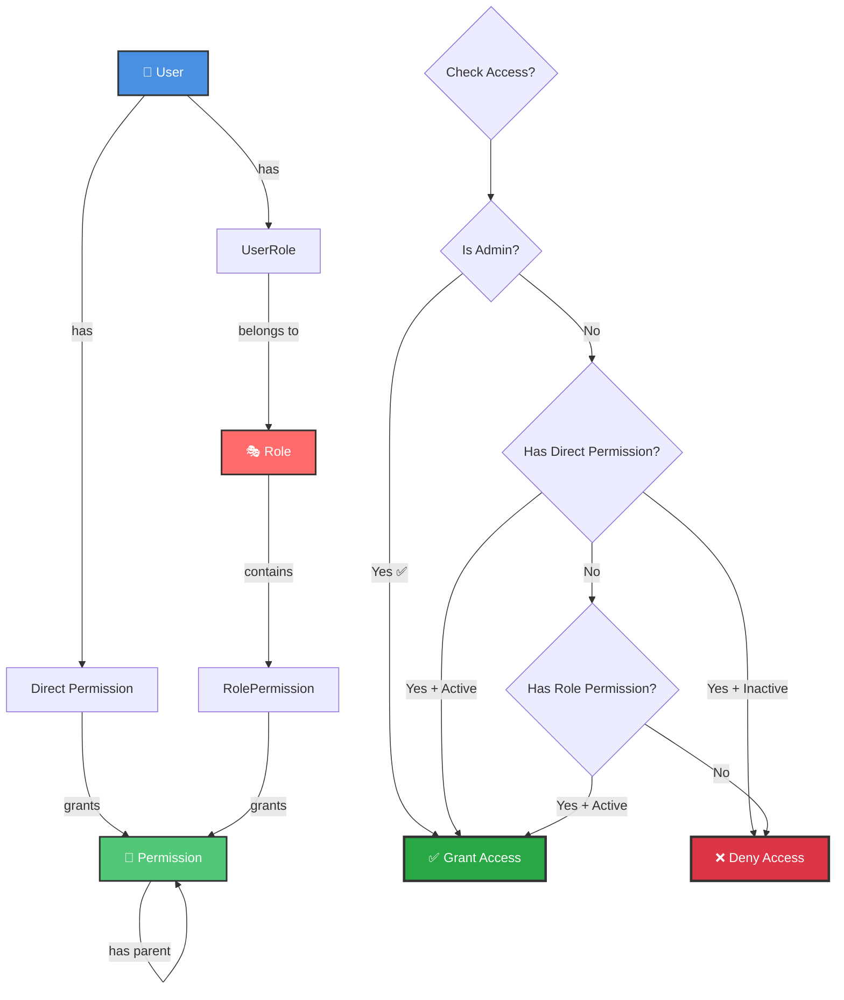
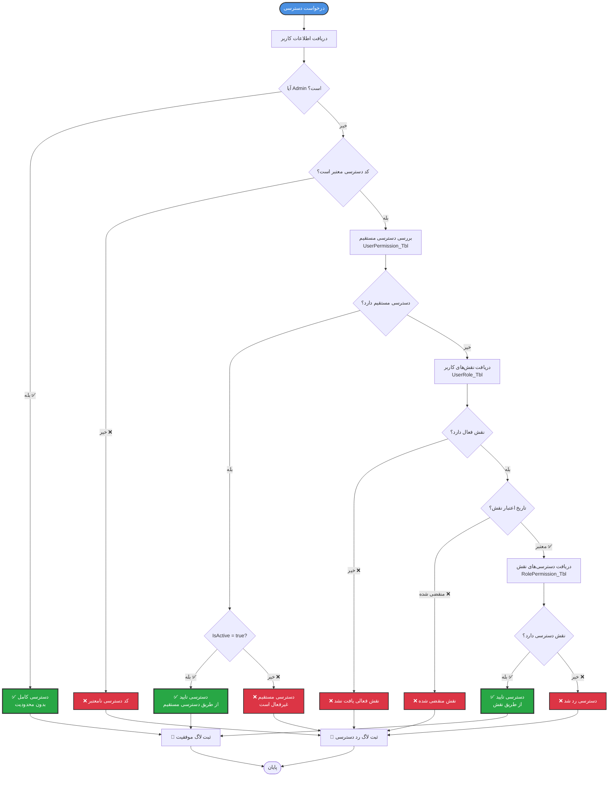
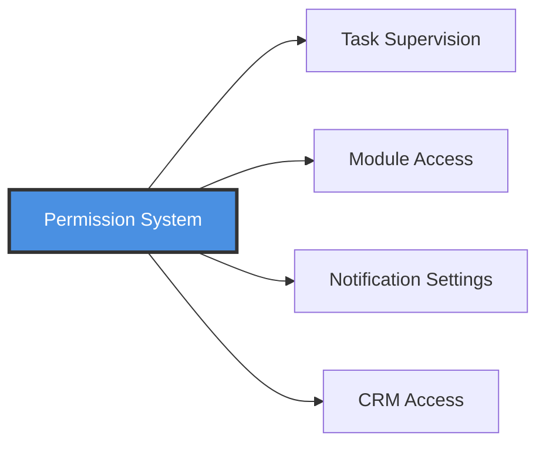

# 🔐 نمودار سیستم دسترسی (Permission System)

## معرفی

سیستم MahERP از یک **سیستم دسترسی سلسله‌مراتبی و چندسطحی** استفاده می‌کند که شامل:
- ✅ دسترسی‌های پایه (Permission)
- ✅ نقش‌ها (Role)
- ✅ اختصاص نقش به کاربر (UserRole)
- ✅ دسترسی مستقیم (UserPermission)

---

## 🔄 نمودار جریان سیستم

### نحوه کارکرد Permission System



---

## 🌳 ساختار درختی Permissions

### دسترسی‌های ماژول CORE

```
CORE (هسته مرکزی)
├── CORE.VIEW (مشاهده ماژول)
├── CORE.PERMISSION (مدیریت دسترسی‌ها)
│   ├── CORE.PERMISSION.VIEW
│   ├── CORE.PERMISSION.CREATE
│   ├── CORE.PERMISSION.EDIT
│   └── CORE.PERMISSION.DELETE
├── CORE.ROLE (مدیریت نقش‌ها)
│   ├── CORE.ROLE.VIEW
│   ├── CORE.ROLE.CREATE
│   ├── CORE.ROLE.EDIT
│   └── CORE.ROLE.DELETE
├── CORE.USER (مدیریت کاربران)
│   ├── CORE.USER.VIEW
│   ├── CORE.USER.CREATE
│   ├── CORE.USER.EDIT
│   ├── CORE.USER.DELETE
│   └── CORE.USER.CHANGEPASSWORD
├── CORE.BRANCH (مدیریت شعب)
│   ├── CORE.BRANCH.VIEW
│   ├── CORE.BRANCH.CREATE
│   ├── CORE.BRANCH.EDIT
│   └── CORE.BRANCH.DELETE
├── CORE.TEAM (مدیریت تیم‌ها)
│   ├── CORE.TEAM.VIEW
│   ├── CORE.TEAM.CREATE
│   ├── CORE.TEAM.EDIT
│   └── CORE.TEAM.DELETE
├── CORE.CONTACT (مدیریت افراد)
│   ├── CORE.CONTACT.VIEW
│   ├── CORE.CONTACT.CREATE
│   ├── CORE.CONTACT.EDIT
│   └── CORE.CONTACT.DELETE
└── CORE.ORGANIZATION (مدیریت سازمان‌ها)
    ├── CORE.ORGANIZATION.VIEW
    ├── CORE.ORGANIZATION.CREATE
    ├── CORE.ORGANIZATION.EDIT
    └── CORE.ORGANIZATION.DELETE
```

### دسترسی‌های ماژول TASK

```
TASK (تسکینگ)
├── TASK.VIEW (مشاهده ماژول)
├── TASK.CREATE (ایجاد تسک)
├── TASK.EDIT (ویرایش تسک)
├── TASK.DELETE (حذف تسک)
├── TASK.ASSIGN (اختصاص تسک به دیگران)
├── TASK.COMPLETE (تکمیل تسک)
├── TASK.SUPERVISE ⭐ (نظارت بر تسک‌های دیگران) - جدید
├── TASK.OPERATION (مدیریت عملیات)
│   ├── TASK.OPERATION.CREATE
│   ├── TASK.OPERATION.EDIT
│   ├── TASK.OPERATION.DELETE
│   └── TASK.OPERATION.COMPLETE
├── TASK.COMMENT (نظرات)
│   ├── TASK.COMMENT.VIEW
│   ├── TASK.COMMENT.CREATE
│   ├── TASK.COMMENT.EDIT
│   └── TASK.COMMENT.DELETE
├── TASK.ATTACHMENT (پیوست‌ها)
│   ├── TASK.ATTACHMENT.VIEW
│   ├── TASK.ATTACHMENT.UPLOAD
│   └── TASK.ATTACHMENT.DELETE
├── TASK.REMINDER (یادآورها)
│   ├── TASK.REMINDER.VIEW
│   ├── TASK.REMINDER.CREATE
│   ├── TASK.REMINDER.EDIT
│   └── TASK.REMINDER.DELETE
├── TASK.SCHEDULE (زمان‌بندی تسک‌ها) 🆕
│   ├── TASK.SCHEDULE.VIEW
│   ├── TASK.SCHEDULE.CREATE
│   ├── TASK.SCHEDULE.EDIT
│   ├── TASK.SCHEDULE.DELETE
│   └── TASK.SCHEDULE.EXECUTE
└── TASK.REPORT (گزارش‌گیری)
    ├── TASK.REPORT.VIEW
    └── TASK.REPORT.EXPORT
```

### دسترسی‌های ماژول CRM

```
CRM (مدیریت ارتباط با مشتری)
├── CRM.VIEW (مشاهده ماژول)
├── CRM.INTERACTION (مدیریت تعاملات)
│   ├── CRM.INTERACTION.VIEW
│   ├── CRM.INTERACTION.CREATE
│   ├── CRM.INTERACTION.EDIT
│   └── CRM.INTERACTION.DELETE
├── CRM.COMMENT (نظرات)
│   ├── CRM.COMMENT.VIEW
│   ├── CRM.COMMENT.CREATE
│   └── CRM.COMMENT.DELETE
├── CRM.EMAIL (ایمیل)
│   ├── CRM.EMAIL.SEND
│   ├── CRM.EMAIL.TEMPLATE
│   └── CRM.EMAIL.BULKSEND
├── CRM.SMS (پیامک)
│   ├── CRM.SMS.SEND
│   ├── CRM.SMS.TEMPLATE
│   └── CRM.SMS.BULKSEND
└── CRM.REPORT (گزارش‌گیری)
    ├── CRM.REPORT.VIEW
    └── CRM.REPORT.EXPORT
```

---

## 🔍 الگوریتم بررسی دسترسی

### روند کامل Check Access



---

## 🎭 ساختار Entity ها

### Permission_Tbl

```csharp
public class Permission
{
    public int Id { get; set; }
    public string Code { get; set; }              // مثال: "TASK.CREATE"
    public string NameEn { get; set; }
    public string NameFa { get; set; }
    public int? ParentId { get; set; }            // برای ساختار درختی
    public int DisplayOrder { get; set; }
    public bool IsActive { get; set; }
    public bool IsSystemPermission { get; set; }   // قابل حذف نیست
    
    // Navigation
    public Permission Parent { get; set; }
    public ICollection<Permission> Children { get; set; }
    public ICollection<RolePermission> RolePermissions { get; set; }
    public ICollection<UserPermission> UserPermissions { get; set; }
}
```

### Role_Tbl

```csharp
public class Role
{
    public int Id { get; set; }
    public string NameEn { get; set; }
    public string NameFa { get; set; }
    public string Description { get; set; }
    public int Priority { get; set; }
    public string Color { get; set; }
    public string Icon { get; set; }
    public bool IsSystemRole { get; set; }        // قابل حذف نیست
    public bool IsActive { get; set; }
    
    // Navigation
    public ICollection<RolePermission> RolePermissions { get; set; }
    public ICollection<UserRole> UserRoles { get; set; }
}
```

### UserRole_Tbl

```csharp
public class UserRole
{
    public int Id { get; set; }
    public string UserId { get; set; }
    public int RoleId { get; set; }
    public bool IsActive { get; set; }
    public DateTime? StartDate { get; set; }      // تاریخ شروع اعتبار
    public DateTime? EndDate { get; set; }        // تاریخ پایان اعتبار
    public DateTime AssignDate { get; set; }
    public string AssignedByUserId { get; set; }
    
    // Navigation
    public AppUsers User { get; set; }
    public Role Role { get; set; }
    public AppUsers AssignedBy { get; set; }
}
```

### UserPermission_Tbl

```csharp
public class UserPermission
{
    public int Id { get; set; }
    public string UserId { get; set; }
    public int PermissionId { get; set; }
    public bool IsActive { get; set; }
    public DateTime AssignDate { get; set; }
    public string AssignedByUserId { get; set; }
    public string Note { get; set; }
    
    // Navigation
    public AppUsers User { get; set; }
    public Permission Permission { get; set; }
    public AppUsers AssignedBy { get; set; }
}
```

### RolePermission_Tbl

```csharp
public class RolePermission
{
    public int Id { get; set; }
    public int RoleId { get; set; }
    public int PermissionId { get; set; }
    public DateTime AssignDate { get; set; }
    public string AssignedByUserId { get; set; }
    
    // Navigation
    public Role Role { get; set; }
    public Permission Permission { get; set; }
    public AppUsers AssignedBy { get; set; }
}
```

---

## 🔧 استفاده در Controller

### استفاده از Attribute

```csharp
// ✅ روش پیشنهادی: استفاده از Attribute
[PermissionRequired("TASK.CREATE")]
public async Task<IActionResult> CreateTask()
{
    // کد ایجاد تسک
    return View();
}

// ✅ چند دسترسی (OR)
[PermissionRequired("TASK.EDIT", "TASK.DELETE")]
public async Task<IActionResult> ManageTask(int id)
{
    // کاربر باید حداقل یکی از دو دسترسی را داشته باشد
    return View();
}
```

### بررسی دستی در کد

```csharp
public async Task<IActionResult> SomeAction()
{
    var userId = _userManager.GetUserId(User);
    
    // بررسی دسترسی
    bool hasAccess = await _permissionService.HasPermissionAsync(
        userId, 
        "TASK.CREATE"
    );
    
    if (!hasAccess)
    {
        return Forbid(); // 403
    }
    
    // ادامه کد
    return View();
}
```

---

## 📊 اولویت‌ها در بررسی دسترسی

```
1️⃣ Admin → دسترسی کامل ✅
    ↓
2️⃣ UserPermission (مستقیم) → اولویت بالا
    ↓ (اگر IsActive = true)
3️⃣ RolePermission (از طریق نقش) → اولویت پایین‌تر
    ↓ (اگر IsActive = true و تاریخ معتبر)
4️⃣ رد دسترسی ❌
```

### مثال عملی

```
کاربر: محمد
Admin: خیر

دسترسی مستقیم (UserPermission):
- TASK.DELETE → IsActive = false ❌

نقش‌ها (UserRole):
- مدیر تیم (Role):
  ├── TASK.CREATE → ✅
  ├── TASK.EDIT → ✅
  └── TASK.DELETE → ✅

نتیجه برای TASK.DELETE:
- دسترسی مستقیم: غیرفعال ❌
- دسترسی از طریق نقش: فعال ✅
→ دسترسی رد می‌شود ❌ (اولویت با دسترسی مستقیم)
```

---

## 🔍 Query های کاربردی

### دریافت دسترسی‌های یک کاربر

```sql
-- دسترسی‌های مستقیم
SELECT p.Code, p.NameFa, up.IsActive
FROM UserPermission_Tbl up
INNER JOIN Permission_Tbl p ON up.PermissionId = p.Id
WHERE up.UserId = 'user-id'
ORDER BY p.Code;

-- دسترسی‌های از طریق نقش
SELECT DISTINCT p.Code, p.NameFa, r.NameFa AS RoleName
FROM UserRole_Tbl ur
INNER JOIN Role_Tbl r ON ur.RoleId = r.Id
INNER JOIN RolePermission_Tbl rp ON r.Id = rp.RoleId
INNER JOIN Permission_Tbl p ON rp.PermissionId = p.Id
WHERE ur.UserId = 'user-id'
  AND ur.IsActive = 1
  AND r.IsActive = 1
  AND (ur.EndDate IS NULL OR ur.EndDate >= GETDATE())
ORDER BY p.Code;
```

---

## 📝 نکات مهم

### ✅ **نقش‌های سیستمی**
```
IsSystemRole = true → قابل حذف نیستند
مثال: Admin, SuperAdmin
```

### ✅ **دسترسی‌های سیستمی**
```
IsSystemPermission = true → قابل حذف نیستند
مثال: CORE.VIEW, TASK.VIEW
```

### ✅ **تاریخ اعتبار نقش**
```csharp
UserRole.StartDate → تاریخ شروع
UserRole.EndDate → تاریخ پایان (nullable)

// چک کردن:
if (EndDate.HasValue && EndDate.Value < DateTime.Now)
{
    // منقضی شده
}
```

### ✅ **Logging**
```
همه تغییرات دسترسی در PermissionLog_Tbl ثبت می‌شوند:
- AssignDate
- AssignedByUserId
- Action (Granted, Revoked)
```

---

## 🔗 ارتباط با سایر سیستم‌ها



---

**نسخه مستند:** 3.0.0  
**آخرین بروزرسانی:** آذر 1403  
**وضعیت:** ✅ Active & Updated

---

[🔙 بازگشت به فهرست](README.md) | [➡️ بعدی: نمودار سیستم تسک](03-Task-System-Diagram.md)
