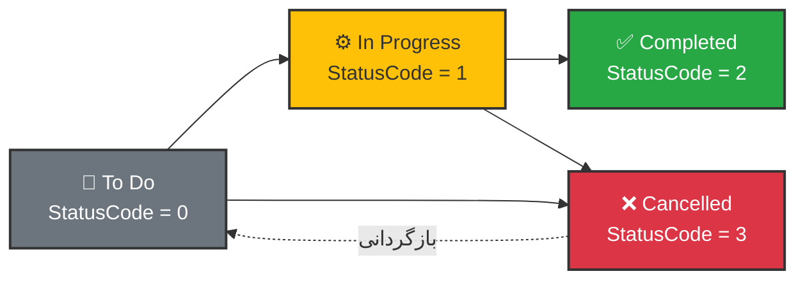
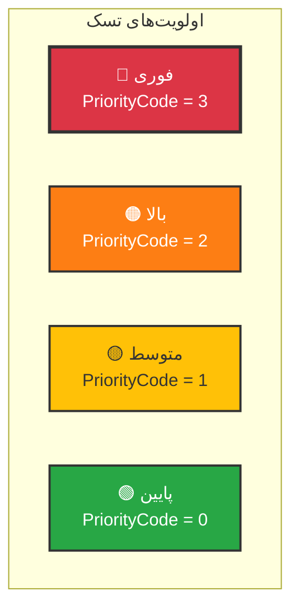
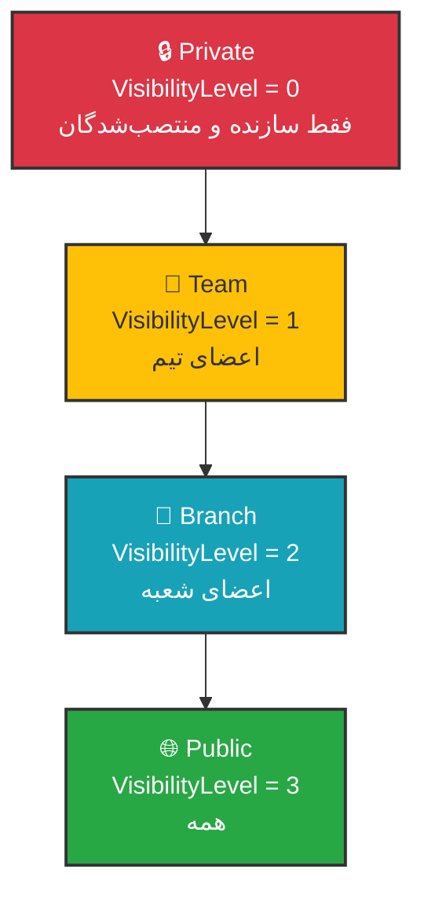
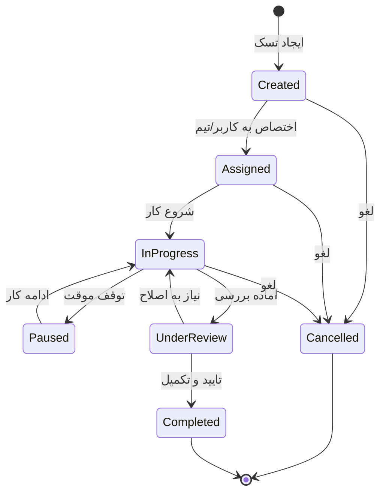
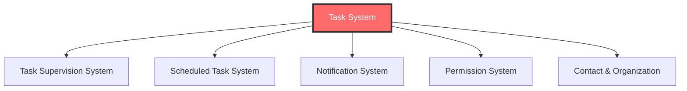

# 📋 نمودار سیستم تسک (Task System)

## معرفی

این بخش نمودارهای مربوط به **سیستم مدیریت تسک‌ها** در MahERP را شامل می‌شود.

---

## 🔄 جریان ایجاد و مدیریت تسک

```mermaid
flowchart TD
    Start([شروع]) --> CreateTask[ایجاد تسک]
    
    CreateTask --> SelectType{نوع تسک؟}
    
    SelectType -->|Individual| AssignUser[اختصاص به کاربر]
    SelectType -->|Team| AssignTeam[اختصاص به تیم]
    SelectType -->|Multiple| AssignMultiple[اختصاص به چند نفر]
    
    AssignUser --> SetDetails[تنظیم جزئیات]
    AssignTeam --> SetDetails
    AssignMultiple --> SetDetails
    
    SetDetails --> AddOperations{عملیات دارد؟}
    AddOperations -->|بله| CreateOperations[ایجاد عملیات‌ها]
    AddOperations -->|خیر| AddReminders
    
    CreateOperations --> AddReminders{یادآور دارد؟}
    AddReminders -->|بله| CreateReminders[ایجاد یادآورها]
    AddReminders -->|خیر| AddCarbonCopy
    
    CreateReminders --> AddCarbonCopy{افزودن رونوشت؟}
    AddCarbonCopy -->|بله| AddViewers[👁️ افزودن ناظران رونوشتی]
    AddCarbonCopy -->|خیر| SaveTask
    
    AddViewers --> SaveTask[ذخیره تسک]
    
    SaveTask --> SendNotification[ارسال اعلان]
    
    SendNotification --> TaskSaved([تسک ذخیره شد])
    
    %% Task Execution Flow
    TaskSaved --> UserReceives[کاربر اعلان دریافت می‌کند]
    UserReceives --> StartWork[شروع کار روی تسک]
    
    StartWork --> CompleteOperations{عملیات‌ها}
    CompleteOperations -->|در حال انجام| LogWork[ثبت گزارش کار]
    CompleteOperations -->|تکمیل شده| CheckCompletion{همه عملیات تکمیل شد؟}
    
    LogWork --> CompleteOperations
    
    CheckCompletion -->|بله| CompleteTask[تکمیل تسک]
    CheckCompletion -->|خیر| CompleteOperations
    
    CompleteTask --> NeedApproval{نیاز به تایید؟}
    
    NeedApproval -->|بله| SupervisorApproval[👁️ تایید ناظر/سرپرست]
    NeedApproval -->|خیر| TaskCompleted
    
    SupervisorApproval --> ManagerApproval[تایید مدیر]
    ManagerApproval --> TaskCompleted([تسک تکمیل و تایید شد])
    
    %% Styling
    style Start fill:#4CAF50,stroke:#333,stroke-width:2px,color:#fff
    style TaskSaved fill:#2196F3,stroke:#333,stroke-width:2px,color:#fff
    style TaskCompleted fill:#4CAF50,stroke:#333,stroke-width:3px,color:#fff
    style AddViewers fill:#FF9800,stroke:#333,stroke-width:2px,color:#fff
    style SupervisorApproval fill:#FF9800,stroke:#333,stroke-width:2px,color:#fff
```



---

## 🔗 رابطه Task با Entity های دیگر

```mermaid
graph LR
    Task[📋 Task] --> Creator[👤 Creator User]
    Task --> Branch[🏢 Branch]
    Task --> Team[👥 Team]
    Task --> Category[📁 Category]
    Task --> Contact[👤 Contact NEW]
    Task --> Organization[🏢 Organization NEW]
    Task --> Contract[📄 Contract]
    
    Task --> Assignments[👥 Assignments]
    Assignments --> AssignedUser1[User 1]
    Assignments --> AssignedUser2[User 2]
    Assignments -.->|in team| AssignedInTeam[⭐ Team Context]
    
    Task --> Viewers[👁️ Viewers Carbon Copy] ⭐
    Viewers --> Viewer1[Viewer 1]
    Viewers --> Viewer2[Viewer 2]
    
    Task --> ViewPermissions[🔑 View Permissions] ⭐
    ViewPermissions --> SpecialPermission1[Permission 1]
    ViewPermissions --> SpecialPermission2[Permission 2]
    
    Task --> Operations[⚙️ Operations]
    Operations --> WorkLogs[📝 Work Logs]
    
    Task --> Comments[💬 Comments]
    Task --> Attachments[📎 Attachments]
    Task --> Reminders[⏰ Reminders]
    Task --> Notifications[🔔 Notifications]
    
    %% Styling
    style Task fill:#FF6B6B,stroke:#333,stroke-width:3px,color:#fff
    style Contact fill:#50C878,stroke:#333,stroke-width:2px,color:#fff
    style Organization fill:#50C878,stroke:#333,stroke-width:2px,color:#fff
    style Viewers fill:#FF9800,stroke:#333,stroke-width:2px,color:#fff
    style ViewPermissions fill:#9C27B0,stroke:#333,stroke-width:2px,color:#fff
    style AssignedInTeam fill:#2196F3,stroke:#333,stroke-width:2px,color:#fff
```

---

## 📊 ساختار Entity: Tasks

```csharp
public class Tasks
{
    // ========== اطلاعات پایه ==========
    public int Id { get; set; }
    public string TaskCode { get; set; }           // کد یکتا تسک
    public string Title { get; set; }
    public string Description { get; set; }
    
    // ========== زمان‌بندی ==========
    public DateTime? StartDate { get; set; }
    public string StartDatePersian { get; set; }
    public DateTime? DueDate { get; set; }
    public string DueDatePersian { get; set; }
    public decimal? EstimatedHours { get; set; }    // برآورد زمان
    
    // ========== وضعیت و اولویت ==========
    public byte StatusCode { get; set; }            // 0=Todo, 1=InProgress, 2=Completed, 3=Cancelled
    public byte PriorityCode { get; set; }          // 0=Low, 1=Medium, 2=High, 3=Urgent
    public bool Important { get; set; }             // مهم
    public int? ProgressPercentage { get; set; }    // درصد پیشرفت
    
    // ========== دسته‌بندی و ساختار ==========
    public int BranchId { get; set; }
    public int? TeamId { get; set; }
    public int? CategoryId { get; set; }
    public int? ParentTaskId { get; set; }          // تسک والد (برای زیرتسک‌ها)
    
    // ========== ارتباطات ==========
    public int? ContactId { get; set; }             // ⭐ مرتبط با فرد
    public int? OrganizationId { get; set; }        // ⭐ مرتبط با سازمان
    public int? ContractId { get; set; }
    public int? StakeholderId { get; set; }         // ⚠️ Obsolete
    
    // ========== تنظیمات نمایش ==========
    public byte VisibilityLevel { get; set; }       // 0=Private, 1=Team, 2=Branch, 3=Public
    public bool IsPrivate { get; set; }             // تسک خصوصی
    
    // ========== زمان‌بندی خودکار 🆕 ==========
    public int? ScheduleId { get; set; }            // ارتباط با ScheduledTaskCreation
    public byte CreationMode { get; set; }          // 0=Manual, 1=Automatic
    
    // ========== Audit ==========
    public string CreatorUserId { get; set; }
    public DateTime CreateDate { get; set; }
    public string ModifierUserId { get; set; }
    public DateTime? ModifyDate { get; set; }
    public bool IsActive { get; set; }
    
    // ========== Navigation Properties ==========
    public AppUsers Creator { get; set; }
    public Branch Branch { get; set; }
    public Team Team { get; set; }
    public TaskCategory Category { get; set; }
    public Contact Contact { get; set; }
    public Organization Organization { get; set; }
    public ScheduledTaskCreation Schedule { get; set; }
    
    public ICollection<TaskAssignment> Assignments { get; set; }
    public ICollection<TaskOperation> Operations { get; set; }
    public ICollection<TaskComment> Comments { get; set; }
    public ICollection<TaskAttachment> Attachments { get; set; }
    public ICollection<TaskReminder> Reminders { get; set; }
    public ICollection<TaskViewer> Viewers { get; set; }      // ⭐ رونوشت‌ها
    public ICollection<TaskWorkLog> WorkLogs { get; set; }
}
```

---

## 📊 ساختار Entity: TaskAssignment

```csharp
public class TaskAssignment
{
    public int Id { get; set; }
    public int TaskId { get; set; }
    public string AssignedUserId { get; set; }
    
    // ⭐ کلیدی: تیمی که در آن assign شده
    public int? AssignedInTeamId { get; set; }
    
    public DateTime AssignDate { get; set; }
    public string AssignedByUserId { get; set; }
    public bool IsActive { get; set; }
    
    // Navigation
    public Tasks Task { get; set; }
    public AppUsers AssignedUser { get; set; }
    public AppUsers AssignedBy { get; set; }
    public Team AssignedInTeam { get; set; }       // ⭐ جدید
}
```

---

## 📊 ساختار Entity: TaskOperation

```csharp
public class TaskOperation
{
    public int Id { get; set; }
    public int TaskId { get; set; }
    public string Title { get; set; }
    public string Description { get; set; }
    public int OperationOrder { get; set; }         // ترتیب نمایش
    public decimal? EstimatedHours { get; set; }
    public byte StatusCode { get; set; }            // 0=Pending, 1=InProgress, 2=Completed
    public int? ProgressPercentage { get; set; }
    
    public DateTime? CompletionDate { get; set; }
    public string CompletedByUserId { get; set; }
    
    public bool IsActive { get; set; }
    
    // Navigation
    public Tasks Task { get; set; }
    public AppUsers CompletedBy { get; set; }
    public ICollection<TaskOperationWorkLog> WorkLogs { get; set; }
}
```

---

## 📊 وضعیت‌های تسک (StatusCode)



### توضیحات وضعیت‌ها

| StatusCode | نام | توضیحات | رنگ |
|------------|-----|---------|-----|
| `0` | To Do | تسک ایجاد شده و در صف انجام | خاکستری |
| `1` | In Progress | در حال انجام | زرد |
| `2` | Completed | تکمیل شده | سبز |
| `3` | Cancelled | لغو شده | قرمز |

---

## 📊 اولویت‌های تسک (PriorityCode)



### توضیحات اولویت‌ها

| PriorityCode | نام | رنگ | آیکون |
|--------------|-----|-----|-------|
| `3` | Urgent (فوری) | قرمز | 🔴 |
| `2` | High (بالا) | نارنجی | 🟠 |
| `1` | Medium (متوسط) | زرد | 🟡 |
| `0` | Low (پایین) | سبز | 🟢 |

---

## 📊 سطوح دید (VisibilityLevel)



---

## 🔄 چرخه حیات تسک (Task Lifecycle)



---

## 📝 Query های کاربردی

### دریافت تسک‌های یک کاربر

```sql
-- تسک‌های منتصب شده به کاربر
SELECT t.*
FROM Tasks_Tbl t
INNER JOIN TaskAssignment_Tbl ta ON t.Id = ta.TaskId
WHERE ta.AssignedUserId = 'user-id'
  AND ta.IsActive = 1
  AND t.IsActive = 1
  AND t.StatusCode != 2  -- غیر از تکمیل شده
ORDER BY t.PriorityCode DESC, t.DueDate;

-- تسک‌های ساخته شده توسط کاربر
SELECT *
FROM Tasks_Tbl
WHERE CreatorUserId = 'user-id'
  AND IsActive = 1
ORDER BY CreateDate DESC;
```

### محاسبه درصد پیشرفت تسک

```sql
-- بر اساس عملیات‌ها
SELECT 
    t.Id,
    t.Title,
    COUNT(o.Id) AS TotalOperations,
    SUM(CASE WHEN o.StatusCode = 2 THEN 1 ELSE 0 END) AS CompletedOperations,
    CASE 
        WHEN COUNT(o.Id) > 0 
        THEN (SUM(CASE WHEN o.StatusCode = 2 THEN 1 ELSE 0 END) * 100 / COUNT(o.Id))
        ELSE 0 
    END AS ProgressPercentage
FROM Tasks_Tbl t
LEFT JOIN TaskOperation_Tbl o ON t.Id = o.TaskId AND o.IsActive = 1
WHERE t.Id = @TaskId
GROUP BY t.Id, t.Title;
```

---

## 🎯 انواع نمایش تسک (TaskViewType)

```csharp
public enum TaskViewType
{
    MyTasks = 0,           // تسک‌های من (assigned + created)
    AssignedByMe = 1,      // تسک‌های اختصاص داده شده توسط من
    Supervised = 2,        // تسک‌های نظارتی (تسک‌های دیگران) ⭐
    AllVisible = 3,        // همه تسک‌های قابل مشاهده
    AssignedToMe = 4,      // فقط assigned به من
    TeamTasks = 5          // تسک‌های تیمی
}
```

---

## 🔗 ارتباط با سایر سیستم‌ها



---

**نسخه مستند:** 3.0.0  
**آخرین بروزرسانی:** آذر 1403  
**وضعیت:** ✅ Active & Updated

---

[🔙 بازگشت به فهرست](README.md) | [➡️ بعدی: سیستم نظارت بر تسک‌ها](04-Task-Supervision-Diagram.md)
