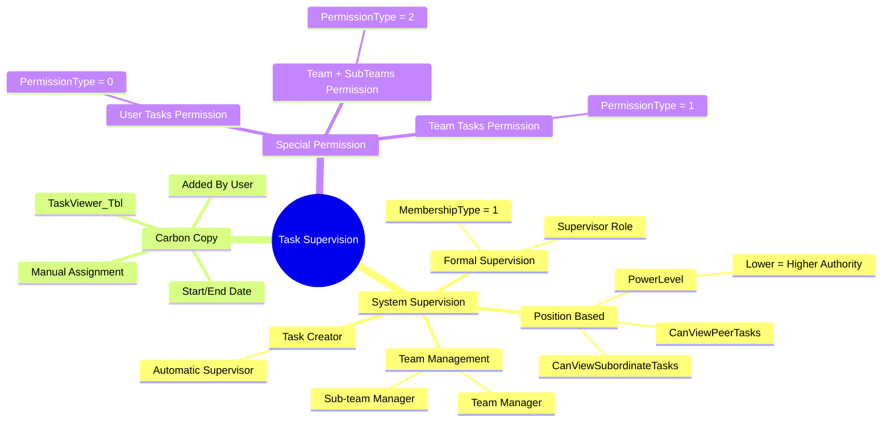
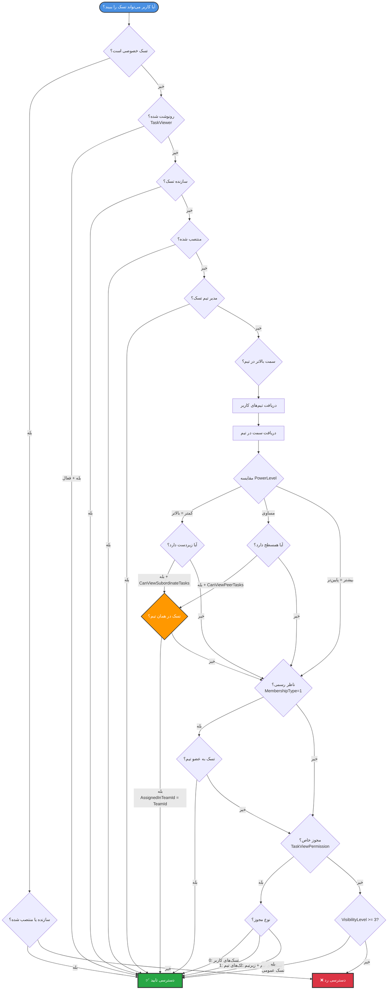
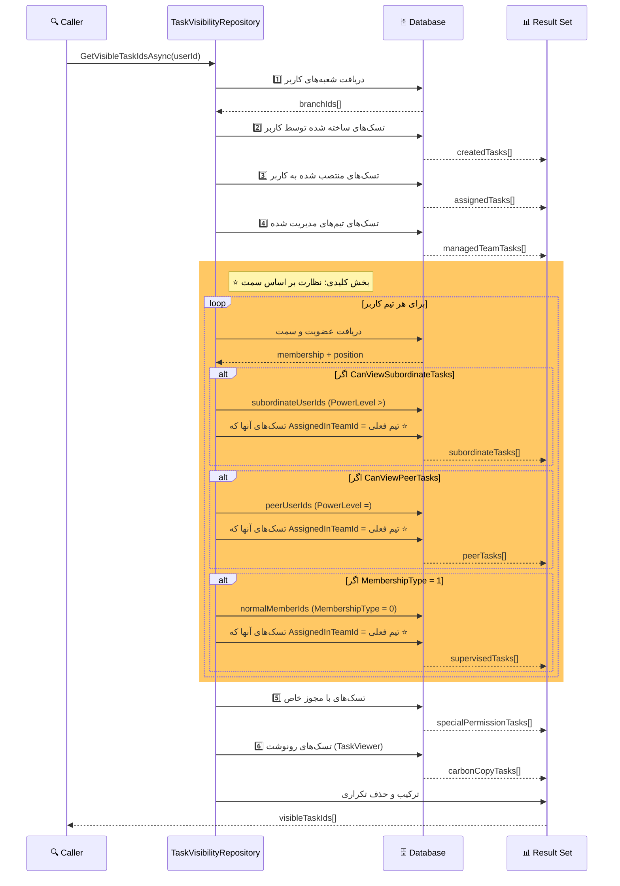
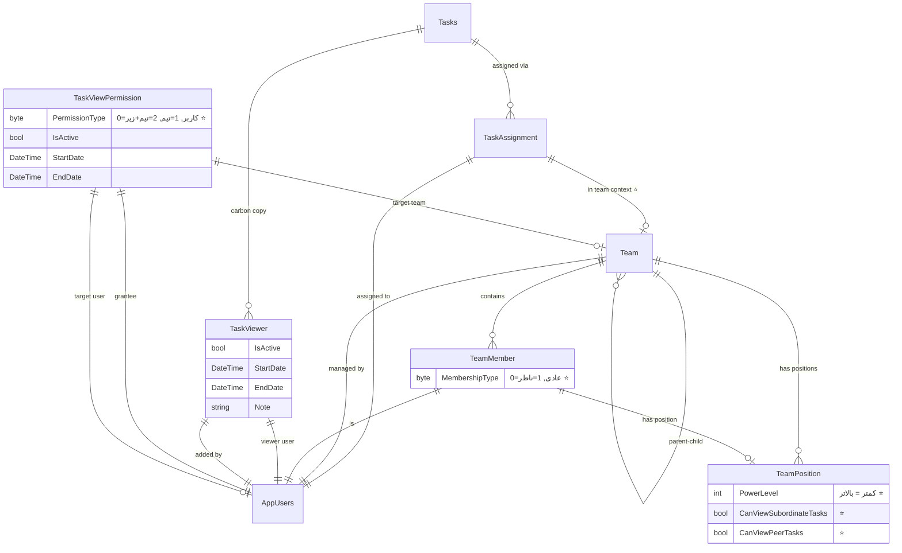
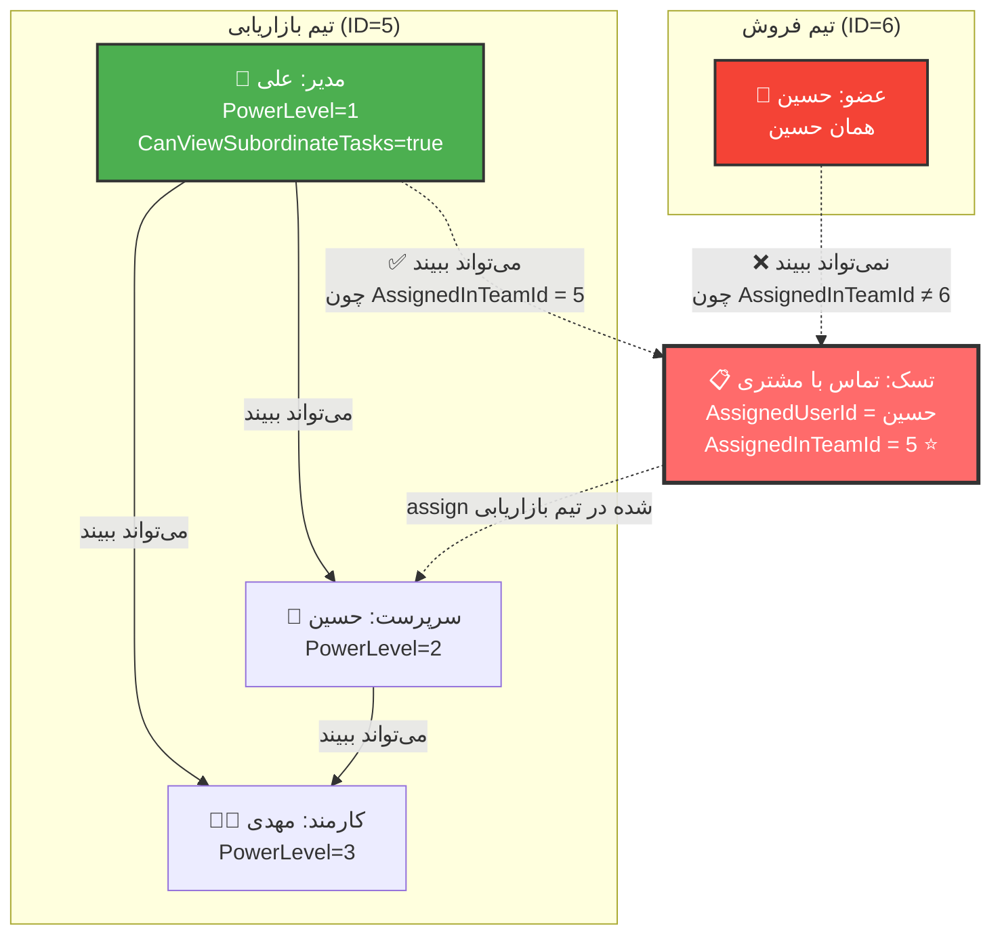

# 👁️ نمودار سیستم نظارت بر تسک‌ها

## معرفی

سیستم نظارت MahERP یک **سیستم هوشمند و چندسطحی** است که به صورت خودکار مشخص می‌کند چه کسانی می‌توانند تسک‌های دیگران را مشاهده کنند.

---

## 🎯 انواع نظارت



---

## 🔍 جریان بررسی قابلیت مشاهده تسک



---

## ⚙️ الگوریتم GetVisibleTaskIdsAsync



---

## 📊 ساختار جداول نظارت



---

## 🎭 Entity: TeamPosition

```csharp
public class TeamPosition
{
    public int Id { get; set; }
    public int TeamId { get; set; }
    public string TitleFa { get; set; }
    public string TitleEn { get; set; }
    
    // ⭐ کلیدی برای نظارت
    public int PowerLevel { get; set; }                    // کمتر = بالاتر
    public bool CanViewSubordinateTasks { get; set; }      // مشاهده زیردستان
    public bool CanViewPeerTasks { get; set; }             // مشاهده همسطح
    
    public bool IsActive { get; set; }
    
    // Navigation
    public Team Team { get; set; }
    public ICollection<TeamMember> Members { get; set; }
}
```

### 📌 منطق PowerLevel

```
PowerLevel کمتر = قدرت بیشتر

مثال:
- مدیر تیم: PowerLevel = 1
- سرپرست: PowerLevel = 2
- کارمند: PowerLevel = 3

→ مدیر می‌تواند تسک‌های سرپرست و کارمند را ببیند
→ سرپرست می‌تواند فقط تسک‌های کارمند را ببیند
```

---

## 🎭 Entity: TeamMember

```csharp
public class TeamMember
{
    public int Id { get; set; }
    public int TeamId { get; set; }
    public string UserId { get; set; }
    public int? PositionId { get; set; }
    
    // ⭐ کلیدی برای نظارت رسمی
    public byte MembershipType { get; set; }  // 0=عضو عادی, 1=ناظر رسمی
    
    public DateTime JoinDate { get; set; }
    public bool IsActive { get; set; }
    
    // Navigation
    public Team Team { get; set; }
    public AppUsers User { get; set; }
    public TeamPosition Position { get; set; }
}
```

### 📌 منطق MembershipType

```
MembershipType = 0: عضو عادی
MembershipType = 1: ناظر رسمی

→ ناظر رسمی می‌تواند تمام تسک‌های اعضای عادی (MembershipType=0) را ببیند
```

---

## 🎭 Entity: TaskViewer (رونوشت)

```csharp
public class TaskViewer
{
    public int Id { get; set; }
    public int TaskId { get; set; }
    public string UserId { get; set; }              // کاربر رونوشت شده
    public string AddedByUserId { get; set; }       // کسی که رونوشت را اضافه کرده
    
    public DateTime AddedDate { get; set; }
    public string Note { get; set; }
    
    public bool IsActive { get; set; }
    public DateTime? StartDate { get; set; }        // تاریخ شروع اعتبار
    public DateTime? EndDate { get; set; }          // تاریخ پایان اعتبار
    
    // Navigation
    public Tasks Task { get; set; }
    public AppUsers User { get; set; }
    public AppUsers AddedBy { get; set; }
}
```

### 📌 نحوه استفاده

```csharp
// افزودن ناظر رونوشتی
var viewer = new TaskViewer
{
    TaskId = taskId,
    UserId = viewerUserId,
    AddedByUserId = currentUserId,
    AddedDate = DateTime.Now,
    Note = "رونوشت برای اطلاع",
    IsActive = true,
    StartDate = DateTime.Now,
    EndDate = DateTime.Now.AddMonths(1)  // یک ماه اعتبار
};
```

---

## 🎭 Entity: TaskViewPermission (مجوز خاص)

```csharp
public class TaskViewPermission
{
    public int Id { get; set; }
    
    public string GranteeUserId { get; set; }       // کاربر گیرنده مجوز
    
    // نوع مجوز
    public byte PermissionType { get; set; }
    // 0 = مشاهده تسک‌های یک کاربر خاص
    // 1 = مشاهده تسک‌های یک تیم خاص
    // 2 = مشاهده تسک‌های تیم و زیرتیم‌ها
    
    public string TargetUserId { get; set; }        // برای نوع 0
    public int? TargetTeamId { get; set; }          // برای نوع 1 و 2
    
    public bool IsActive { get; set; }
    public DateTime? StartDate { get; set; }
    public DateTime? EndDate { get; set; }
    
    public string GrantedByUserId { get; set; }
    public DateTime GrantDate { get; set; }
    
    // Navigation
    public AppUsers Grantee { get; set; }
    public AppUsers TargetUser { get; set; }
    public Team TargetTeam { get; set; }
    public AppUsers GrantedBy { get; set; }
}
```

---

## 🎨 مثال عملی: نظارت بر اساس سمت



### توضیحات سناریو

```
تیم بازاریابی:
- مدیر: علی (PowerLevel = 1, CanViewSubordinateTasks = true)
- سرپرست: حسین (PowerLevel = 2)
- کارمند: مهدی (PowerLevel = 3)

تیم فروش:
- عضو: حسین (همان حسین)

تسک: "تماس با مشتری X"
- Assigned to: حسین
- AssignedInTeamId: تیم بازاریابی (ID=5)

نتیجه:
✅ علی می‌تواند تسک را ببیند چون:
   - مدیر تیم بازاریابی است
   - سمت بالاتر از حسین دارد (PowerLevel: 1 < 2)
   
❌ مدیر تیم فروش نمی‌تواند این تسک را ببیند چون:
   - AssignedInTeamId = تیم بازاریابی
   - تسک در تیم فروش assign نشده
```

---

## 📝 نمایش دلیل نظارت

### متد: GetSupervisionTypeAndReason

```csharp
public (string supervisionType, string supervisionReason) 
    GetSupervisionTypeAndReason(int taskId, string userId)
{
    // خروجی نمونه:
    // ("system", "شما مدیر تیم «بازاریابی» هستید")
    // ("system", "شما در تیم «بازاریابی» سمت بالاتر از حسین، علی دارید")
    // ("system", "شما ناظر رسمی تیم «فروش» هستید")
    // ("carbon-copy", "شما توسط مدیر در تاریخ 1403/10/15 به این تسک رونوشت شده‌اید")
}
```

### الگوریتم

```
1️⃣ بررسی رونوشت (TaskViewer)
   → اگر یافت شد: return ("carbon-copy", توضیحات)

2️⃣ بررسی نظارت سیستمی:
   
   ✅ سازنده تسک
   ✅ مدیر تیم تسک
   ✅ مدیر تیم اعضای assigned
   ✅ سمت بالاتر از اعضای assigned
   ✅ ناظر رسمی تیم اعضای assigned
   ✅ سمت بالاتر در تیم‌های کاربر (حتی اگر assigned نباشند)
   ✅ ناظر رسمی در تیم‌های کاربر

3️⃣ ترکیب دلایل:
   → اگر چند دلیل: "دلیل1 و دلیل2 و ..."
   → اگر هیچ دلیلی: "ناظر سیستمی"
```

---

## 🔍 Query های کاربردی

### تسک‌های نظارتی کاربر

```sql
-- تسک‌هایی که کاربر می‌تواند ببیند ولی assign نشده
SELECT t.*
FROM Tasks_Tbl t
WHERE t.Id IN (
    -- لیست شناسه‌های قابل مشاهده از GetVisibleTaskIdsAsync
)
AND t.Id NOT IN (
    SELECT TaskId 
    FROM TaskAssignment_Tbl 
    WHERE AssignedUserId = @UserId AND IsActive = 1
)
AND t.CreatorUserId != @UserId
ORDER BY t.CreateDate DESC;
```

### دریافت ناظران یک تسک

```sql
-- ناظران رونوشتی
SELECT u.FirstName, u.LastName, tv.AddedDate, tv.Note
FROM TaskViewer_Tbl tv
INNER JOIN AspNetUsers u ON tv.UserId = u.Id
WHERE tv.TaskId = @TaskId
  AND tv.IsActive = 1
  AND (tv.EndDate IS NULL OR tv.EndDate >= GETDATE());

-- ناظران سیستمی (نیاز به پردازش در کد)
EXEC GetTaskSupervisorsAsync @TaskId, @IncludeCreator;
```

---

## 💡 نکات کلیدی

### ✅ **فیلتر تیم (Team-Scoped)**

```csharp
// ❌ قبل از اصلاح:
var tasks = TaskAssignment که AssignedUserId در subordinateUserIds

// ✅ بعد از اصلاح:
var tasks = TaskAssignment که:
  - AssignedUserId در subordinateUserIds
  - AssignedInTeamId = تیم فعلی  ⭐
```

### ✅ **چرا فیلتر تیم مهم است؟**

```
مثال:
- شما: مدیر حسین در تیم "بازاریابی"
- حسین: عضو تیم "بازاریابی" و "فروش"

❌ بدون فیلتر تیم:
   → می‌بینید: تسک‌های حسین در "بازاریابی" + "فروش"

✅ با فیلتر تیم:
   → می‌بینید: فقط تسک‌های حسین در "بازاریابی"
```

---

**نسخه مستند:** 3.0.0  
**آخرین بروزرسانی:** آذر 1403  
**وضعیت:** ✅ Active & Updated

---

[🔙 بازگشت به فهرست](README.md) | [➡️ بعدی: تسک‌های زمان‌بندی شده](05-Scheduled-Task-Diagram.md)
