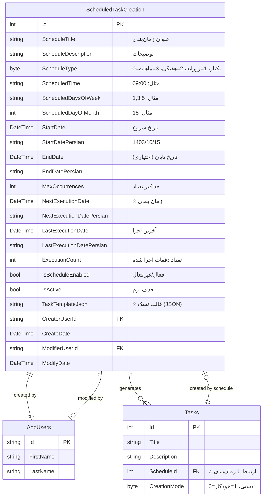
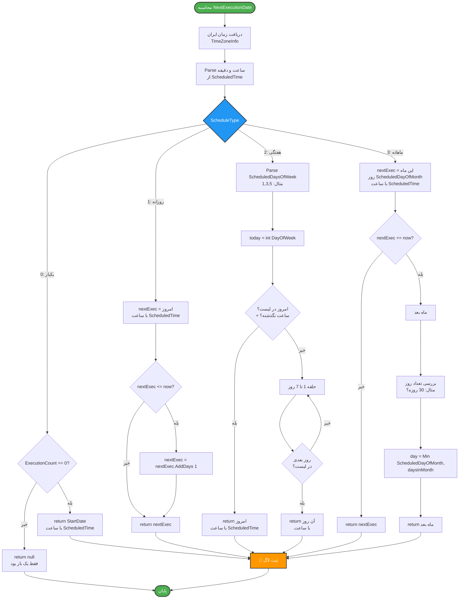
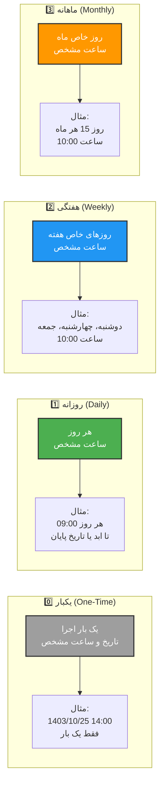
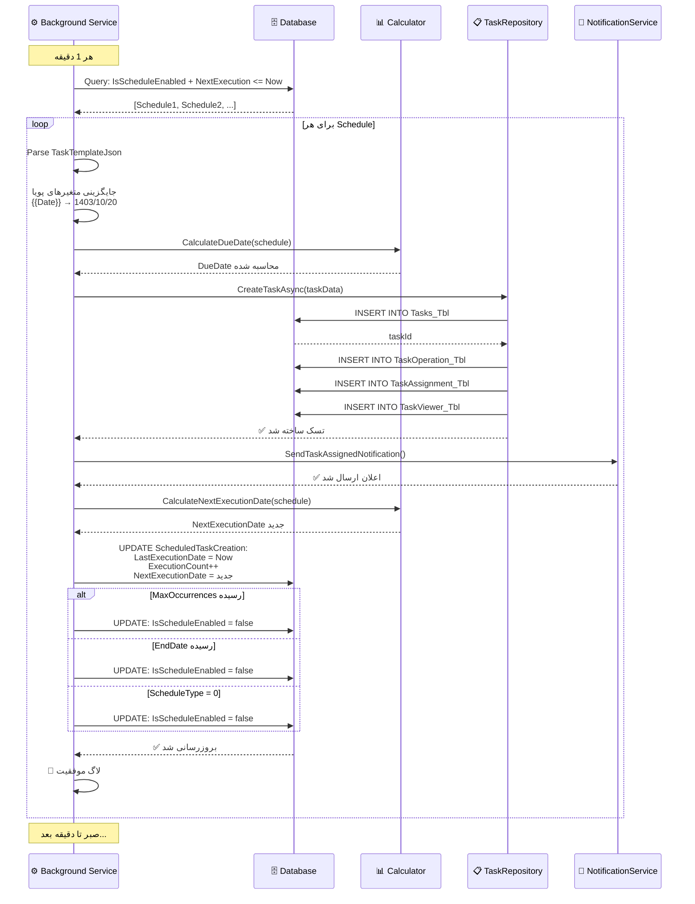
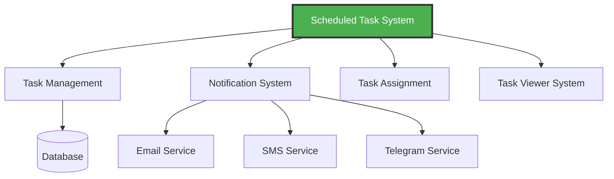

# 🕐 نمودار سیستم تسک‌های زمان‌بندی شده (Scheduled Tasks)

## معرفی

این بخش یکی از **جدیدترین و پیشرفته‌ترین** قابلیت‌های MahERP است که امکان **ساخت خودکار تسک‌ها** بر اساس زمان‌بندی را فراهم می‌کند.

---

## 🎯 قابلیت‌های کلیدی

- ✅ ساخت خودکار تسک‌ها در زمان مشخص
- ✅ 4 نوع زمان‌بندی: یکبار، روزانه، هفتگی، ماهانه
- ✅ قالب JSON برای تسک (شامل عملیات، اختصاص‌ها، رونوشت‌ها)
- ✅ متغیرهای پویا: `{{Date}}`, `{{DateTime}}`, `{{PersianDate}}`
- ✅ مدیریت دوره اعتبار (StartDate, EndDate, MaxOccurrences)
- ✅ Background Service با اجرای هر 1 دقیقه
- ✅ پشتیبانی از TimeZone ایران

---

## 🔄 جریان کامل Scheduled Task Creation

```mermaid
flowchart TD
    Start([👤 کاربر می‌خواهد<br/>تسک تکرارشونده بسازد]) --> OpenForm[باز کردن فرم<br/>Create Scheduled Task]
    
    OpenForm --> FillBasicInfo[📝 وارد کردن اطلاعات پایه]
    
    FillBasicInfo --> BasicFields[• عنوان زمان‌بندی<br/>• توضیحات<br/>• تاریخ شروع/پایان<br/>• حداکثر تعداد اجرا]
    
    BasicFields --> SelectScheduleType{نوع زمان‌بندی}
    
    SelectScheduleType -->|یکبار| OneTime[📅 ScheduleType = 0<br/>• فقط یک بار اجرا<br/>• تاریخ و ساعت مشخص]
    SelectScheduleType -->|روزانه| Daily[📅 ScheduleType = 1<br/>• هر روز<br/>• ساعت اجرا]
    SelectScheduleType -->|هفتگی| Weekly[📅 ScheduleType = 2<br/>• روزهای هفته<br/>• ساعت اجرا]
    SelectScheduleType -->|ماهانه| Monthly[📅 ScheduleType = 3<br/>• روز ماه<br/>• ساعت اجرا]
    
    OneTime --> FillTaskTemplate
    Daily --> FillTaskTemplate
    Weekly --> FillTaskTemplate
    Monthly --> FillTaskTemplate[📋 پر کردن قالب تسک]
    
    FillTaskTemplate --> TaskFields[• عنوان تسک<br/>• توضیحات<br/>• اولویت<br/>• برآورد زمان<br/>• شعبه<br/>• دسته‌بندی]
    
    TaskFields --> AddOperations[➕ افزودن عملیات‌ها]
    AddOperations --> OperationsList[لیست عملیات:<br/>1. عملیات 1<br/>2. عملیات 2<br/>3. ...]
    
    OperationsList --> AddAssignments[👥 اختصاص کاربران]
    AddAssignments --> AssignmentsList[• کاربر 1 در تیم A<br/>• کاربر 2 در تیم B<br/>• ...]
    
    AssignmentsList --> AddCarbonCopy{رونوشت؟}
    AddCarbonCopy -->|بله| AddViewers[👁️ افزودن ناظران]
    AddCarbonCopy -->|خیر| SaveSchedule
    
    AddViewers --> SaveSchedule[💾 ذخیره زمان‌بندی]
    
    SaveSchedule --> CreateJSON[ساخت TaskTemplateJson]
    CreateJSON --> CalculateNext[⏰ محاسبه NextExecutionDate]
    
    CalculateNext --> SaveToDB[(💾 ذخیره در دیتابیس<br/>ScheduledTaskCreation_Tbl)]
    
    SaveToDB --> ScheduleSaved([✅ زمان‌بندی ذخیره شد])
    
    ScheduleSaved --> WaitForExecution[⏳ در انتظار اجرا...]
    
    WaitForExecution --> BGServiceCheck[⚙️ Background Service<br/>هر 1 دقیقه چک می‌کند]
    
    BGServiceCheck --> CheckTime{زمان رسیده؟<br/>NextExecutionDate <= Now}
    
    CheckTime -->|خیر| WaitForExecution
    CheckTime -->|بله| ExecuteSchedule[🚀 اجرای زمان‌بندی]
    
    ExecuteSchedule --> ParseJSON[Parse TaskTemplateJson]
    ParseJSON --> ReplaceVariables[جایگزینی متغیرهای پویا<br/>{{Date}}, {{DateTime}}, ...]
    
    ReplaceVariables --> CreateTask[📋 ساخت تسک جدید]
    CreateTask --> SaveTask[(💾 ذخیره در Tasks_Tbl<br/>ScheduleId = schedule.Id)]
    
    SaveTask --> CreateOps[⚙️ ثبت عملیات‌ها<br/>TaskOperation_Tbl]
    CreateOps --> CreateAssigns[👥 ثبت اختصاص‌ها<br/>TaskAssignment_Tbl]
    CreateAssigns --> CreateViewers[👁️ ثبت ناظران<br/>TaskViewer_Tbl]
    
    CreateViewers --> SendNotif[📧 ارسال اعلان به<br/>انجام‌دهندگان]
    
    SendNotif --> UpdateSchedule[🔄 بروزرسانی زمان‌بندی]
    
    UpdateSchedule --> UpdateFields[• LastExecutionDate = Now<br/>• ExecutionCount++<br/>• NextExecutionDate = محاسبه بعدی]
    
    UpdateFields --> CheckConditions{بررسی شرایط}
    
    CheckConditions -->|ExecutionCount >= MaxOccurrences| Disable1[IsScheduleEnabled = false]
    CheckConditions -->|Now >= EndDate| Disable2[IsScheduleEnabled = false]
    CheckConditions -->|ScheduleType = 0| Disable3[IsScheduleEnabled = false<br/>یکبار بود]
    CheckConditions -->|ادامه دارد| SaveUpdate
    
    Disable1 --> SaveUpdate
    Disable2 --> SaveUpdate
    Disable3 --> SaveUpdate[(💾 ذخیره تغییرات)]
    
    SaveUpdate --> LogSuccess[📝 ثبت لاگ موفقیت]
    
    LogSuccess --> CheckEnabled{IsScheduleEnabled?}
    
    CheckEnabled -->|بله| WaitForExecution
    CheckEnabled -->|خیر| EndSchedule([⏹️ زمان‌بندی متوقف شد])
    
    %% Styling
    style Start fill:#4CAF50,stroke:#333,stroke-width:2px,color:#fff
    style ScheduleSaved fill:#2196F3,stroke:#333,stroke-width:2px,color:#fff
    style ExecuteSchedule fill:#FF9800,stroke:#333,stroke-width:3px,color:#fff
    style CreateTask fill:#9C27B0,stroke:#333,stroke-width:2px,color:#fff
    style EndSchedule fill:#F44336,stroke:#333,stroke-width:2px,color:#fff
```

---

## 📊 ساختار Entity: ScheduledTaskCreation



### 📋 توضیحات فیلدها

| فیلد | نوع | توضیحات | مثال |
|------|-----|---------|------|
| `ScheduleType` | `byte` | 0=یکبار، 1=روزانه، 2=هفتگی، 3=ماهانه | `1` (روزانه) |
| `ScheduledTime` | `string` | ساعت اجرا (HH:mm) | `"09:30"` |
| `ScheduledDaysOfWeek` | `string` | روزهای هفته (برای هفتگی) | `"1,3,5"` (دوشنبه، چهارشنبه، جمعه) |
| `ScheduledDayOfMonth` | `int?` | روز ماه (برای ماهانه) | `15` |
| `MaxOccurrences` | `int?` | حداکثر تعداد اجرا | `10` |
| `TaskTemplateJson` | `string` | قالب کامل تسک به صورت JSON | `{...}` |

---

## 🔍 الگوریتم محاسبه NextExecutionDate



---

## 📄 نمونه TaskTemplateJson

```json
{
  "Title": "گزارش روزانه - {{Date}}",
  "Description": "گزارش مربوط به تاریخ {{PersianDate}}",
  "PriorityCode": 1,
  "Important": true,
  "EstimatedHours": 2.5,
  "BranchId": 5,
  "CategoryId": 10,
  "DueDateOffsetDays": 1,
  "Operations": [
    {
      "Title": "جمع‌آوری داده‌ها",
      "Description": "جمع‌آوری اطلاعات روز گذشته",
      "OperationOrder": 1,
      "EstimatedHours": 1.0
    },
    {
      "Title": "تحلیل و گزارش",
      "Description": "تحلیل داده‌ها و تهیه گزارش",
      "OperationOrder": 2,
      "EstimatedHours": 1.0
    },
    {
      "Title": "ارسال گزارش",
      "Description": "ارسال گزارش به مدیریت",
      "OperationOrder": 3,
      "EstimatedHours": 0.5
    }
  ],
  "Assignments": [
    {
      "UserId": "user-id-123",
      "TeamId": 5
    },
    {
      "UserId": "user-id-456",
      "TeamId": 5
    }
  ],
  "CarbonCopies": [
    {
      "UserId": "manager-id-789",
      "Note": "رونوشت برای مدیر"
    }
  ]
}
```

### 📌 متغیرهای پویا

| متغیر | توضیحات | مثال خروجی |
|-------|---------|------------|
| `{{Date}}` | تاریخ میلادی | `2024-12-20` |
| `{{PersianDate}}` | تاریخ شمسی | `1403/10/01` |
| `{{DateTime}}` | تاریخ و زمان میلادی | `2024-12-20 09:30` |
| `{{PersianDateTime}}` | تاریخ و زمان شمسی | `1403/10/01 09:30` |
| `{{Time}}` | ساعت فعلی | `09:30` |

---

## 📊 مقایسه انواع زمان‌بندی



---

## ⚙️ Sequence Diagram: اجرای Background Service



---

## 💡 مثال‌های کاربردی

### مثال 1: گزارش روزانه

```csharp
var schedule = new ScheduledTaskCreation
{
    ScheduleTitle = "گزارش روزانه فروش",
    ScheduleDescription = "ارسال گزارش روزانه فروش به مدیر",
    ScheduleType = 1, // روزانه
    ScheduledTime = "09:00",
    StartDate = DateTime.Now,
    IsScheduleEnabled = true,
    TaskTemplateJson = JsonSerializer.Serialize(new {
        Title = "گزارش فروش - {{PersianDate}}",
        Description = "بررسی فروش روز گذشته",
        PriorityCode = 2, // بالا
        DueDateOffsetDays = 0, // امروز
        Operations = new[] {
            new { Title = "جمع‌آوری داده", OperationOrder = 1 },
            new { Title = "تحلیل", OperationOrder = 2 }
        },
        Assignments = new[] {
            new { UserId = "sales-manager-id", TeamId = 3 }
        }
    })
};
```

### مثال 2: جلسه هفتگی

```csharp
var schedule = new ScheduledTaskCreation
{
    ScheduleTitle = "جلسه هفتگی تیم",
    ScheduleType = 2, // هفتگی
    ScheduledTime = "14:00",
    ScheduledDaysOfWeek = "1,3", // دوشنبه و چهارشنبه
    StartDate = DateTime.Now,
    IsScheduleEnabled = true,
    TaskTemplateJson = JsonSerializer.Serialize(new {
        Title = "جلسه تیم - {{PersianDate}}",
        Description = "جلسه هماهنگی تیم",
        PriorityCode = 1,
        Assignments = new[] {
            new { UserId = "team-lead-id", TeamId = 5 }
        }
    })
};
```

### مثال 3: گزارش ماهانه

```csharp
var schedule = new ScheduledTaskCreation
{
    ScheduleTitle = "گزارش ماهانه عملکرد",
    ScheduleType = 3, // ماهانه
    ScheduledTime = "10:00",
    ScheduledDayOfMonth = 1, // اول هر ماه
    StartDate = DateTime.Now,
    MaxOccurrences = 12, // برای یک سال
    IsScheduleEnabled = true,
    TaskTemplateJson = JsonSerializer.Serialize(new {
        Title = "گزارش ماهانه - {{PersianDate}}",
        Description = "بررسی عملکرد ماه گذشته",
        PriorityCode = 3, // فوری
        DueDateOffsetDays = 7,
        Operations = new[] {
            new { Title = "جمع‌آوری داده‌ها", OperationOrder = 1, EstimatedHours = 2.0 },
            new { Title = "تحلیل اطلاعات", OperationOrder = 2, EstimatedHours = 3.0 },
            new { Title = "تهیه گزارش", OperationOrder = 3, EstimatedHours = 2.0 },
            new { Title = "ارائه به مدیریت", OperationOrder = 4, EstimatedHours = 1.0 }
        }
    })
};
```

---

## 🔍 Query های کاربردی

### دریافت زمان‌بندی‌های فعال

```sql
SELECT 
    Id,
    ScheduleTitle,
    CASE ScheduleType
        WHEN 0 THEN 'یکبار'
        WHEN 1 THEN 'روزانه'
        WHEN 2 THEN 'هفتگی'
        WHEN 3 THEN 'ماهانه'
    END AS ScheduleTypeText,
    ScheduledTime,
    NextExecutionDate,
    NextExecutionDatePersian,
    ExecutionCount,
    MaxOccurrences
FROM ScheduledTaskCreation_Tbl
WHERE IsScheduleEnabled = 1
  AND IsActive = 1
ORDER BY NextExecutionDate;
```

### دریافت تسک‌های ساخته شده توسط زمان‌بندی

```sql
SELECT 
    t.Id,
    t.TaskCode,
    t.Title,
    t.CreateDate,
    s.ScheduleTitle,
    s.ScheduleType
FROM Tasks_Tbl t
INNER JOIN ScheduledTaskCreation_Tbl s ON t.ScheduleId = s.Id
WHERE t.CreationMode = 1  -- خودکار
ORDER BY t.CreateDate DESC;
```

### آمار زمان‌بندی‌ها

```sql
SELECT 
    CASE ScheduleType
        WHEN 0 THEN 'یکبار'
        WHEN 1 THEN 'روزانه'
        WHEN 2 THEN 'هفتگی'
        WHEN 3 THEN 'ماهانه'
    END AS Type,
    COUNT(*) AS TotalSchedules,
    SUM(CASE WHEN IsScheduleEnabled = 1 THEN 1 ELSE 0 END) AS ActiveSchedules,
    SUM(ExecutionCount) AS TotalExecutions
FROM ScheduledTaskCreation_Tbl
WHERE IsActive = 1
GROUP BY ScheduleType;
```

---

## 💡 نکات مهم

### ✅ **1. TimeZone ایران**

```csharp
private static readonly TimeZoneInfo IranTimeZone = 
    TimeZoneInfo.FindSystemTimeZoneById("Iran Standard Time");

var nowIran = TimeZoneInfo.ConvertTimeFromUtc(DateTime.UtcNow, IranTimeZone);
```

### ✅ **2. محاسبه DueDate خودکار**

```csharp
// بر اساس DueDateOffsetDays در JSON
var dueDate = nextExecution.AddDays(template.DueDateOffsetDays ?? 0);
```

### ✅ **3. جلوگیری از تداخل تیم**

```csharp
// هر assignment باید TeamId داشته باشد
Assignments = new[] {
    new { UserId = "user-id", TeamId = 5 }  // ⭐ TeamId ضروری
}
```

### ✅ **4. Validation در هنگام ایجاد**

```csharp
// بررسی‌های لازم:
✅ ScheduledTime معتبر باشد (HH:mm)
✅ برای هفتگی: ScheduledDaysOfWeek خالی نباشد
✅ برای ماهانه: ScheduledDayOfMonth بین 1-31 باشد
✅ TaskTemplateJson معتبر و قابل Parse باشد
```

---

## 🐛 Troubleshooting

### مشکل: زمان‌بندی اجرا نمی‌شود

```sql
-- چک کردن وضعیت
SELECT 
    Id,
    ScheduleTitle,
    IsScheduleEnabled,
    IsActive,
    NextExecutionDate,
    LastExecutionDate,
    DATEDIFF(MINUTE, NextExecutionDate, GETDATE()) AS MinutesLate
FROM ScheduledTaskCreation_Tbl
WHERE IsScheduleEnabled = 1
  AND NextExecutionDate <= GETDATE();
```

**راه حل‌های ممکن:**
1. بررسی Background Service در حال اجراست؟
2. بررسی `IsScheduleEnabled = true`
3. بررسی `NextExecutionDate` در گذشته است؟
4. بررسی لاگ‌های خطا

### مشکل: تسک با فیلدهای اشتباه ساخته می‌شود

**علت:** JSON Template معتبر نیست یا متغیرها جایگزین نشده‌اند

**راه حل:**
```csharp
// اعتبارسنجی JSON قبل از ذخیره
try {
    var template = JsonSerializer.Deserialize<TaskTemplate>(json);
    // بررسی فیلدهای ضروری
} catch {
    // JSON نامعتبر
}
```

---

## 🔗 ارتباط با سایر سیستم‌ها



---

**نسخه مستند:** 3.0.0  
**آخرین بروزرسانی:** آذر 1403  
**وضعیت:** 🆕 New Feature - Active

---

[🔙 بازگشت به فهرست](README.md) | [➡️ بعدی: سیستم اعلان‌رسانی](06-Notification-System-Diagram.md)
