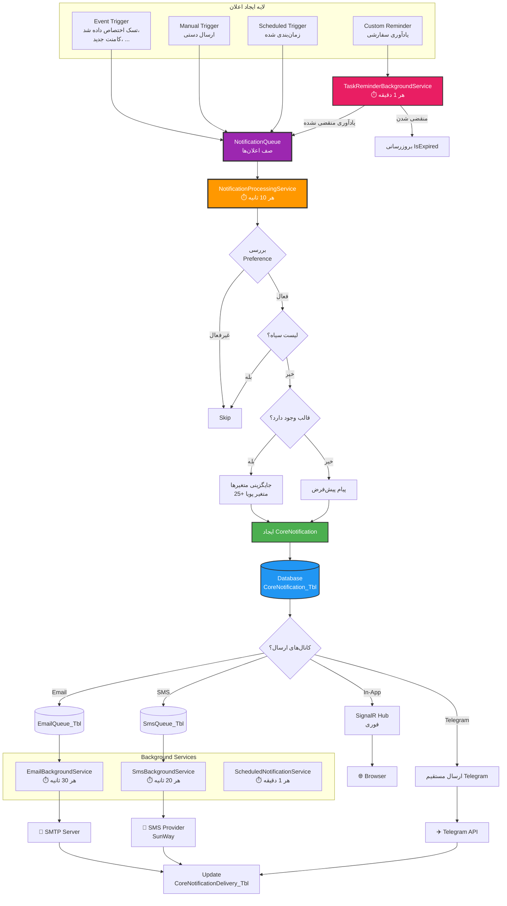
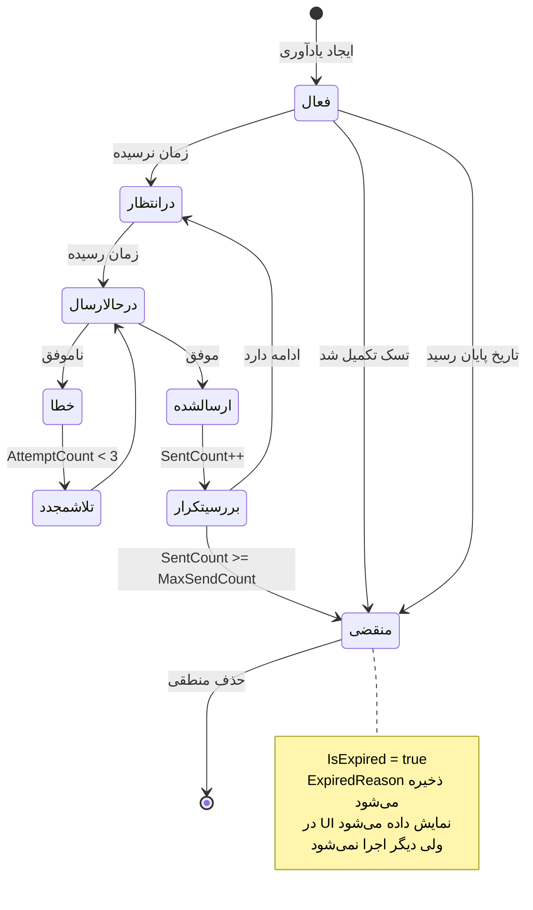
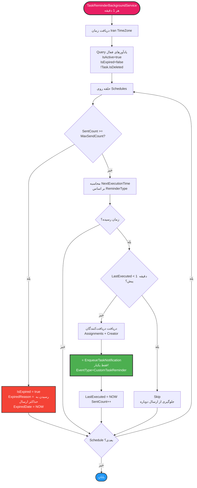
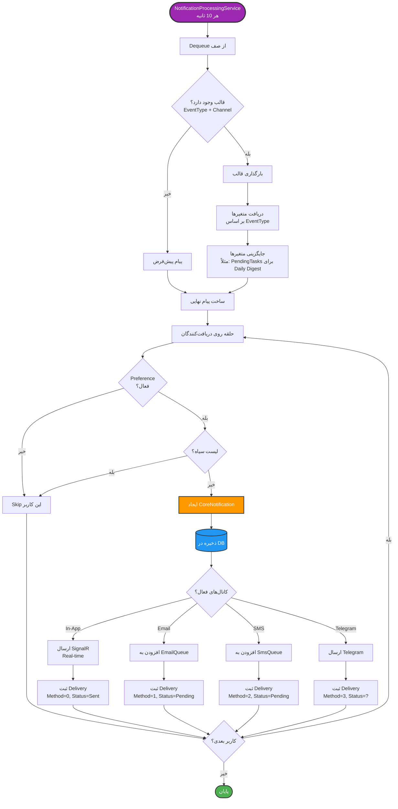
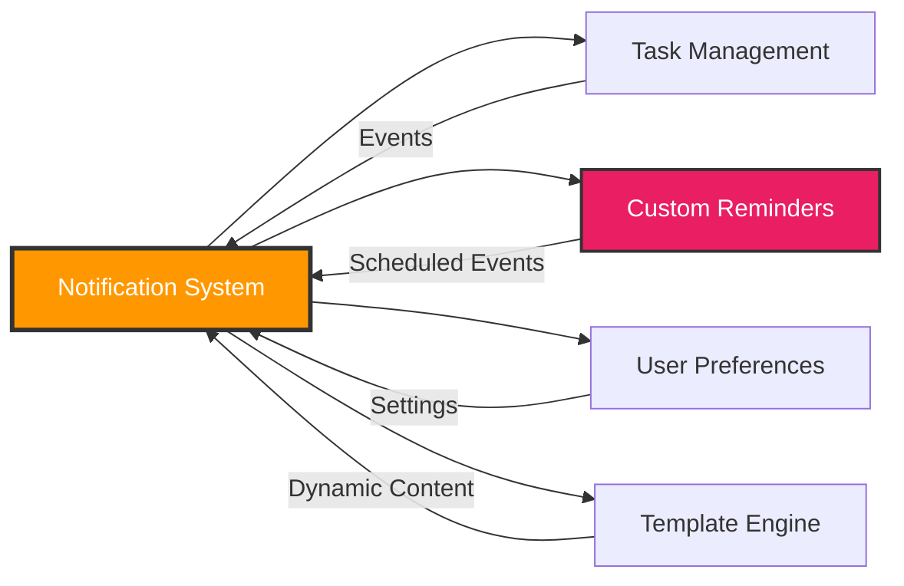

# 🔔 نمودار سیستم اعلان‌رسانی (Notification System)

## معرفی

سیستم اعلان‌رسانی MahERP یک **سیستم پیشرفته و چندکاناله** است که از **زمان‌بندی خودکار**، **قالب‌های پویا** و **ارسال هوشمند** پشتیبانی می‌کند.

---

## 🎯 ویژگی‌های کلیدی

- ✅ **4 کانال ارسال:** In-App (SignalR), Email, SMS, Telegram
- ✅ **قالب‌های پویا** با 25+ متغیر
- ✅ **زمان‌بندی خودکار** (روزانه، هفتگی، ماهانه)
- ✅ **SignalR** برای اعلان‌های Real-time
- ✅ **صف ارسال** با Background Services
- ✅ **لیست سیاه** (Blacklist)
- ✅ **ترجیحات کاربر** (User Preferences)
- ✅ **آمار و گزارش‌گیری**
- ✅ **یادآورهای سفارشی** (Custom Reminders) با وضعیت منقضی
- ✅ **جلوگیری از ارسال دوباره** (Anti-Duplicate)

---

## 🏗️ معماری سیستم



---

## 📊 Entity: CoreNotification

```csharp
public class CoreNotification
{
    public int Id { get; set; }
    
    // ⭐ سیستم و نوع
    public byte SystemId { get; set; }  // 1-7: مالی، منابع انسانی، CRM، تسکینگ، ...
    public byte NotificationTypeGeneral { get; set; }  // 0-10: اطلاع‌رسانی، ایجاد، ...
    
    // ⭐ گیرنده و فرستنده
    public string RecipientUserId { get; set; }
    public string? SenderUserId { get; set; }
    
    // ⭐ محتوا
    public string Title { get; set; }
    public string Message { get; set; }
    public string? ActionUrl { get; set; }
    
    // ⭐ ارتباط با رکورد
    public string? RelatedRecordId { get; set; }  // ⚠️ تغییر از int به string
    public string? RelatedRecordType { get; set; }  // "Task", "TaskReminder"
    public string? RelatedRecordTitle { get; set; }
    
    // ⭐ اولویت
    public byte Priority { get; set; }  // 0=عادی, 1=مهم, 2=فوری, 3=بحرانی
    
    // ⭐ وضعیت
    public bool IsRead { get; set; }
    public DateTime? ReadDate { get; set; }
    public bool IsClicked { get; set; }
    public DateTime? ClickDate { get; set; }
    
    public DateTime CreateDate { get; set; }
    public bool IsActive { get; set; }
    
    // Navigation
    public AppUsers Recipient { get; set; }
    public AppUsers? Sender { get; set; }
    public ICollection<CoreNotificationDetail> Details { get; set; }
    public ICollection<CoreNotificationDelivery> Deliveries { get; set; }
}
```

---

## 📊 Entity: NotificationTemplate

```csharp
public class NotificationTemplate
{
    public int Id { get; set; }
    
    // ⭐ اطلاعات پایه
    public string TemplateName { get; set; }
    public byte NotificationEventType { get; set; }  // ⚠️ تغییر از int به byte
    // EventTypes: 1=TaskAssigned, 2=TaskCompleted, 3=TaskDeadlineReminder, 
    //             4=TaskCommentAdded, 5=TaskUpdated, 6=TaskOperationCompleted,
    //             13=DailyTaskDigest, 15=CustomTaskReminder
    
    public byte Channel { get; set; }  // 0=System, 1=Email, 2=SMS, 3=Telegram
    
    // ⭐ محتوا
    public string? Subject { get; set; }
    public string MessageTemplate { get; set; }  // با متغیرهای {{Variable}}
    public string? BodyHtml { get; set; }  // برای Email
    
    // ⭐ دریافت‌کنندگان
    public byte RecipientMode { get; set; }  // 0=همه, 1=خاص, 2=همه به جز...
    
    // ⭐⭐⭐ زمان‌بندی
    public bool IsScheduled { get; set; }
    public byte ScheduleType { get; set; }  // 0=دستی, 1=روزانه, 2=هفتگی, 3=ماهانه, 4=سفارشی
    public string? ScheduledTime { get; set; }  // "07:15" (HH:mm)
    public string? ScheduledDaysOfWeek { get; set; }  // "1,3,5" (دوشنبه، چهارشنبه، جمعه)
    public int? ScheduledDayOfMonth { get; set; }  // 15
    public string? CronExpression { get; set; }  // برای زمان‌بندی سفارشی
    
    public DateTime? LastExecutionDate { get; set; }
    public DateTime? NextExecutionDate { get; set; }  // ⚠️ ذخیره در UTC
    public bool IsScheduleEnabled { get; set; }
    
    // ⭐ متادیتا
    public bool IsSystemTemplate { get; set; }
    public bool IsActive { get; set; }
    public int Version { get; set; }
    public int UsageCount { get; set; }
    public DateTime? LastUsedDate { get; set; }
    
    // Navigation
    public ICollection<NotificationTemplateRecipient> Recipients { get; set; }
    public ICollection<NotificationTemplateHistory> History { get; set; }
}
```

---

## 🔔 یادآورهای سفارشی (Custom Reminders)

### Entity: TaskReminderSchedule

```csharp
public class TaskReminderSchedule
{
    public int Id { get; set; }
    public int TaskId { get; set; }
    
    public string Title { get; set; }
    public string? Description { get; set; }
    
    // ⭐ نوع یادآوری
    public byte ReminderType { get; set; }
    // 0 = یکبار در زمان مشخص
    // 1 = تکراری با فاصله زمانی مشخص
    // 2 = قبل از پایان مهلت (X روز قبل)
    // 3 = در روز شروع تسک
    // 4 = ماهانه با انتخاب چند روز
    
    public int? IntervalDays { get; set; }
    public int? DaysBeforeDeadline { get; set; }
    public string? ScheduledDaysOfMonth { get; set; }  // "10,20,25"
    
    public DateTime? StartDate { get; set; }
    public DateTime? EndDate { get; set; }
    public TimeSpan NotificationTime { get; set; }  // ساعت ارسال
    
    // ⭐ وضعیت
    public bool IsActive { get; set; }
    
    // ⭐⭐⭐ وضعیت منقضی (NEW!)
    public bool IsExpired { get; set; }
    public string? ExpiredReason { get; set; }
    // مثال: "رسیدن به حداکثر ارسال (1 بار)"
    //        "تسک تکمیل شده"
    //        "پایان تاریخ EndDate"
    public DateTime? ExpiredDate { get; set; }
    
    // ⭐ کنترل تعداد ارسال
    public int SentCount { get; set; }
    public int? MaxSendCount { get; set; }  // null = نامحدود
    // برای یادآوری‌های یکباره: MaxSendCount = 1
    // برای تکراری: MaxSendCount = تعداد تکرار یا null
    
    public DateTime? LastExecuted { get; set; }
    
    // Navigation
    public Tasks Task { get; set; }
}
```

### 🔄 چرخه حیات یادآوری



---

## 🔤 متغیرهای پویا (Dynamic Variables)

### دسته‌بندی متغیرها

```csharp
public enum NotificationVariableCategory : byte
{
    General = 0,        // Date, Time, PersianDate
    Recipient = 1,      // RecipientFullName, RecipientEmail
    Sender = 2,         // SenderName
    Task = 3,           // TaskTitle, TaskCode, TaskDueDate
    TaskList = 4,       // PendingTasks (برای Daily Digest)
    ReminderSchedule = 5 // Title, Message, ActionUrl (برای یادآورها)
}
```

### متغیرهای عمومی (General)

| متغیر | توضیحات | مثال |
|-------|---------|------|
| `{{Date}}` | تاریخ میلادی | 2024-12-27 |
| `{{Time}}` | ساعت فعلی | 09:30 |
| `{{PersianDate}}` | تاریخ شمسی | 1403/10/07 |
| `{{DateTime}}` | تاریخ و ساعت میلادی | 2024-12-27 09:30 |
| `{{PersianDateTime}}` | تاریخ و ساعت شمسی | 1403/10/07 09:30 |

### متغیرهای دریافت‌کننده (Recipient)

| متغیر | توضیحات | مثال |
|-------|---------|------|
| `{{RecipientFullName}}` | نام کامل دریافت‌کننده | احمد محمدی |
| `{{RecipientFirstName}}` | نام دریافت‌کننده | احمد |
| `{{RecipientLastName}}` | نام خانوادگی | محمدی |
| `{{RecipientUserName}}` | نام کاربری | ahmad.mohammadi |
| `{{RecipientEmail}}` | ایمیل | ahmad@example.com |
| `{{RecipientPhone}}` | شماره موبایل | 09123456789 |

### متغیرهای تسک (Task)

| متغیر | توضیحات | مثال |
|-------|---------|------|
| `{{TaskTitle}}` | عنوان تسک | تماس با مشتری X |
| `{{TaskCode}}` | کد تسک | TSK-2024-00123 |
| `{{TaskDescription}}` | توضیحات تسک | پیگیری پروژه جدید |
| `{{TaskPriority}}` | اولویت تسک | فوری |
| `{{TaskDueDate}}` | مهلت تسک | 1403/10/20 |
| `{{TaskStartDate}}` | تاریخ شروع | 1403/10/10 |
| `{{TaskStatus}}` | وضعیت تسک | در حال انجام |
| `{{TaskCategory}}` | دسته‌بندی | امور مالی |
| `{{TaskStakeholder}}` | طرف حساب | شرکت ABC |
| `{{TaskBranch}}` | شعبه | دفتر مرکزی |
| `{{TaskCreatorName}}` | سازنده تسک | علی رضایی |

### متغیرهای لیست تسک (TaskList)

| متغیر | توضیحات | استفاده |
|-------|---------|---------|
| `{{PendingTasks}}` | لیست تسک‌های باز با جزئیات کامل | برای Daily Digest |

**خروجی نمونه `{{PendingTasks}}`:**

```html
<div class="task-list">
    <h3>📌 تسک‌های در حال انجام شما:</h3>
    
    <div class="task-item">
        <h4>1️⃣ تماس با مشتری X</h4>
        <p>📝 پیگیری پروژه جدید و دریافت بازخورد</p>
        <p>📅 شروع: 1403/10/10 | 🔚 پایان: 1403/10/20</p>
        <p>👤 سازنده: احمد محمدی | 🟡 اولویت: متوسط</p>
        <p>📊 پیشرفت: 40% (2/5 عملیات)</p>
        <p>🔗 <a href="https://...">مشاهده جزئیات</a></p>
    </div>
    
    <div class="summary">
        📊 جمع کل: 2 تسک در حال انجام
    </div>
</div>
```

### متغیرهای یادآوری (ReminderSchedule)

| متغیر | توضیحات | مثال |
|-------|---------|------|
| `{{Title}}` | عنوان یادآوری | یادآوری قبل از مهلت |
| `{{Message}}` | متن یادآوری | 3 روز تا پایان مهلت باقی مانده |
| `{{ActionUrl}}` | لینک مستقیم | https://.../Tasks/Details/123 |
| `{{SenderName}}` | فرستنده اعلان | محمد حسینی |

---

## 🎯 انواع رویدادهای اعلان (NotificationEventType)

```csharp
public enum NotificationEventType : byte
{
    TaskAssigned = 1,           // تخصیص تسک جدید
    TaskCompleted = 2,          // تکمیل تسک
    TaskDeadlineReminder = 3,   // یادآوری سررسید
    TaskCommentAdded = 4,       // نظر جدید
    TaskUpdated = 5,            // ویرایش تسک
    TaskOperationCompleted = 6, // تکمیل عملیات
    TaskDeleted = 7,            // حذف تسک
    TaskStatusChanged = 8,      // تغییر وضعیت
    OperationAssigned = 9,      // تخصیص عملیات
    CommentMentioned = 10,      // Mention در کامنت
    TaskPriorityChanged = 11,   // تغییر اولویت
    TaskReassigned = 12,        // تخصیص مجدد
    DailyTaskDigest = 13,       // خلاصه روزانه
    TaskWorkLog = 14,           // ثبت کار
    CustomTaskReminder = 15     // یادآوری سفارشی ⭐ NEW
}
```

### ⭐ تفاوت TaskDeadlineReminder و CustomTaskReminder

| ویژگی | TaskDeadlineReminder (3) | CustomTaskReminder (15) |
|-------|-------------------------|------------------------|
| **منبع** | سیستمی (خودکار) | کاربر (دستی) |
| **زمان‌بندی** | ثابت (مثلاً 3 روز قبل) | سفارشی (کاربر تعیین می‌کنه) |
| **نوع** | فقط یکبار | یکبار، تکراری، روزانه، ماهانه |
| **قابل حذف** | خیر | بله |
| **قابل ویرایش** | خیر | بله |
| **وضعیت منقضی** | ندارد | دارد (IsExpired) |

---

## 🔄 Flowchart: پردازش یادآوری سفارشی



---

## 🔄 Flowchart: پردازش صف اعلان‌ها



---

## 📧 مثال قالب: Daily Task Digest

### ⚙️ تنظیمات قالب

```csharp
var template = new NotificationTemplate
{
    TemplateName = "خلاصه روزانه تسک‌ها",
    NotificationEventType = 13, // DailyTaskDigest
    Channel = 3, // Telegram
    
    MessageTemplate = @"
🌅 **سلام {{RecipientFullName}} عزیز**

📋 **خلاصه تسک‌های امروز شما:**

{{PendingTasks}}

---

📅 **تاریخ:** {{PersianDate}}
🕐 **ساعت:** {{Time}}
🔗 [مشاهده تمام تسک‌ها]({{ActionUrl}})

_✨ این پیام به صورت خودکار ارسال شده است_
    ",
    
    RecipientMode = 0, // همه کاربران
    
    // ⭐ زمان‌بندی
    IsScheduled = true,
    ScheduleType = 1, // روزانه
    ScheduledTime = "07:15", // ساعت 7:15 صبح (Iran Time)
    IsScheduleEnabled = true,
    IsActive = true
};
```

### 📱 خروجی نهایی (Telegram)

```
🌅 سلام احمد محمدی عزیز

📋 خلاصه تسک‌های امروز شما:

📌 تسک‌های در حال انجام شما:

1️⃣ تماس با مشتری X
📝 پیگیری پروژه جدید و دریافت بازخورد
📅 شروع: 1403/10/10 | 🔚 پایان: 1403/10/20
👤 سازنده: احمد محمدی | 🟡 اولویت: متوسط
📊 پیشرفت: 40% (2/5 عملیات)

2️⃣ تهیه گزارش ماهانه
📝 آماده‌سازی گزارش فروش ماه گذشته
📅 شروع: 1403/10/15 | 🔚 پایان: 1403/10/25
👤 سازنده: مدیر فروش | 🔴 اولویت: فوری
📊 پیشرفت: 60% (3/5 عملیات)

📊 جمع کل: 2 تسک در حال انجام

---

📅 تاریخ: 1403/10/07
🕐 ساعت: 07:15
🔗 مشاهده تمام تسک‌ها

✨ این پیام به صورت خودکار ارسال شده است
```

---

## 🛡️ جلوگیری از ارسال دوباره (Anti-Duplicate)

### مشکل قبلی ❌

```csharp
// ❌ اشتباه: برای هر کاربر یک EnqueueTaskNotification
foreach (var userId in recipientUserIds)
{
    NotificationProcessingBackgroundService.EnqueueTaskNotification(
        schedule.TaskId,
        "SYSTEM",
        NotificationEventType.CustomTaskReminder,
        priority: 2
    );
}
// نتیجه: اگر 2 کاربر باشند، 2×2 = 4 اعلان ارسال می‌شود! 🐛
```

### راه حل فعلی ✅

```csharp
// ✅ درست: فقط یکبار صدا بزن
NotificationProcessingBackgroundService.EnqueueTaskNotification(
    schedule.TaskId,
    "SYSTEM",
    NotificationEventType.CustomTaskReminder,
    priority: 2
);
// نتیجه: NotificationProcessingService خودش برای همه Assignments ارسال می‌کنه
// هر کاربر فقط 1 اعلان می‌گیره ✅
```

### مکانیزم‌های اضافی

1. **بررسی LastExecuted:**
```csharp
if (schedule.LastExecuted.HasValue &&
    (nowIran - schedule.LastExecuted.Value).TotalMinutes < 1)
{
    // Skip - جلوگیری از اجرای مکرر در کمتر از 1 دقیقه
    continue;
}
```

2. **محدودیت تعداد ارسال:**
```csharp
if (schedule.MaxSendCount.HasValue && 
    schedule.SentCount >= schedule.MaxSendCount.Value)
{
    // منقضی کن
    schedule.IsExpired = true;
    schedule.ExpiredReason = $"رسیدن به حداکثر ارسال ({schedule.MaxSendCount} بار)";
    schedule.ExpiredDate = DateTime.Now;
}
```

---

## 📱 کانال‌های ارسال

### 1️⃣ In-App (SignalR)

```javascript
// Client-side
connection.on("ReceiveNotification", function(notification) {
    showToast(notification.title, notification.message);
    updateBadge(notification.priority);
    playSound();
});
```

**ویژگی‌ها:**
- ✅ ارسال فوری (Real-time)
- ✅ بدون صف
- ✅ همیشه فعال

### 2️⃣ Email

```csharp
public class EmailQueue
{
    public int Id { get; set; }
    public string ToEmail { get; set; }
    public string Subject { get; set; }
    public string Body { get; set; }
    public bool IsHtml { get; set; }
    public byte Priority { get; set; }
    public byte Status { get; set; }  // 0=Pending, 1=Sending, 2=Sent, 3=Failed
    public int AttemptCount { get; set; }
    public DateTime CreateDate { get; set; }
    public DateTime? SentDate { get; set; }
}
```

**Background Service:**
- ⏱️ اجرا: هر 30 ثانیه
- 📦 Batch: 50 ایمیل
- 🔁 Retry: 3 بار

### 3️⃣ SMS

```csharp
public class SmsQueue
{
    public int Id { get; set; }
    public string PhoneNumber { get; set; }
    public string Message { get; set; }
    public int? ProviderId { get; set; }
    public byte Status { get; set; }
    public int AttemptCount { get; set; }
    public DateTime CreateDate { get; set; }
    public DateTime? SentDate { get; set; }
}
```

**Providers:**
- 📱 **SunWay SMS** (پیش‌فرض)
- 🔌 قابلیت افزودن Provider های دیگر

### 4️⃣ Telegram

```csharp
// ارسال مستقیم (بدون صف)
await _telegramService.SendNotificationAsync(
    message: message,
    chatId: userChatId,
    botToken: settings.BotToken,
    buttons: new[]
    {
        new { Text = "مشاهده تسک", Url = actionUrl },
        new { Text = "تکمیل", CallbackData = $"complete_{taskId}" }
    }
);
```

**ویژگی‌های خاص:**
- ✅ دکمه‌های پویا (Inline Keyboard)
- ✅ Markdown formatting
- ✅ پشتیبانی از Emoji

---

## 🔐 سیستم ترجیحات کاربر

```csharp
public class UserNotificationPreference
{
    public int Id { get; set; }
    public string UserId { get; set; }
    
    // ⭐ ترجیحات کلی
    public bool EnableInApp { get; set; } = true;
    public bool EnableEmail { get; set; } = true;
    public bool EnableSms { get; set; } = false;
    public bool EnableTelegram { get; set; } = true;
    
    // ⭐ ترجیحات بر اساس نوع
    public byte? NotificationEventType { get; set; }
    public bool IsEnabled { get; set; }
    
    // ⭐ زمان‌بندی
    public TimeSpan? QuietHoursStart { get; set; }  // 22:00
    public TimeSpan? QuietHoursEnd { get; set; }    // 08:00
    
    // ⭐ فرکانس
    public byte? DigestFrequency { get; set; }  // 0=فوری, 1=روزانه, 2=هفتگی
}
```

---

## 📊 آمار و گزارش‌گیری

### Query آماری روزانه

```sql
-- آمار 30 روز اخیر
SELECT 
    CAST(CreateDate AS DATE) AS Date,
    DeliveryMethod,
    COUNT(*) AS TotalSent,
    SUM(CASE WHEN DeliveryStatus = 2 THEN 1 ELSE 0 END) AS Delivered,
    SUM(CASE WHEN DeliveryStatus = 3 THEN 1 ELSE 0 END) AS Failed,
    CAST(
        100.0 * SUM(CASE WHEN DeliveryStatus = 2 THEN 1 ELSE 0 END) / COUNT(*)
        AS DECIMAL(5,2)
    ) AS SuccessRate,
    AVG(DATEDIFF(SECOND, CreateDate, DeliveryDate)) AS AvgDeliverySeconds
FROM CoreNotificationDelivery_Tbl
WHERE CreateDate >= DATEADD(DAY, -30, GETDATE())
GROUP BY CAST(CreateDate AS DATE), DeliveryMethod
ORDER BY Date DESC, DeliveryMethod;
```

### Query یادآورهای منقضی

```sql
-- بررسی یادآورهای منقضی شده
SELECT 
    Id,
    TaskId,
    Title,
    ReminderType,
    SentCount,
    MaxSendCount,
    ExpiredReason,
    ExpiredDate,
    LastExecuted
FROM TaskReminderSchedule_Tbl
WHERE IsExpired = 1
ORDER BY ExpiredDate DESC;
```

---

## 💡 نکات پیاده‌سازی

### ✅ **1. TimeZone Handling**

```csharp
// ⭐ همیشه از Iran TimeZone استفاده کن
private static readonly TimeZoneInfo IranTimeZone = 
    TimeZoneInfo.FindSystemTimeZoneById("Iran Standard Time");

var nowIran = TimeZoneInfo.ConvertTimeFromUtc(DateTime.UtcNow, IranTimeZone);

// ⚠️ NextExecutionDate در UTC ذخیره می‌شود
template.NextExecutionDate = TimeZoneInfo.ConvertTimeToUtc(nextExecutionIran, IranTimeZone);
```

### ✅ **2. جلوگیری از Spam**

```csharp
// محدودیت تعداد اعلان در بازه زمانی
public async Task<bool> CanSendNotificationAsync(string userId)
{
    var recentCount = await _context.CoreNotification_Tbl
        .Where(n =>
            n.RecipientUserId == userId &&
            n.CreateDate >= DateTime.Now.AddMinutes(-5))
        .CountAsync();
    
    return recentCount < 10; // حداکثر 10 اعلان در 5 دقیقه
}
```

### ✅ **3. Retry Logic**

```csharp
// تلاش مجدد برای ارسال‌های ناموفق
if (delivery.AttemptCount < 3)
{
    delivery.AttemptCount++;
    delivery.DeliveryStatus = 0; // Pending
    // تلاش مجدد در دفعه بعد
}
else
{
    delivery.DeliveryStatus = 3; // Failed
    delivery.ErrorMessage = "حداکثر تلاش انجام شد";
}
```

### ✅ **4. Batch Processing**

```csharp
// پردازش دسته‌جمعی برای عملکرد بهتر
var batch = await _context.EmailQueue_Tbl
    .Where(e => e.Status == 0)
    .OrderBy(e => e.Priority)
    .ThenBy(e => e.CreateDate)
    .Take(50)
    .ToListAsync();

foreach (var email in batch)
{
    await SendEmailAsync(email);
}
```

---

## 🔗 ارتباط با سایر سیستم‌ها



---

## 📝 تغییرات نسخه 3.1.0

### 🆕 ویژگی‌های جدید

1. **یادآورهای سفارشی (Custom Reminders)**
   - ✅ 5 نوع یادآوری (یکبار، تکراری، قبل از مهلت، روز شروع، ماهانه)
   - ✅ وضعیت منقضی (`IsExpired`)
   - ✅ کنترل تعداد ارسال (`MaxSendCount`)
   - ✅ نمایش Badge منقضی در UI

2. **EventType صحیح برای یادآورها**
   - ✅ `CustomTaskReminder` (15) برای یادآورهای سفارشی
   - ✅ جداسازی از `TaskDeadlineReminder` (3)

3. **رفع باگ ارسال دوباره**
   - ✅ حذف حلقه `foreach` روی کاربران
   - ✅ فقط یکبار `EnqueueTaskNotification`
   - ✅ بررسی `LastExecuted < 1 دقیقه`

4. **بهبود متغیرهای پویا**
   - ✅ 25+ متغیر دسته‌بندی شده
   - ✅ `{{PendingTasks}}` با فرمت کامل HTML
   - ✅ فیلتر متغیرها بر اساس `EventType`

### 🐛 رفع اشکالات

- ✅ رفع باگ ارسال دوباره یادآورها
- ✅ رفع مشکل TimeZone در `NextExecutionDate`
- ✅ جلوگیری از اجرای مکرر در کمتر از 1 دقیقه

---

**نسخه مستند:** 3.1.0  
**آخرین بروزرسانی:** 7 دی 1403 (27 دسامبر 2024)  
**وضعیت:** ✅ Active & Production-Ready

---

[🔙 بازگشت به فهرست](README.md) | [➡️ بعدی: Background Services](07-Background-Services-Diagram.md)
