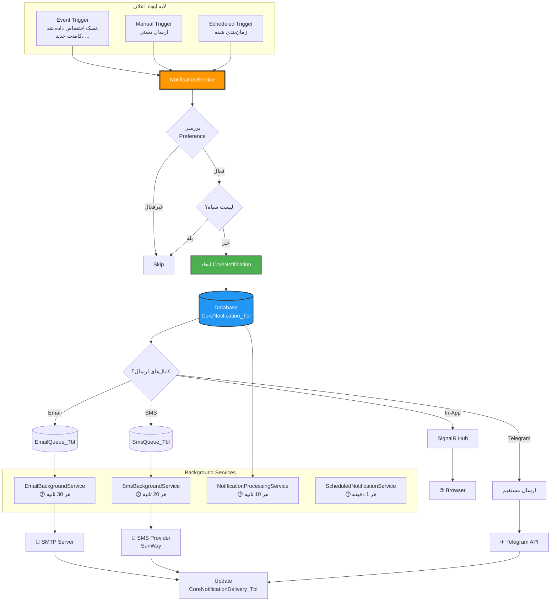
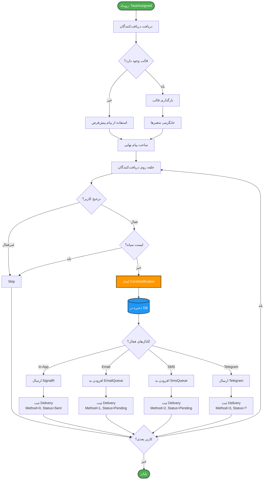
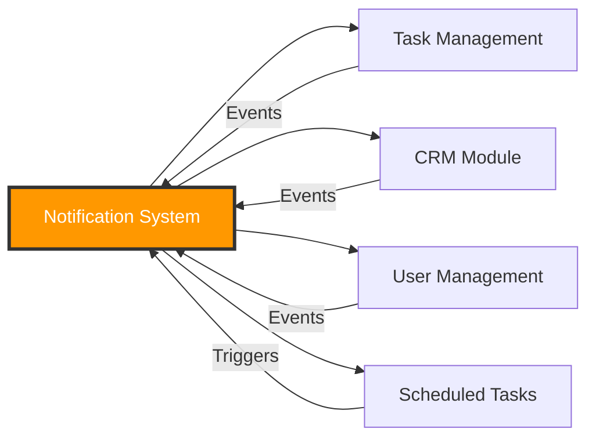

# 🔔 نمودار سیستم اعلان‌رسانی (Notification System)

## معرفی

سیستم اعلان‌رسانی MahERP یک **سیستم پیشرفته و چندکاناله** است که از **زمان‌بندی خودکار**، **قالب‌های پویا** و **ارسال هوشمند** پشتیبانی می‌کند.

---

## 🎯 ویژگی‌های کلیدی

- ✅ **3 کانال ارسال:** Email, SMS, Telegram
- ✅ **قالب‌های پویا** با 20+ متغیر
- ✅ **زمان‌بندی خودکار** (روزانه، هفتگی، ماهانه)
- ✅ **SignalR** برای اعلان‌های Real-time
- ✅ **صف ارسال** با Background Services
- ✅ **لیست سیاه** (Blacklist)
- ✅ **ترجیحات کاربر** (User Preferences)
- ✅ **آمار و گزارش‌گیری**

---

## 🏗️ معماری سیستم



---

## 📊 Entity: CoreNotification

```csharp
public class CoreNotification
{
    public int Id { get; set; }
    
    // ⭐ سیستم و نوع
    public byte SystemId { get; set; }  // 1-7: مالی، منابع انسانی، CRM، ...
    public byte NotificationTypeGeneral { get; set; }  // 0-10: اطلاع‌رسانی، ایجاد، ...
    
    // ⭐ گیرنده و فرستنده
    public string RecipientUserId { get; set; }
    public string SenderUserId { get; set; }
    
    // ⭐ محتوا
    public string Title { get; set; }
    public string Message { get; set; }
    public string ActionUrl { get; set; }
    
    // ⭐ ارتباط با رکورد
    public int? RelatedRecordId { get; set; }
    
    // ⭐ اولویت
    public byte Priority { get; set; }  // 0=عادی, 1=مهم, 2=فوری, 3=بحرانی
    
    // ⭐ وضعیت
    public bool IsRead { get; set; }
    public DateTime? ReadDate { get; set; }
    public bool IsClicked { get; set; }
    public DateTime? ClickDate { get; set; }
    
    public DateTime CreateDate { get; set; }
    public bool IsActive { get; set; }
    
    // Navigation
    public AppUsers Recipient { get; set; }
    public AppUsers Sender { get; set; }
    public ICollection<CoreNotificationDetail> Details { get; set; }
    public ICollection<CoreNotificationDelivery> Deliveries { get; set; }
}
```

---

## 📊 Entity: CoreNotificationDelivery

```csharp
public class CoreNotificationDelivery
{
    public int Id { get; set; }
    public int CoreNotificationId { get; set; }
    
    // ⭐ کانال ارسال
    public byte DeliveryMethod { get; set; }  // 1=Email, 2=SMS, 3=Telegram
    public string DeliveryAddress { get; set; }  // ایمیل، شماره، ChatId
    
    // ⭐ وضعیت
    public byte DeliveryStatus { get; set; }  // 0=Pending, 1=Sent, 2=Delivered, 3=Failed
    
    // ⭐ تلاش‌ها
    public int AttemptCount { get; set; }
    public DateTime? DeliveryDate { get; set; }
    public string ErrorMessage { get; set; }
    
    public DateTime CreateDate { get; set; }
    
    // Navigation
    public CoreNotification CoreNotification { get; set; }
}
```

---

## 📊 Entity: NotificationTemplate

```csharp
public class NotificationTemplate
{
    public int Id { get; set; }
    
    // ⭐ اطلاعات پایه
    public string TemplateName { get; set; }
    public int NotificationEventType { get; set; }  // TaskAssigned, TaskCompleted, ...
    public byte Channel { get; set; }  // 1=Email, 2=SMS, 3=Telegram
    
    // ⭐ محتوا
    public string Subject { get; set; }
    public string MessageTemplate { get; set; }  // با متغیرهای {{Variable}}
    
    // ⭐ دریافت‌کنندگان
    public byte RecipientMode { get; set; }  // 0=همه, 1=خاص, 2=همه به جز...
    
    // ⭐⭐⭐ زمان‌بندی (جدید)
    public bool IsScheduled { get; set; }
    public byte? ScheduleType { get; set; }  // 0=دستی, 1=روزانه, 2=هفتگی, 3=ماهانه
    public string ScheduledTime { get; set; }  // "07:15"
    public string ScheduledDaysOfWeek { get; set; }  // "1,3,5"
    public int? ScheduledDayOfMonth { get; set; }  // 15
    
    public DateTime? LastExecutionDate { get; set; }
    public DateTime? NextExecutionDate { get; set; }
    public bool IsScheduleEnabled { get; set; }
    
    public bool IsActive { get; set; }
    
    // Navigation
    public ICollection<NotificationTemplateRecipient> Recipients { get; set; }
    public ICollection<NotificationTemplateVariable> Variables { get; set; }
}
```

---

## 🔤 متغیرهای پویا (Dynamic Variables)

### متغیرهای عمومی

| متغیر | توضیحات | مثال |
|-------|---------|------|
| `{{RecipientFullName}}` | نام کامل دریافت‌کننده | احمد محمدی |
| `{{RecipientFirstName}}` | نام دریافت‌کننده | احمد |
| `{{SenderFullName}}` | نام کامل فرستنده | علی رضایی |
| `{{Date}}` | تاریخ میلادی | 2024-12-20 |
| `{{PersianDate}}` | تاریخ شمسی | 1403/10/01 |
| `{{Time}}` | ساعت فعلی | 09:30 |
| `{{DateTime}}` | تاریخ و ساعت میلادی | 2024-12-20 09:30 |
| `{{PersianDateTime}}` | تاریخ و ساعت شمسی | 1403/10/01 09:30 |

### متغیرهای تسک

| متغیر | توضیحات | مثال |
|-------|---------|------|
| `{{TaskTitle}}` | عنوان تسک | تماس با مشتری X |
| `{{TaskCode}}` | کد تسک | TSK-2024-00123 |
| `{{TaskDescription}}` | توضیحات تسک | پیگیری پروژه جدید |
| `{{TaskPriority}}` | اولویت تسک | فوری |
| `{{TaskDueDate}}` | مهلت تسک | 1403/10/20 |
| `{{TaskStatus}}` | وضعیت تسک | در حال انجام |
| `{{TaskProgress}}` | درصد پیشرفت | 45% |
| `{{ActionUrl}}` | لینک تسک | https://... |

### متغیرهای ویژه

| متغیر | توضیحات | استفاده |
|-------|---------|---------|
| `{{PendingTasks}}` | لیست تسک‌های باز | برای Daily Digest |
| `{{TaskList}}` | لیست فرمت شده تسک‌ها | گزارش‌های هفتگی |
| `{{TeamName}}` | نام تیم | تیم بازاریابی |
| `{{BranchName}}` | نام شعبه | شعبه مرکزی |

---

## 📧 مثال قالب: Daily Task Digest

### قالب پیام

```html
<div style="direction: rtl; font-family: Tahoma;">
    <h2>سلام {{RecipientFullName}} عزیز،</h2>
    
    <p>خلاصه تسک‌های امروز شما:</p>
    
    {{PendingTasks}}
    
    <hr/>
    
    <div style="color: #666; font-size: 12px;">
        📅 تاریخ: {{PersianDate}}<br/>
        🕐 ساعت: {{Time}}<br/>
        🔗 <a href="{{ActionUrl}}">مشاهده تمام تسک‌ها</a>
    </div>
</div>
```

### خروجی واقعی `{{PendingTasks}}`

```html
<div class="task-list">
    <h3>📌 تسک‌های در حال انجام شما:</h3>
    
    <div class="task-item">
        <h4>1️⃣ تماس با مشتری X</h4>
        <p>📝 پیگیری پروژه جدید و دریافت بازخورد</p>
        <p>📅 شروع: 1403/10/10 | 🔚 پایان: 1403/10/20</p>
        <p>👤 سازنده: احمد محمدی | 🟡 اولویت: متوسط</p>
        <p>📊 پیشرفت: 40% (2/5 عملیات)</p>
    </div>
    
    <div class="task-item">
        <h4>2️⃣ تهیه گزارش ماهانه</h4>
        <p>📝 آماده‌سازی گزارش فروش ماه گذشته</p>
        <p>📅 شروع: 1403/10/15 | 🔚 پایان: 1403/10/25</p>
        <p>👤 سازنده: مدیر فروش | 🔴 اولویت: فوری</p>
        <p>📊 پیشرفت: 60% (3/5 عملیات)</p>
    </div>
    
    <div class="summary">
        📊 جمع کل: 2 تسک در حال انجام
    </div>
</div>
```

---

## 🔄 Flowchart: ارسال اعلان



---

## 📱 کانال‌های ارسال

### 1️⃣ Email

```csharp
public class EmailQueue
{
    public int Id { get; set; }
    public string ToEmail { get; set; }
    public string Subject { get; set; }
    public string Body { get; set; }
    public bool IsHtml { get; set; }
    public byte Priority { get; set; }
    public byte Status { get; set; }  // 0=Pending, 1=Sending, 2=Sent, 3=Failed
    public int AttemptCount { get; set; }
    public DateTime CreateDate { get; set; }
    public DateTime? SentDate { get; set; }
}
```

**Background Service:**
```csharp
// EmailBackgroundService
// اجرا: هر 30 ثانیه
// وظیفه: پردازش صف EmailQueue و ارسال
```

### 2️⃣ SMS

```csharp
public class SmsQueue
{
    public int Id { get; set; }
    public string PhoneNumber { get; set; }
    public string Message { get; set; }
    public int? ProviderId { get; set; }
    public byte Status { get; set; }
    public int AttemptCount { get; set; }
    public DateTime CreateDate { get; set; }
    public DateTime? SentDate { get; set; }
}
```

**Providers:**
- 📱 **SunWay SMS** (پیش‌فرض)
- 🔌 قابلیت افزودن Provider های دیگر

### 3️⃣ Telegram

```csharp
// ارسال مستقیم (بدون صف)
await _telegramService.SendNotificationAsync(
    message: message,
    chatId: userChatId,
    botToken: settings.BotToken,
    buttons: dynamicButtons  // دکمه‌های پویا
);
```

**ویژگی‌های خاص:**
- ✅ دکمه‌های پویا (مثلاً: "مشاهده تسک", "تکمیل")
- ✅ Webhook برای دریافت پاسخ
- ✅ پشتیبانی از Markdown

### 4️⃣ In-App (SignalR)

```javascript
// Client-side
connection.on("ReceiveNotification", function(notification) {
    showToast(notification.title, notification.message);
    updateBadge(notification.priority);
    playSound();
});
```

---

## 🔐 سیستم ترجیحات کاربر

```csharp
public class UserNotificationPreference
{
    public int Id { get; set; }
    public string UserId { get; set; }
    
    // ⭐ ترجیحات کلی
    public bool EnableInApp { get; set; }
    public bool EnableEmail { get; set; }
    public bool EnableSms { get; set; }
    public bool EnableTelegram { get; set; }
    
    // ⭐ ترجیحات بر اساس نوع
    public int? NotificationEventType { get; set; }
    public bool IsEnabled { get; set; }
    
    // ⭐ زمان‌بندی
    public TimeSpan? QuietHoursStart { get; set; }  // 22:00
    public TimeSpan? QuietHoursEnd { get; set; }    // 08:00
    
    // ⭐ فرکانس
    public byte? DigestFrequency { get; set; }  // 0=فوری, 1=روزانه, 2=هفتگی
}
```

---

## 🚫 لیست سیاه (Blacklist)

```csharp
public class NotificationBlacklist
{
    public int Id { get; set; }
    
    public string Email { get; set; }
    public string PhoneNumber { get; set; }
    public long? TelegramChatId { get; set; }
    
    public string Reason { get; set; }
    public DateTime CreateDate { get; set; }
    public bool IsActive { get; set; }
}
```

**استفاده:**
```csharp
// قبل از ارسال
if (await _blacklistService.IsBlockedAsync(email: recipientEmail))
{
    // Skip این دریافت‌کننده
    return;
}
```

---

## ⏰ زمان‌بندی خودکار اعلان‌ها

### Background Service: ScheduledNotificationBackgroundService

```csharp
// ⏱️ اجرا: هر 1 دقیقه
// 🌍 TimeZone: Iran Standard Time

protected override async Task ExecuteAsync(CancellationToken stoppingToken)
{
    while (!stoppingToken.IsCancellationRequested)
    {
        var nowIran = TimeZoneInfo.ConvertTimeFromUtc(
            DateTime.UtcNow, 
            IranTimeZone
        );
        
        // ⭐ Query: قالب‌های آماده
        var dueTemplates = await _context.NotificationTemplate_Tbl
            .Where(t =>
                t.IsScheduled &&
                t.IsScheduleEnabled &&
                t.IsActive &&
                t.NextExecutionDate.HasValue &&
                t.NextExecutionDate.Value <= nowIran &&
                // ⭐ جلوگیری از اجرای مکرر
                (!t.LastExecutionDate.HasValue || 
                 EF.Functions.DateDiffMinute(t.LastExecutionDate.Value, nowIran) >= 1))
            .ToListAsync();
        
        foreach (var template in dueTemplates)
        {
            await ExecuteScheduledTemplateAsync(template, nowIran);
        }
        
        await Task.Delay(TimeSpan.FromMinutes(1), stoppingToken);
    }
}
```

### مثال: اعلان روزانه تسک‌ها

```csharp
var template = new NotificationTemplate
{
    TemplateName = "خلاصه روزانه تسک‌ها",
    NotificationEventType = 13, // DailyTaskDigest
    Channel = 3, // Telegram
    
    MessageTemplate = @"
سلام {{RecipientFullName}} عزیز,

{{PendingTasks}}

---
📅 تاریخ: {{PersianDate}}
🕐 ساعت: {{Time}}
🔗 مشاهده تمام تسک‌ها: {{ActionUrl}}
    ",
    
    RecipientMode = 0, // همه کاربران
    
    // ⭐ زمان‌بندی
    IsScheduled = true,
    ScheduleType = 1, // روزانه
    ScheduledTime = "07:15",
    IsScheduleEnabled = true,
    IsActive = true
};
```

---

## 📊 آمار و گزارش‌گیری

### Entity: NotificationDeliveryStats

```csharp
public class NotificationDeliveryStats
{
    public int Id { get; set; }
    public DateTime StatDate { get; set; }
    public byte DeliveryMethod { get; set; }
    
    public int TotalSent { get; set; }
    public int TotalDelivered { get; set; }
    public int TotalFailed { get; set; }
    
    public decimal SuccessRate { get; set; }  // درصد موفقیت
    public decimal AverageDeliveryTime { get; set; }  // میانگین زمان ارسال
}
```

### Query آماری

```sql
-- آمار روزانه ارسال
SELECT 
    CAST(CreateDate AS DATE) AS Date,
    DeliveryMethod,
    COUNT(*) AS TotalSent,
    SUM(CASE WHEN DeliveryStatus = 2 THEN 1 ELSE 0 END) AS Delivered,
    SUM(CASE WHEN DeliveryStatus = 3 THEN 1 ELSE 0 END) AS Failed,
    AVG(DATEDIFF(SECOND, CreateDate, DeliveryDate)) AS AvgDeliverySeconds
FROM CoreNotificationDelivery_Tbl
WHERE CreateDate >= DATEADD(DAY, -30, GETDATE())
GROUP BY CAST(CreateDate AS DATE), DeliveryMethod
ORDER BY Date DESC, DeliveryMethod;
```

---

## 💡 نکات پیاده‌سازی

### ✅ **1. جلوگیری از Spam**

```csharp
// محدودیت تعداد اعلان در بازه زمانی
public async Task<bool> CanSendNotificationAsync(string userId)
{
    var recentCount = await _context.CoreNotification_Tbl
        .Where(n =>
            n.RecipientUserId == userId &&
            n.CreateDate >= DateTime.Now.AddMinutes(-5))
        .CountAsync();
    
    return recentCount < 10; // حداکثر 10 اعلان در 5 دقیقه
}
```

### ✅ **2. Retry Logic**

```csharp
// تلاش مجدد برای ارسال‌های ناموفق
if (delivery.AttemptCount < 3)
{
    delivery.AttemptCount++;
    delivery.DeliveryStatus = 0; // Pending
    // تلاش مجدد در دفعه بعد
}
else
{
    delivery.DeliveryStatus = 3; // Failed
}
```

### ✅ **3. Batch Processing**

```csharp
// پردازش دسته‌جمعی برای عملکرد بهتر
var batch = await _context.EmailQueue_Tbl
    .Where(e => e.Status == 0)
    .OrderBy(e => e.Priority)
    .Take(50)
    .ToListAsync();

foreach (var email in batch)
{
    await SendEmailAsync(email);
}
```

---

## 🔗 ارتباط با سایر سیستم‌ها



---

**نسخه مستند:** 3.0.0  
**آخرین بروزرسانی:** آذر 1403  
**وضعیت:** ✅ Active & Advanced

---

[🔙 بازگشت به فهرست](README.md) | [➡️ بعدی: Background Services](07-Background-Services-Diagram.md)
