# ⚙️ نمودار Background Services و زمان‌بندی

## معرفی

MahERP از **8 Background Service** برای پردازش خودکار و زمان‌بندی استفاده می‌کند. این سرویس‌ها به صورت مستقل و موازی اجرا می‌شوند.

---

## 📋 لیست کامل Background Services


---

## 🔄 جدول زمان‌بندی

| Service | فاصله اجرا | TimeZone | اولویت | وظیفه |
|---------|-----------|----------|---------|-------|
| `TelegramPollingService` | ⏱️ **5 ثانیه** | UTC | بالا | دریافت پیام‌های تلگرام |
| `NotificationProcessingService` | ⏱️ **10 ثانیه** | UTC | بالا | پردازش اعلان‌های رویدادی |
| `SmsBackgroundService` | ⏱️ **20 ثانیه** | UTC | متوسط | ارسال پیامک‌ها |
| `EmailBackgroundService` | ⏱️ **30 ثانیه** | UTC | متوسط | ارسال ایمیل‌ها |
| `ScheduledNotificationService` | ⏱️ **1 دقیقه** | **Iran** 🇮🇷 | بالا | اجرای قالب‌های زمان‌بندی شده |
| `ScheduledTaskCreationService` 🆕 | ⏱️ **1 دقیقه** | **Iran** 🇮🇷 | بالا | ساخت تسک‌های زمان‌بندی شده |
| `ModuleTrackingService` | ⏱️ **5 دقیقه** | UTC | پایین | جمع‌آوری آمار ماژول‌ها |
| `ExpiredRoleCleanupService` | ⏱️ **روزانه 02:00** | **Iran** 🇮🇷 | پایین | حذف نقش‌های منقضی |

---

## 🔍 جزئیات هر Background Service

### 1️⃣ NotificationProcessingBackgroundService

**وظیفه:** پردازش اعلان‌های رویدادی (Event-based)

```csharp
public class NotificationProcessingBackgroundService : BackgroundService
{
    private readonly TimeSpan _interval = TimeSpan.FromSeconds(10);
    
    protected override async Task ExecuteAsync(CancellationToken stoppingToken)
    {
        while (!stoppingToken.IsCancellationRequested)
        {
            try
            {
                // 1️⃣ دریافت اعلان‌های پردازش نشده
                var pendingNotifications = await GetPendingNotificationsAsync();
                
                // 2️⃣ پردازش هر اعلان
                foreach (var notification in pendingNotifications)
                {
                    await ProcessNotificationAsync(notification);
                }
            }
            catch (Exception ex)
            {
                _logger.LogError(ex, "خطا در NotificationProcessingService");
            }
            
            await Task.Delay(_interval, stoppingToken);
        }
    }
}
```

**جریان کار:**


---

### 2️⃣ ScheduledNotificationBackgroundService ⭐

**وظیفه:** اجرای قالب‌های اعلان زمان‌بندی شده

```csharp
public class ScheduledNotificationBackgroundService : BackgroundService
{
    private readonly TimeSpan _interval = TimeSpan.FromMinutes(1);
    private static readonly TimeZoneInfo IranTimeZone = 
        TimeZoneInfo.FindSystemTimeZoneById("Iran Standard Time");
    
    protected override async Task ExecuteAsync(CancellationToken stoppingToken)
    {
        while (!stoppingToken.IsCancellationRequested)
        {
            try
            {
                var nowIran = TimeZoneInfo.ConvertTimeFromUtc(
                    DateTime.UtcNow, 
                    IranTimeZone
                );
                
                // ⭐ Query: قالب‌های آماده برای اجرا
                var dueTemplates = await _context.NotificationTemplate_Tbl
                    .Where(t =>
                        t.IsScheduled &&
                        t.IsScheduleEnabled &&
                        t.IsActive &&
                        t.NextExecutionDate.HasValue &&
                        t.NextExecutionDate.Value <= nowIran &&
                        // ⭐⭐⭐ جلوگیری از اجرای مکرر
                        (!t.LastExecutionDate.HasValue || 
                         EF.Functions.DateDiffMinute(t.LastExecutionDate.Value, nowIran) >= 1))
                    .ToListAsync(stoppingToken);
                
                foreach (var template in dueTemplates)
                {
                    // ⭐ Double-check در حافظه
                    if (template.LastExecutionDate.HasValue &&
                        (nowIran - template.LastExecutionDate.Value).TotalMinutes < 1)
                    {
                        continue; // Skip
                    }
                    
                    await ExecuteScheduledTemplateAsync(template, nowIran);
                }
            }
            catch (Exception ex)
            {
                _logger.LogError(ex, "خطا در ScheduledNotificationService");
            }
            
            await Task.Delay(_interval, stoppingToken);
        }
    }
}
```

**جریان کار:**


---

### 3️⃣ ScheduledTaskCreationBackgroundService 🆕

**وظیفه:** ساخت خودکار تسک‌ها بر اساس زمان‌بندی

```csharp
public class ScheduledTaskCreationBackgroundService : BackgroundService
{
    private readonly TimeSpan _interval = TimeSpan.FromMinutes(1);
    private static readonly TimeZoneInfo IranTimeZone = 
        TimeZoneInfo.FindSystemTimeZoneById("Iran Standard Time");
    
    protected override async Task ExecuteAsync(CancellationToken stoppingToken)
    {
        while (!stoppingToken.IsCancellationRequested)
        {
            try
            {
                var nowIran = TimeZoneInfo.ConvertTimeFromUtc(
                    DateTime.UtcNow, 
                    IranTimeZone
                );
                
                // ⭐ Query زمان‌بندی‌های آماده
                var dueSchedules = await _context.ScheduledTaskCreation_Tbl
                    .Where(s =>
                        s.IsScheduleEnabled &&
                        s.IsActive &&
                        s.NextExecutionDate.HasValue &&
                        s.NextExecutionDate.Value <= nowIran)
                    .ToListAsync(stoppingToken);
                
                foreach (var schedule in dueSchedules)
                {
                    await ExecuteScheduleAsync(schedule, nowIran);
                }
            }
            catch (Exception ex)
            {
                _logger.LogError(ex, "خطا در ScheduledTaskCreationService");
            }
            
            await Task.Delay(_interval, stoppingToken);
        }
    }
    
    private async Task ExecuteScheduleAsync(
        ScheduledTaskCreation schedule, 
        DateTime nowIran)
    {
        // 1️⃣ Parse JSON Template
        var template = JsonSerializer.Deserialize<TaskTemplate>(
            schedule.TaskTemplateJson
        );
        
        // 2️⃣ جایگزینی متغیرهای پویا
        template.Title = ReplaceVariables(template.Title, nowIran);
        template.Description = ReplaceVariables(template.Description, nowIran);
        
        // 3️⃣ ساخت تسک
        var task = await _taskRepository.CreateTaskAsync(template, schedule.Id);
        
        // 4️⃣ ارسال اعلان
        await _notificationService.SendTaskAssignedNotificationsAsync(task);
        
        // 5️⃣ بروزرسانی زمان‌بندی
        schedule.LastExecutionDate = nowIran;
        schedule.ExecutionCount++;
        schedule.NextExecutionDate = CalculateNextExecutionDate(schedule);
        
        // 6️⃣ بررسی شرایط توقف
        if (schedule.MaxOccurrences.HasValue && 
            schedule.ExecutionCount >= schedule.MaxOccurrences.Value)
        {
            schedule.IsScheduleEnabled = false;
        }
        
        await _context.SaveChangesAsync();
    }
}
```

---

### 4️⃣ EmailBackgroundService

**وظیفه:** ارسال ایمیل‌ها از صف

```csharp
public class EmailBackgroundService : BackgroundService
{
    private readonly TimeSpan _interval = TimeSpan.FromSeconds(30);
    
    protected override async Task ExecuteAsync(CancellationToken stoppingToken)
    {
        while (!stoppingToken.IsCancellationRequested)
        {
            try
            {
                // 1️⃣ دریافت ایمیل‌های Pending
                var pendingEmails = await _context.EmailQueue_Tbl
                    .Where(e => e.Status == 0)  // Pending
                    .OrderBy(e => e.Priority)   // اولویت بالا اول
                    .ThenBy(e => e.CreateDate)  // قدیمی‌ترها اول
                    .Take(10)                   // Batch = 10
                    .ToListAsync(stoppingToken);
                
                // 2️⃣ ارسال
                foreach (var email in pendingEmails)
                {
                    await SendEmailAsync(email);
                }
            }
            catch (Exception ex)
            {
                _logger.LogError(ex, "خطا در EmailBackgroundService");
            }
            
            await Task.Delay(_interval, stoppingToken);
        }
    }
}
```

---

### 5️⃣ SmsBackgroundService

**وظیفه:** ارسال پیامک‌ها از صف

```csharp
public class SmsBackgroundService : BackgroundService
{
    private readonly TimeSpan _interval = TimeSpan.FromSeconds(20);
    
    protected override async Task ExecuteAsync(CancellationToken stoppingToken)
    {
        while (!stoppingToken.IsCancellationRequested)
        {
            try
            {
                var pendingSms = await _context.SmsQueue_Tbl
                    .Where(s => s.Status == 0)
                    .OrderBy(s => s.CreateDate)
                    .Take(5)  // Batch کوچک‌تر برای SMS
                    .ToListAsync(stoppingToken);
                
                foreach (var sms in pendingSms)
                {
                    await SendSmsAsync(sms);
                }
            }
            catch (Exception ex)
            {
                _logger.LogError(ex, "خطا در SmsBackgroundService");
            }
            
            await Task.Delay(_interval, stoppingToken);
        }
    }
}
```

---

### 6️⃣ TelegramPollingBackgroundService

**وظیفه:** دریافت پیام‌های تلگرام

```csharp
public class TelegramPollingBackgroundService : BackgroundService
{
    private readonly TimeSpan _interval = TimeSpan.FromSeconds(5);
    private int _lastUpdateId = 0;
    
    protected override async Task ExecuteAsync(CancellationToken stoppingToken)
    {
        while (!stoppingToken.IsCancellationRequested)
        {
            try
            {
                var updates = await _telegramClient.GetUpdatesAsync(
                    offset: _lastUpdateId + 1,
                    timeout: 5
                );
                
                foreach (var update in updates)
                {
                    await ProcessUpdateAsync(update);
                    _lastUpdateId = Math.Max(_lastUpdateId, update.Id);
                }
            }
            catch (Exception ex)
            {
                _logger.LogError(ex, "خطا در TelegramPollingService");
            }
            
            await Task.Delay(_interval, stoppingToken);
        }
    }
}
```

---

### 7️⃣ ModuleTrackingBackgroundService

**وظیفه:** جمع‌آوری آمار استفاده از ماژول‌ها

```csharp
public class ModuleTrackingBackgroundService : BackgroundService
{
    private readonly TimeSpan _interval = TimeSpan.FromMinutes(5);
    
    protected override async Task ExecuteAsync(CancellationToken stoppingToken)
    {
        while (!stoppingToken.IsCancellationRequested)
        {
            try
            {
                // 1️⃣ آمار فعالیت کاربران
                var activeUsers = await GetActiveUsersLastHourAsync();
                
                // 2️⃣ آمار استفاده از ماژول‌ها
                var moduleStats = await GetModuleUsageStatsAsync();
                
                // 3️⃣ ذخیره آمار
                await SaveStatsAsync(activeUsers, moduleStats);
            }
            catch (Exception ex)
            {
                _logger.LogError(ex, "خطا در ModuleTrackingService");
            }
            
            await Task.Delay(_interval, stoppingToken);
        }
    }
}
```

---

### 8️⃣ ExpiredRoleCleanupBackgroundService

**وظیفه:** غیرفعال کردن نقش‌های منقضی شده

```csharp
public class ExpiredRoleCleanupBackgroundService : BackgroundService
{
    private static readonly TimeZoneInfo IranTimeZone = 
        TimeZoneInfo.FindSystemTimeZoneById("Iran Standard Time");
    
    protected override async Task ExecuteAsync(CancellationToken stoppingToken)
    {
        while (!stoppingToken.IsCancellationRequested)
        {
            try
            {
                var nowIran = TimeZoneInfo.ConvertTimeFromUtc(
                    DateTime.UtcNow, 
                    IranTimeZone
                );
                
                // ⏰ فقط در ساعت 02:00 صبح اجرا شود
                if (nowIran.Hour == 2 && nowIran.Minute < 5)
                {
                    await CleanupExpiredRolesAsync(nowIran);
                }
                
                // ⏱️ چک هر 5 دقیقه
                await Task.Delay(TimeSpan.FromMinutes(5), stoppingToken);
            }
            catch (Exception ex)
            {
                _logger.LogError(ex, "خطا در ExpiredRoleCleanupService");
            }
        }
    }
    
    private async Task CleanupExpiredRolesAsync(DateTime nowIran)
    {
        var expiredRoles = await _context.UserRole_Tbl
            .Where(ur =>
                ur.IsActive &&
                ur.EndDate.HasValue &&
                ur.EndDate.Value < nowIran)
            .ToListAsync();
        
        foreach (var role in expiredRoles)
        {
            role.IsActive = false;
            _logger.LogInformation(
                $"نقش {role.RoleId} برای کاربر {role.UserId} غیرفعال شد."
            );
        }
        
        await _context.SaveChangesAsync();
    }
}
```

---

## 📊 Gantt Chart: زمان‌بندی Services

```mermaid
gantt
    title Background Services زمان‌بندی (24 ساعته)
    dateFormat HH:mm
    axisFormat %H:%M
    
    section Email
    EmailBackgroundService :active, email, 00:00, 24h
    
    section SMS
    SmsBackgroundService :active, sms, 00:00, 24h
    
    section Telegram
    TelegramPollingService :active, telegram, 00:00, 24h
    
    section Notifications
    NotificationProcessing :active, notify, 00:00, 24h
    ScheduledNotifications :crit, scheduled, 00:00, 24h
    
    section Scheduled Tasks 🆕
    ScheduledTaskCreation :crit, schtask, 00:00, 24h
    
    section Maintenance
    ExpiredRoleCleanup :done, cleanup, 02:00, 1h
    ModuleTracking :active, track, 00:00, 24h
    
    section ⭐ مثال Daily Task
    FirstExecution :milestone, first, 09:00, 0
    SecondExecution :milestone, second, 09:00, 0
```



---

## 🔄 مقایسه: Scheduled Notification vs Scheduled Task


### تفاوت‌های کلیدی

| ویژگی | Scheduled Notification | Scheduled Task 🆕 |
|-------|----------------------|------------------|
| **هدف** | اطلاع‌رسانی | ساخت تسک کامل |
| **خروجی** | فقط پیام | تسک + عملیات + اختصاص |
| **قابلیت پیگیری** | ❌ خیر | ✅ بله |
| **ثبت در Tasks_Tbl** | ❌ خیر | ✅ بله (با ScheduleId) |
| **اعلان خودکار** | ✅ خودش پیام است | ✅ اعلان جداگانه ارسال می‌شود |
| **مثال** | خلاصه روزانه تسک‌ها | گزارش ماهانه (تسک جدید) |

---

## 💡 نکات مهم پیاده‌سازی

### ✅ **1. TimeZone مناسب**

```csharp
// ❌ اشتباه
var now = DateTime.Now;

// ✅ صحیح
var iranTimeZone = TimeZoneInfo.FindSystemTimeZoneById("Iran Standard Time");
var nowIran = TimeZoneInfo.ConvertTimeFromUtc(DateTime.UtcNow, iranTimeZone);
```

### ✅ **2. جلوگیری از اجرای مکرر**

```csharp
// ⭐ Mechanism دوگانه:

// 1️⃣ در Query
WHERE (!LastExecutionDate.HasValue || 
       DateDiffMinute(LastExecutionDate, NOW) >= 1)

// 2️⃣ در کد (Double-check)
if (template.LastExecutionDate.HasValue &&
    (nowIran - template.LastExecutionDate.Value).TotalMinutes < 1)
{
    continue; // Skip
}
```

### ✅ **3. Graceful Shutdown**

```csharp
protected override async Task ExecuteAsync(CancellationToken stoppingToken)
{
    while (!stoppingToken.IsCancellationRequested)
    {
        try
        {
            await DoWorkAsync();
        }
        catch (OperationCanceledException)
        {
            // Application is shutting down
            _logger.LogInformation("Service is stopping gracefully");
            break;
        }
        catch (Exception ex)
        {
            _logger.LogError(ex, "Error in service");
        }
        
        await Task.Delay(_interval, stoppingToken);
    }
}
```

### ✅ **4. Batch Processing**

```csharp
// پردازش دسته‌جمعی برای Performance بهتر
var batch = await _context.EmailQueue_Tbl
    .Where(e => e.Status == 0)
    .OrderBy(e => e.Priority)
    .Take(10)  // ⭐ حجم مناسب batch
    .ToListAsync();
```

### ✅ **5. Retry Logic**

```csharp
if (email.AttemptCount < 3)
{
    email.Status = 1; // Sending
    try
    {
        await SendAsync(email);
        email.Status = 2; // Sent
    }
    catch
    {
        email.AttemptCount++;
        email.Status = 0; // Pending (تلاش مجدد)
    }
}
else
{
    email.Status = 3; // Failed
}
```

---

## 🐛 Troubleshooting

### مشکل 1: Service اجرا نمی‌شود

**بررسی:**
```csharp
// در Program.cs
builder.Services.AddHostedService<YourBackgroundService>();
```

**لاگ:**
```csharp
_logger.LogInformation("Service started at {Time}", DateTime.Now);
```

### مشکل 2: اجرای مکرر

**راه حل:**
```csharp
// اضافه کردن فیلتر DateDiffMinute در Query
// + Double-check در کد
```

### مشکل 3: Memory Leak

**راه حل:**
```csharp
// استفاده از IServiceScopeFactory
using (var scope = _serviceScopeFactory.CreateScope())
{
    var dbContext = scope.ServiceProvider.GetRequiredService<AppDbContext>();
    // کار با dbContext
}
// dbContext به صورت خودکار Dispose می‌شود
```

---

## 📝 Query های مفید

### وضعیت Background Services

```sql
-- آخرین اجرای هر Service
SELECT 
    'ScheduledNotification' AS ServiceName,
    MAX(LastExecutionDate) AS LastRun,
    COUNT(*) AS TotalSchedules
FROM NotificationTemplate_Tbl
WHERE IsScheduled = 1

UNION ALL

SELECT 
    'ScheduledTask',
    MAX(LastExecutionDate),
    COUNT(*)
FROM ScheduledTaskCreation_Tbl
WHERE IsScheduleEnabled = 1;
```

### آمار ارسال

```sql
-- آمار ارسال 24 ساعت گذشته
SELECT 
    'Email' AS Channel,
    COUNT(*) AS Total,
    SUM(CASE WHEN Status = 2 THEN 1 ELSE 0 END) AS Sent,
    SUM(CASE WHEN Status = 3 THEN 1 ELSE 0 END) AS Failed
FROM EmailQueue_Tbl
WHERE CreateDate >= DATEADD(HOUR, -24, GETDATE())

UNION ALL

SELECT 
    'SMS',
    COUNT(*),
    SUM(CASE WHEN Status = 2 THEN 1 ELSE 0 END),
    SUM(CASE WHEN Status = 3 THEN 1 ELSE 0 END)
FROM SmsQueue_Tbl
WHERE CreateDate >= DATEADD(HOUR, -24, GETDATE());
```

---

**نسخه مستند:** 3.0.0  
**آخرین بروزرسانی:** آذر 1403  
**وضعیت:** ✅ Active & Optimized

---

[🔙 بازگشت به فهرست](README.md) | [➡️ بعدی: آمار و رفع مشکلات](08-Statistics-Troubleshooting.md)
