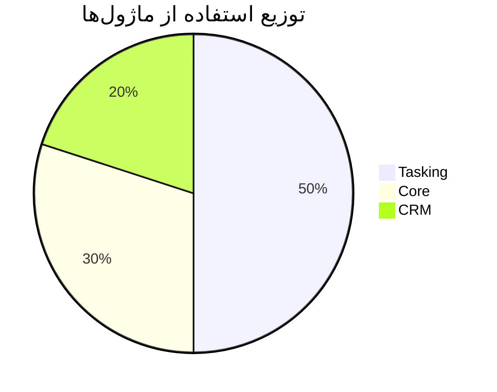
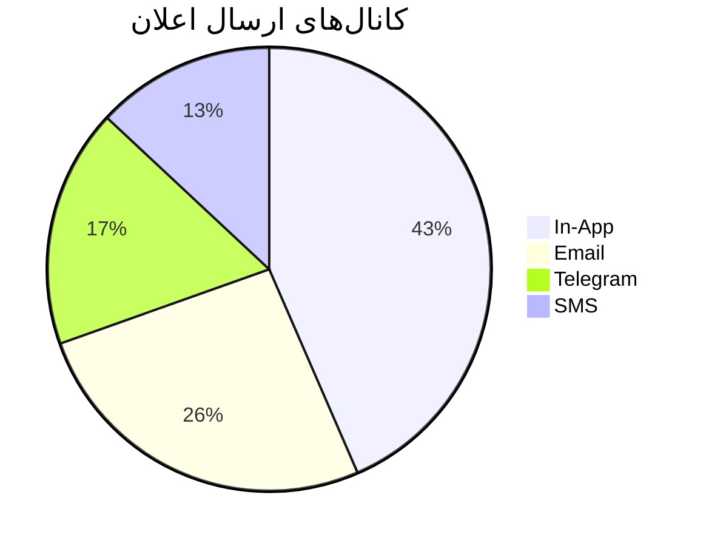
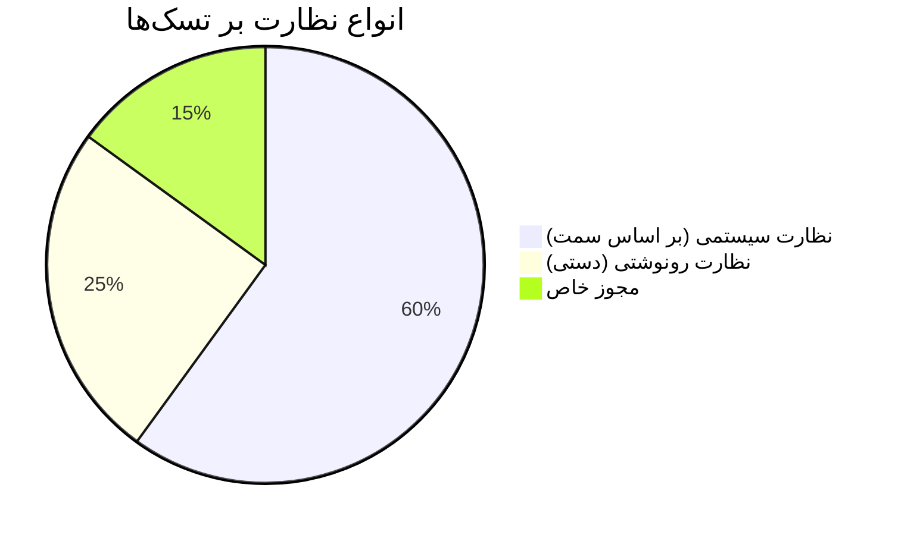
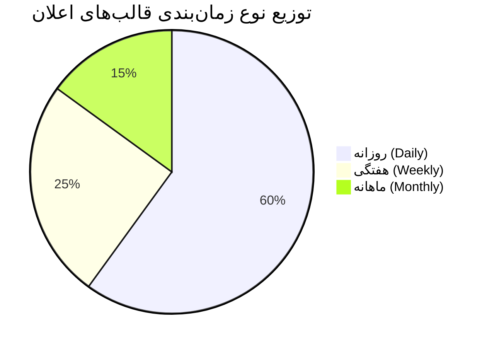
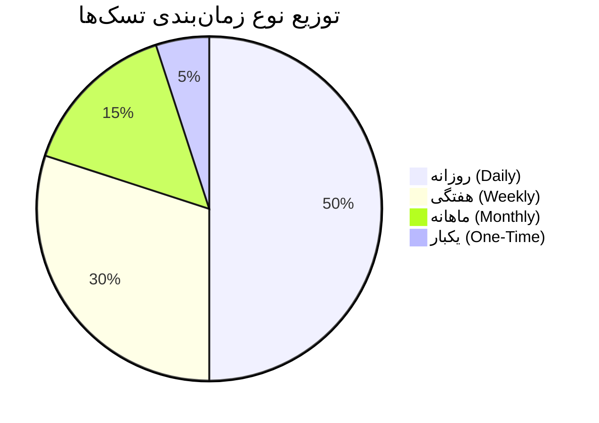
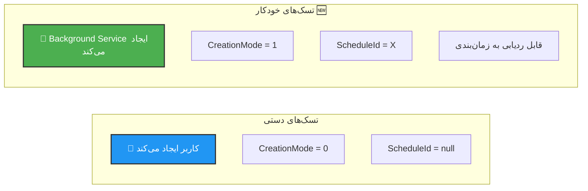
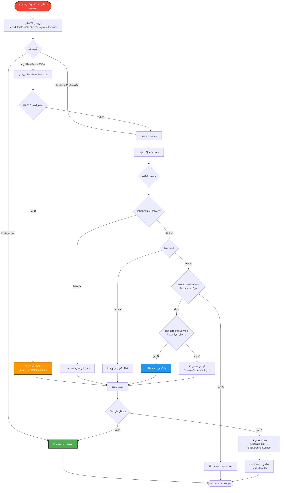

# 📊 آمار و رفع مشکلات (Statistics & Troubleshooting)

## معرفی

این بخش شامل **نمودارهای آماری**، **Query های تحلیلی** و **راهنمای رفع مشکلات** سیستم MahERP است.

---

## 📈 نمودارهای آماری

### توزیع استفاده از ماژول‌ها



**Query:**
```sql
SELECT 
    ModuleName,
    COUNT(DISTINCT UserId) AS UniqueUsers,
    COUNT(*) AS TotalAccess
FROM UserActivityLog_Tbl
WHERE CreateDate >= DATEADD(DAY, -30, GETDATE())
GROUP BY ModuleName
ORDER BY TotalAccess DESC;
```

---

### کانال‌های ارسال اعلان



**Query:**
```sql
SELECT 
    CASE DeliveryMethod
        WHEN 0 THEN 'In-App'
        WHEN 1 THEN 'Email'
        WHEN 2 THEN 'SMS'
        WHEN 3 THEN 'Telegram'
    END AS Channel,
    COUNT(*) AS TotalSent,
    SUM(CASE WHEN DeliveryStatus = 2 THEN 1 ELSE 0 END) AS Delivered,
    CAST(SUM(CASE WHEN DeliveryStatus = 2 THEN 1.0 ELSE 0 END) / COUNT(*) * 100 AS DECIMAL(5,2)) AS SuccessRate
FROM CoreNotificationDelivery_Tbl
WHERE CreateDate >= DATEADD(DAY, -7, GETDATE())
GROUP BY DeliveryMethod
ORDER BY TotalSent DESC;
```

---

### انواع نظارت بر تسک‌ها



**Query:**
```sql
-- نظارت رونوشتی
SELECT 
    'Carbon Copy' AS SupervisionType,
    COUNT(DISTINCT TaskId) AS TotalTasks,
    COUNT(*) AS TotalViewers
FROM TaskViewer_Tbl
WHERE IsActive = 1

UNION ALL

-- مجوز خاص
SELECT 
    'Special Permission',
    COUNT(DISTINCT GranteeUserId),
    COUNT(*)
FROM TaskViewPermission_Tbl
WHERE IsActive = 1;
```

---

### نوع زمان‌بندی قالب‌های اعلان



**Query:**
```sql
SELECT 
    CASE ScheduleType
        WHEN 1 THEN 'روزانه'
        WHEN 2 THEN 'هفتگی'
        WHEN 3 THEN 'ماهانه'
    END AS Type,
    COUNT(*) AS TotalSchedules,
    SUM(CASE WHEN IsScheduleEnabled = 1 THEN 1 ELSE 0 END) AS ActiveSchedules
FROM NotificationTemplate_Tbl
WHERE IsScheduled = 1
  AND IsActive = 1
GROUP BY ScheduleType;
```

---

### نوع زمان‌بندی تسک‌ها 🆕



**Query:**
```sql
SELECT 
    CASE ScheduleType
        WHEN 0 THEN 'یکبار'
        WHEN 1 THEN 'روزانه'
        WHEN 2 THEN 'هفتگی'
        WHEN 3 THEN 'ماهانه'
    END AS Type,
    COUNT(*) AS TotalSchedules,
    SUM(ExecutionCount) AS TotalExecutions,
    AVG(CAST(ExecutionCount AS FLOAT)) AS AvgExecutions
FROM ScheduledTaskCreation_Tbl
WHERE IsActive = 1
GROUP BY ScheduleType
ORDER BY TotalSchedules DESC;
```

---

### مقایسه تسک‌های دستی vs خودکار



**Query:**
```sql
SELECT 
    CASE CreationMode
        WHEN 0 THEN 'دستی'
        WHEN 1 THEN 'خودکار'
    END AS CreationType,
    COUNT(*) AS TotalTasks,
    AVG(DATEDIFF(DAY, CreateDate, DueDate)) AS AvgDurationDays,
    COUNT(CASE WHEN StatusCode = 2 THEN 1 END) AS CompletedTasks
FROM Tasks_Tbl
WHERE CreateDate >= DATEADD(MONTH, -3, GETDATE())
  AND IsActive = 1
GROUP BY CreationMode;
```

---

## 🐛 راهنمای رفع مشکلات

### 1️⃣ تسک خودکار ساخته نمی‌شود 🆕



#### Query تست

```sql
-- بررسی وضعیت زمان‌بندی‌های تسک
SELECT 
    Id,
    ScheduleTitle,
    ScheduleType,
    CASE ScheduleType
        WHEN 0 THEN 'یکبار'
        WHEN 1 THEN 'روزانه'
        WHEN 2 THEN 'هفتگی'
        WHEN 3 THEN 'ماهانه'
    END AS ScheduleTypeText,
    ScheduledTime,
    LastExecutionDate,
    NextExecutionDate,
    DATEDIFF(MINUTE, LastExecutionDate, GETDATE()) AS MinutesSinceLastExecution,
    ExecutionCount,
    MaxOccurrences,
    IsScheduleEnabled,
    IsActive,
    CASE 
        WHEN NextExecutionDate IS NULL THEN '⚠️ NextExecution خالی'
        WHEN NOT IsScheduleEnabled THEN '⏹️ غیرفعال'
        WHEN NOT IsActive THEN '🗑️ حذف شده'
        WHEN NextExecutionDate <= GETDATE() THEN '⚡ آماده اجرا'
        ELSE '⏳ در انتظار'
    END AS Status,
    CASE 
        WHEN MaxOccurrences IS NOT NULL AND ExecutionCount >= MaxOccurrences THEN '🛑 به حداکثر رسیده'
        WHEN GETDATE() >= EndDate THEN '🛑 تاریخ پایان رسیده'
        ELSE '✅ در حال اجرا'
    END AS ExecutionStatus
FROM ScheduledTaskCreation_Tbl
ORDER BY NextExecutionDate;
```

#### بررسی تسک‌های ساخته شده

```sql
SELECT 
    t.Id AS TaskId,
    t.TaskCode,
    t.Title,
    t.CreationMode,
    t.ScheduleId,
    s.ScheduleTitle,
    t.CreateDate
FROM Tasks_Tbl t
LEFT JOIN ScheduledTaskCreation_Tbl s ON t.ScheduleId = s.Id
WHERE t.CreationMode = 1  -- خودکار
ORDER BY t.CreateDate DESC;
```

---

### 2️⃣ اعلان‌های زمان‌بندی شده ارسال نمی‌شوند

#### Checklist

```
✅ بررسی وضعیت IsScheduleEnabled
✅ بررسی NextExecutionDate
✅ بررسی LastExecutionDate (حداقل 1 دقیقه فاصله)
✅ بررسی Background Service در حال اجراست
✅ بررسی لاگ‌های خطا
```

#### Query دیباگ

```sql
SELECT 
    Id,
    TemplateName,
    ScheduleType,
    ScheduledTime,
    LastExecutionDate,
    NextExecutionDate,
    DATEDIFF(MINUTE, LastExecutionDate, GETDATE()) AS MinutesSinceLastExecution,
    DATEDIFF(MINUTE, GETDATE(), NextExecutionDate) AS MinutesUntilNext,
    IsScheduleEnabled,
    IsActive,
    CASE 
        WHEN NOT IsScheduleEnabled THEN '❌ غیرفعال'
        WHEN NOT IsActive THEN '❌ حذف شده'
        WHEN NextExecutionDate <= GETDATE() AND 
             (LastExecutionDate IS NULL OR 
              DATEDIFF(MINUTE, LastExecutionDate, GETDATE()) >= 1) 
        THEN '✅ آماده اجرا'
        WHEN DATEDIFF(MINUTE, LastExecutionDate, GETDATE()) < 1 
        THEN '⏳ اجرا شده (کمتر از 1 دقیقه)'
        ELSE '⏳ در انتظار'
    END AS Status
FROM NotificationTemplate_Tbl
WHERE IsScheduled = 1
ORDER BY NextExecutionDate;
```

---

### 3️⃣ نظارت بر تسک‌ها کار نمی‌کند

#### سناریوهای مشکل

**مشکل A:** کاربر نمی‌تواند تسک زیردست را ببیند

```sql
-- بررسی سمت کاربر در تیم
SELECT 
    u.FirstName + ' ' + u.LastName AS UserName,
    t.NameFa AS TeamName,
    p.TitleFa AS PositionTitle,
    p.PowerLevel,
    p.CanViewSubordinateTasks,
    p.CanViewPeerTasks
FROM TeamMember_Tbl tm
INNER JOIN AspNetUsers u ON tm.UserId = u.Id
INNER JOIN Team_Tbl t ON tm.TeamId = t.Id
LEFT JOIN TeamPosition_Tbl p ON tm.PositionId = p.Id
WHERE tm.UserId = 'user-id'
  AND tm.IsActive = 1;
```

**مشکل B:** تسک در تیم دیگری assign شده (AssignedInTeamId)

```sql
-- بررسی AssignedInTeamId
SELECT 
    t.TaskCode,
    t.Title,
    ta.AssignedInTeamId,
    team.NameFa AS AssignedTeamName,
    u.FirstName + ' ' + u.LastName AS AssignedToUser
FROM Tasks_Tbl t
INNER JOIN TaskAssignment_Tbl ta ON t.Id = ta.TaskId
LEFT JOIN Team_Tbl team ON ta.AssignedInTeamId = team.Id
LEFT JOIN AspNetUsers u ON ta.AssignedUserId = u.Id
WHERE t.Id = @TaskId
  AND ta.IsActive = 1;
```

---

### 4️⃣ ایمیل/SMS ارسال نمی‌شود

#### بررسی صف

```sql
-- وضعیت صف ایمیل
SELECT 
    Status,
    CASE Status
        WHEN 0 THEN 'Pending'
        WHEN 1 THEN 'Sending'
        WHEN 2 THEN 'Sent'
        WHEN 3 THEN 'Failed'
    END AS StatusText,
    COUNT(*) AS Total,
    MIN(CreateDate) AS OldestItem,
    MAX(CreateDate) AS NewestItem
FROM EmailQueue_Tbl
GROUP BY Status;

-- ایمیل‌های Failed
SELECT TOP 10
    ToEmail,
    Subject,
    AttemptCount,
    CreateDate,
    SentDate,
    ErrorMessage
FROM EmailQueue_Tbl
WHERE Status = 3
ORDER BY CreateDate DESC;
```

#### بررسی Background Service

```csharp
// در لاگ‌ها دنبال این پیام‌ها بگردید:
[Information] EmailBackgroundService started
[Information] Processing 5 emails from queue
[Error] Failed to send email: {ErrorMessage}
```

---

### 5️⃣ Performance کند است

#### Query تحلیل Performance

```sql
-- تسک‌های بدون Index
SELECT 
    t.Id,
    t.TaskCode,
    COUNT(ta.Id) AS AssignmentCount,
    COUNT(to.Id) AS OperationCount
FROM Tasks_Tbl t
LEFT JOIN TaskAssignment_Tbl ta ON t.Id = ta.TaskId
LEFT JOIN TaskOperation_Tbl to ON t.Id = to.TaskId
WHERE t.IsActive = 1
GROUP BY t.Id, t.TaskCode
HAVING COUNT(ta.Id) > 50 OR COUNT(to.Id) > 100;

-- اعلان‌های خوانده نشده
SELECT 
    RecipientUserId,
    COUNT(*) AS UnreadCount
FROM CoreNotification_Tbl
WHERE IsRead = 0
  AND IsActive = 1
GROUP BY RecipientUserId
HAVING COUNT(*) > 100
ORDER BY UnreadCount DESC;
```

#### پیشنهادات بهینه‌سازی

1. **افزودن Index:**
```sql
CREATE INDEX IX_Tasks_StatusCode_DueDate 
ON Tasks_Tbl (StatusCode, DueDate) 
INCLUDE (Title, PriorityCode);

CREATE INDEX IX_CoreNotification_RecipientUserId_IsRead 
ON CoreNotification_Tbl (RecipientUserId, IsRead) 
WHERE IsActive = 1;
```

2. **Pagination:**
```csharp
// استفاده از Skip و Take
var tasks = await query
    .OrderByDescending(t => t.CreateDate)
    .Skip((pageNumber - 1) * pageSize)
    .Take(pageSize)
    .ToListAsync();
```

3. **Caching:**
```csharp
// Cache کردن داده‌های ثابت
var categories = await _cache.GetOrCreateAsync("TaskCategories", async entry =>
{
    entry.AbsoluteExpirationRelativeToNow = TimeSpan.FromHours(1);
    return await _context.TaskCategory_Tbl.ToListAsync();
});
```

---

## 📊 Dashboard Queries

### آمار کلی سیستم

```sql
-- خلاصه سیستم
SELECT 
    (SELECT COUNT(*) FROM AspNetUsers WHERE IsActive = 1) AS TotalUsers,
    (SELECT COUNT(*) FROM Tasks_Tbl WHERE IsActive = 1) AS TotalTasks,
    (SELECT COUNT(*) FROM Tasks_Tbl WHERE StatusCode = 1 AND IsActive = 1) AS InProgressTasks,
    (SELECT COUNT(*) FROM CoreNotification_Tbl WHERE IsRead = 0 AND IsActive = 1) AS UnreadNotifications,
    (SELECT COUNT(*) FROM ScheduledTaskCreation_Tbl WHERE IsScheduleEnabled = 1 AND IsActive = 1) AS ActiveSchedules;
```

### آمار هفتگی

```sql
-- فعالیت 7 روز گذشته
SELECT 
    CAST(CreateDate AS DATE) AS Date,
    COUNT(CASE WHEN CreationMode = 0 THEN 1 END) AS ManualTasks,
    COUNT(CASE WHEN CreationMode = 1 THEN 1 END) AS AutoTasks,
    COUNT(*) AS TotalTasks
FROM Tasks_Tbl
WHERE CreateDate >= DATEADD(DAY, -7, GETDATE())
  AND IsActive = 1
GROUP BY CAST(CreateDate AS DATE)
ORDER BY Date DESC;
```

### Top Users

```sql
-- کاربران فعال
SELECT TOP 10
    u.FirstName + ' ' + u.LastName AS UserName,
    COUNT(DISTINCT t.Id) AS CreatedTasks,
    COUNT(DISTINCT ta.TaskId) AS AssignedTasks,
    COUNT(DISTINCT c.Id) AS Comments
FROM AspNetUsers u
LEFT JOIN Tasks_Tbl t ON u.Id = t.CreatorUserId AND t.IsActive = 1
LEFT JOIN TaskAssignment_Tbl ta ON u.Id = ta.AssignedUserId AND ta.IsActive = 1
LEFT JOIN TaskComment_Tbl c ON u.Id = c.UserId AND c.IsActive = 1
WHERE u.IsActive = 1
  AND (t.CreateDate >= DATEADD(DAY, -30, GETDATE()) OR ta.AssignDate >= DATEADD(DAY, -30, GETDATE()))
GROUP BY u.Id, u.FirstName, u.LastName
ORDER BY CreatedTasks + AssignedTasks DESC;
```

---

## 🔍 Query های پیشرفته

### گزارش کامل تسک

```sql
-- اطلاعات کامل یک تسک
SELECT 
    -- اطلاعات پایه
    t.TaskCode,
    t.Title,
    t.Description,
    
    -- وضعیت و اولویت
    CASE t.StatusCode
        WHEN 0 THEN 'To Do'
        WHEN 1 THEN 'In Progress'
        WHEN 2 THEN 'Completed'
        WHEN 3 THEN 'Cancelled'
    END AS Status,
    CASE t.PriorityCode
        WHEN 0 THEN 'پایین'
        WHEN 1 THEN 'متوسط'
        WHEN 2 THEN 'بالا'
        WHEN 3 THEN 'فوری'
    END AS Priority,
    
    -- زمان‌بندی
    t.StartDatePersian,
    t.DueDatePersian,
    t.EstimatedHours,
    
    -- سازنده
    creator.FirstName + ' ' + creator.LastName AS Creator,
    
    -- تیم و شعبه
    team.NameFa AS TeamName,
    branch.NameFa AS BranchName,
    
    -- اختصاص‌ها
    (SELECT STRING_AGG(u.FirstName + ' ' + u.LastName, ', ')
     FROM TaskAssignment_Tbl ta
     INNER JOIN AspNetUsers u ON ta.AssignedUserId = u.Id
     WHERE ta.TaskId = t.Id AND ta.IsActive = 1) AS AssignedToUsers,
    
    -- عملیات
    (SELECT COUNT(*) 
     FROM TaskOperation_Tbl 
     WHERE TaskId = t.Id AND IsActive = 1) AS TotalOperations,
    (SELECT COUNT(*) 
     FROM TaskOperation_Tbl 
     WHERE TaskId = t.Id AND StatusCode = 2 AND IsActive = 1) AS CompletedOperations,
    
    -- نظرات و پیوست‌ها
    (SELECT COUNT(*) FROM TaskComment_Tbl WHERE TaskId = t.Id AND IsActive = 1) AS Comments,
    (SELECT COUNT(*) FROM TaskAttachment_Tbl WHERE TaskId = t.Id AND IsActive = 1) AS Attachments,
    
    -- زمان‌بندی (اگر خودکار است)
    CASE WHEN t.CreationMode = 1 THEN 'خودکار' ELSE 'دستی' END AS CreationType,
    s.ScheduleTitle AS ScheduleName
    
FROM Tasks_Tbl t
INNER JOIN AspNetUsers creator ON t.CreatorUserId = creator.Id
LEFT JOIN Team_Tbl team ON t.TeamId = team.Id
LEFT JOIN Branch_Tbl branch ON t.BranchId = branch.Id
LEFT JOIN ScheduledTaskCreation_Tbl s ON t.ScheduleId = s.Id
WHERE t.Id = @TaskId;
```

### تحلیل نظارت بر تسک‌ها

```sql
-- آمار نظارت بر تسک‌ها
WITH SupervisionStats AS (
    SELECT 
        t.Id AS TaskId,
        t.TaskCode,
        t.Title,
        -- نظارت رونوشتی
        (SELECT COUNT(*) 
         FROM TaskViewer_Tbl 
         WHERE TaskId = t.Id AND IsActive = 1) AS CarbonCopyCount,
        -- مجوز خاص
        (SELECT COUNT(DISTINCT tvp.GranteeUserId)
         FROM TaskViewPermission_Tbl tvp
         WHERE tvp.IsActive = 1
           AND (tvp.TargetUserId = t.CreatorUserId 
                OR tvp.TargetTeamId = t.TeamId)) AS SpecialPermissionCount,
        -- اختصاص‌ها
        (SELECT COUNT(*) 
         FROM TaskAssignment_Tbl 
         WHERE TaskId = t.Id AND IsActive = 1) AS AssignmentCount
    FROM Tasks_Tbl t
    WHERE t.IsActive = 1
)
SELECT 
    TaskCode,
    Title,
    AssignmentCount AS DirectAssignees,
    CarbonCopyCount AS CarbonCopyViewers,
    SpecialPermissionCount AS SpecialPermissionUsers,
    AssignmentCount + CarbonCopyCount + SpecialPermissionCount AS TotalViewers
FROM SupervisionStats
WHERE CarbonCopyCount > 0 OR SpecialPermissionCount > 0
ORDER BY TotalViewers DESC;
```

---

## 💡 نکات بهینه‌سازی

### ✅ Database

1. **Index های مفید:**
```sql
-- Tasks
CREATE INDEX IX_Tasks_StatusCode_DueDate ON Tasks_Tbl (StatusCode, DueDate) INCLUDE (Title, PriorityCode);
CREATE INDEX IX_Tasks_CreatorUserId ON Tasks_Tbl (CreatorUserId) WHERE IsActive = 1;

-- TaskAssignment
CREATE INDEX IX_TaskAssignment_AssignedUserId_AssignedInTeamId 
ON TaskAssignment_Tbl (AssignedUserId, AssignedInTeamId) WHERE IsActive = 1;

-- Notifications
CREATE INDEX IX_CoreNotification_RecipientUserId_IsRead 
ON CoreNotification_Tbl (RecipientUserId, IsRead) WHERE IsActive = 1;
```

2. **Cleanup رکوردهای قدیمی:**
```sql
-- حذف اعلان‌های خوانده شده قدیمی‌تر از 6 ماه
DELETE FROM CoreNotification_Tbl
WHERE IsRead = 1
  AND ReadDate < DATEADD(MONTH, -6, GETDATE());

-- Archive تسک‌های تکمیل شده قدیمی
-- (انتقال به جدول Archive)
```

### ✅ Application

1. **استفاده از Projection:**
```csharp
// ❌ بد
var tasks = await _context.Tasks_Tbl
    .Include(t => t.Assignments)
    .Include(t => t.Operations)
    .ToListAsync();

// ✅ خوب
var tasks = await _context.Tasks_Tbl
    .Select(t => new TaskListItemDto {
        Id = t.Id,
        Title = t.Title,
        StatusCode = t.StatusCode
    })
    .ToListAsync();
```

2. **Async/Await صحیح:**
```csharp
// ✅ استفاده صحیح
await foreach (var task in GetTasksAsync())
{
    await ProcessTaskAsync(task);
}
```

---

## 📞 تماس با پشتیبانی

اگر مشکل حل نشد، لطفاً اطلاعات زیر را ارسال کنید:

1. **لاگ‌ها** از پوشه `Logs/`
2. **Query نتایج** از بخش Troubleshooting
3. **Screenshot** از خطا (در صورت وجود)
4. **نسخه سیستم** و **تاریخ آخرین بروزرسانی**

---

**نسخه مستند:** 3.0.0  
**آخرین بروزرسانی:** آذر 1403  
**وضعیت:** ✅ Complete

---

[🔙 بازگشت به فهرست](README.md) | [📘 مستندات اصلی](../MahERP-System-Documentation.md)
