# 📊 نمودارها و دیاگرام‌های سیستم MahERP

## 📋 فهرست
1. [نمودار ERD کلی دیتابیس](#نمودار-erd-کلی)
2. [نمودار سیستم دسترسی](#نمودار-سیستم-دسترسی)
3. [نمودار سیستم تسک](#نمودار-سیستم-تسک)
4. [نمودار سیستم نظارت بر تسک‌ها](#نمودار-سیستم-نظارت-بر-تسکها) ⭐ **جدید**
5. [نمودار سیستم اعلان‌رسانی](#نمودار-سیستم-اعلانرسانی)
6. [نمودار Background Services و زمان‌بندی](#نمودار-background-services-و-زمانبندی) ⭐ **به‌روزرسانی شده**
7. [نمودار جریان کاربر](#نمودار-جریان-کاربر)

---

## 🗄️ نمودار ERD کلی

### ساختار کلی جداول

```mermaid
erDiagram
    %% ========== Users & Authentication ==========
    AppUsers ||--o{ UserRole : has
    AppUsers ||--o{ UserPermission : has
    AppUsers ||--o{ BranchUser : "works in"
    AppUsers ||--o{ TeamMember : "member of"
    AppUsers ||--o{ Tasks : creates
    AppUsers ||--o{ TaskAssignment : "assigned to"
    AppUsers ||--o{ CoreNotification : receives
    
    %% ========== Permissions ==========
    Permission ||--o{ Permission : "parent-child"
    Permission ||--o{ RolePermission : "used in"
    Permission ||--o{ UserPermission : "assigned to"
    
    Role ||--o{ RolePermission : contains
    Role ||--o{ UserRole : "assigned via"
    
    %% ========== Organization Structure ==========
    Branch ||--o{ BranchUser : employs
    Branch ||--o{ BranchContact : has
    Branch ||--o{ BranchOrganization : has
    Branch ||--o{ Tasks : manages
    
    Team ||--o{ Team : "parent-child (sub-teams)"
    Team ||--|| AppUsers : "managed by"
    Team ||--o{ TeamMember : contains
    Team ||--o{ TeamPosition : has
    Team ||--o{ Tasks : owns
    
    TeamMember ||--|| AppUsers : is
    TeamMember ||--o| TeamPosition : "has position"
    
    TeamPosition ||--o{ TeamMember : fills
    
    %% ========== Contacts & Organizations (NEW) ==========
    Contact ||--o{ ContactPhone : has
    Contact ||--o{ ContactGroupMember : "member of"
    Contact ||--o{ BranchContact : "in branch"
    Contact ||--o{ OrganizationContact : "works at"
    Contact ||--o{ Tasks : "related to"
    
    Organization ||--o{ OrganizationDepartment : has
    Organization ||--o{ OrganizationContact : employs
    Organization ||--o{ OrganizationGroupMember : "member of"
    Organization ||--o{ BranchOrganization : "in branch"
    Organization ||--o{ Tasks : "related to"
    
    OrganizationDepartment ||--o{ DepartmentPosition : has
    DepartmentPosition ||--o{ DepartmentMember : fills
    
    ContactGroup ||--o{ ContactGroupMember : contains
    OrganizationGroup ||--o{ OrganizationGroupMember : contains
    
    %% ========== Tasks & Supervision (UPDATED) ==========
    Tasks ||--o{ TaskAssignment : "assigned via"
    Tasks ||--o{ TaskOperation : contains
    Tasks ||--o{ TaskComment : has
    Tasks ||--o{ TaskAttachment : has
    Tasks ||--o{ TaskReminder : has
    Tasks ||--o{ TaskWorkLog : tracks
    Tasks ||--o{ TaskViewer : "visible to (carbon copy)"
    Tasks ||--o{ CoreNotification : generates
    
    TaskAssignment ||--|| AppUsers : "assigned to"
    TaskAssignment ||--o| Team : "in team context"
    
    TaskViewer ||--|| AppUsers : "viewer user"
    TaskViewer ||--|| AppUsers : "added by user"
    
    TaskViewPermission ||--|| AppUsers : "grantee user"
    TaskViewPermission ||--o| AppUsers : "target user"
    TaskViewPermission ||--o| Team : "target team"
    
    TaskOperation ||--o{ TaskOperationWorkLog : tracks
    
    TaskCategory ||--o{ Tasks : categorizes
    TaskSchedule ||--o{ Tasks : "generates automatically"
    
    %% ========== Notifications ==========
    CoreNotification ||--o{ CoreNotificationDetail : "has details"
    CoreNotification ||--o{ CoreNotificationDelivery : "delivered via"
    
    NotificationTemplate ||--o{ NotificationTemplateRecipient : "sent to"
    NotificationTemplate ||--o{ NotificationTemplateVariable : uses
    NotificationTemplate ||--o{ NotificationTemplateHistory : tracks
    
    %% ========== Communication ==========
    EmailQueue ||--|| EmailLog : "logged as"
    SmsQueue ||--|| SmsLog : "logged as"
    
    EmailTemplate ||--o{ EmailTemplateRecipient : "sent to"
    SmsTemplate ||--o{ SmsTemplateRecipient : "sent to"
    
    SmsProvider ||--o{ SmsQueue : "sends via"
    
    %% ========== CRM ==========
    CRMInteraction ||--o{ CRMComment : has
    CRMInteraction ||--o{ CRMAttachment : has
    CRMInteraction ||--o{ CRMParticipant : involves
    CRMInteraction ||--o{ CRMTeam : "managed by"
```

---

## 🔐 نمودار سیستم دسترسی

### نحوه کارکرد Permission System

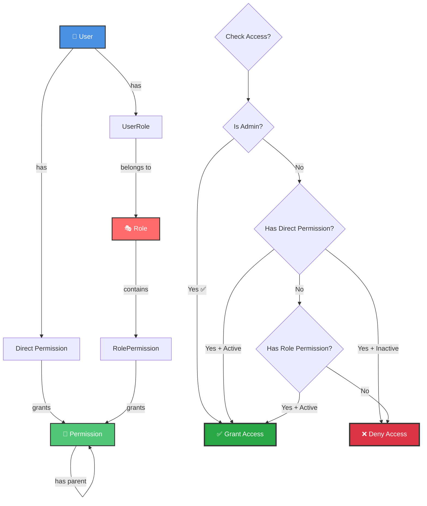

### ساختار درختی Permissions

```
CORE (هسته مرکزی)
├── CORE.VIEW (مشاهده)
├── CORE.PERMISSION (مدیریت دسترسی‌ها)
│   ├── CORE.PERMISSION.VIEW
│   ├── CORE.PERMISSION.CREATE
│   ├── CORE.PERMISSION.EDIT
│   └── CORE.PERMISSION.DELETE
├── CORE.ROLE (مدیریت نقش‌ها)
│   ├── CORE.ROLE.VIEW
│   ├── CORE.ROLE.CREATE
│   └── ...
├── CORE.USER (مدیریت کاربران)
│   └── ...
└── CORE.BRANCH (مدیریت شعب)
    └── ...

TASK (تسکینگ)
├── TASK.VIEW
├── TASK.CREATE
├── TASK.EDIT
├── TASK.DELETE
├── TASK.ASSIGN (اختصاص تسک)
├── TASK.COMPLETE (تکمیل تسک)
├── TASK.SUPERVISE ⭐ (نظارت بر تسک‌های دیگران) - جدید
└── TASK.OPERATION
    ├── TASK.OPERATION.CREATE
    └── ...

CRM (مدیریت ارتباط با مشتری)
├── CRM.VIEW
├── CRM.CREATE
├── CRM.EDIT
└── ...
```

---

## 📋 نمودار سیستم تسک

### جریان ایجاد و مدیریت تسک

```mermaid
flowchart TD
    Start([شروع]) --> CreateTask[ایجاد تسک]
    
    CreateTask --> SelectType{نوع تسک؟}
    
    SelectType -->|Individual| AssignUser[اختصاص به کاربر]
    SelectType -->|Team| AssignTeam[اختصاص به تیم]
    SelectType -->|Multiple| AssignMultiple[اختصاص به چند نفر]
    
    AssignUser --> SetDetails[تنظیم جزئیات]
    AssignTeam --> SetDetails
    AssignMultiple --> SetDetails
    
    SetDetails --> AddOperations{عملیات دارد؟}
    AddOperations -->|بله| CreateOperations[ایجاد عملیات‌ها]
    AddOperations -->|خیر| AddReminders
    
    CreateOperations --> AddReminders{یادآور دارد؟}
    AddReminders -->|بله| CreateReminders[ایجاد یادآورها]
    AddReminders -->|خیر| AddCarbonCopy
    
    CreateReminders --> AddCarbonCopy{افزودن رونوشت؟}
    AddCarbonCopy -->|بله| AddViewers[👁️ افزودن ناظران رونوشتی]
    AddCarbonCopy -->|خیر| SaveTask
    
    AddViewers --> SaveTask[ذخیره تسک]
    
    SaveTask --> SendNotification[ارسال اعلان]
    
    SendNotification --> TaskSaved([تسک ذخیره شد])
    
    %% Task Execution Flow
    TaskSaved --> UserReceives[کاربر اعلان دریافت می‌کند]
    UserReceives --> StartWork[شروع کار روی تسک]
    
    StartWork --> CompleteOperations{عملیات‌ها}
    CompleteOperations -->|در حال انجام| LogWork[ثبت گزارش کار]
    CompleteOperations -->|تکمیل شده| CheckCompletion{همه عملیات تکمیل شد؟}
    
    LogWork --> CompleteOperations
    
    CheckCompletion -->|بله| CompleteTask[تکمیل تسک]
    CheckCompletion -->|خیر| CompleteOperations
    
    CompleteTask --> NeedApproval{نیاز به تایید؟}
    
    NeedApproval -->|بله| SupervisorApproval[👁️ تایید ناظر/سرپرست]
    NeedApproval -->|خیر| TaskCompleted
    
    SupervisorApproval --> ManagerApproval[تایید مدیر]
    ManagerApproval --> TaskCompleted([تسک تکمیل و تایید شد])
    
    %% Styling
    style Start fill:#4CAF50,stroke:#333,stroke-width:2px,color:#fff
    style TaskSaved fill:#2196F3,stroke:#333,stroke-width:2px,color:#fff
    style TaskCompleted fill:#4CAF50,stroke:#333,stroke-width:3px,color:#fff
    style AddViewers fill:#FF9800,stroke:#333,stroke-width:2px,color:#fff
    style SupervisorApproval fill:#FF9800,stroke:#333,stroke-width:2px,color:#fff
```

### رابطه Task با Entities دیگر

```mermaid
graph LR
    Task[📋 Task] --> Creator[👤 Creator User]
    Task --> Branch[🏢 Branch]
    Task --> Team[👥 Team]
    Task --> Category[📁 Category]
    Task --> Contact[👤 Contact NEW]
    Task --> Organization[🏢 Organization NEW]
    Task --> Contract[📄 Contract]
    
    Task --> Assignments[👥 Assignments]
    Assignments --> AssignedUser1[User 1]
    Assignments --> AssignedUser2[User 2]
    Assignments -.->|in team| AssignedInTeam[⭐ Team Context]
    
    Task --> Viewers[👁️ Viewers Carbon Copy] ⭐
    Viewers --> Viewer1[Viewer 1]
    Viewers --> Viewer2[Viewer 2]
    
    Task --> ViewPermissions[🔑 View Permissions] ⭐
    ViewPermissions --> SpecialPermission1[Permission 1]
    ViewPermissions --> SpecialPermission2[Permission 2]
    
    Task --> Operations[⚙️ Operations]
    Operations --> WorkLogs[📝 Work Logs]
    
    Task --> Comments[💬 Comments]
    Task --> Attachments[📎 Attachments]
    Task --> Reminders[⏰ Reminders]
    Task --> Notifications[🔔 Notifications]
    
    %% Styling
    style Task fill:#FF6B6B,stroke:#333,stroke-width:3px,color:#fff
    style Contact fill:#50C878,stroke:#333,stroke-width:2px,color:#fff
    style Organization fill:#50C878,stroke:#333,stroke-width:2px,color:#fff
    style Viewers fill:#FF9800,stroke:#333,stroke-width:2px,color:#fff
    style ViewPermissions fill:#9C27B0,stroke:#333,stroke-width:2px,color:#fff
    style AssignedInTeam fill:#2196F3,stroke:#333,stroke-width:2px,color:#fff
```

---

## 👁️ نمودار سیستم نظارت بر تسک‌ها

### انواع نظارت

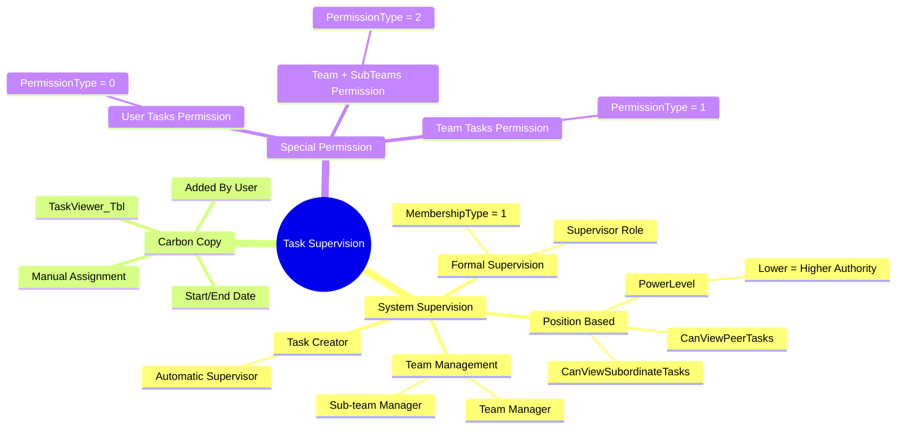

### جریان بررسی قابلیت مشاهده تسک


### الگوریتم GetVisibleTaskIdsAsync

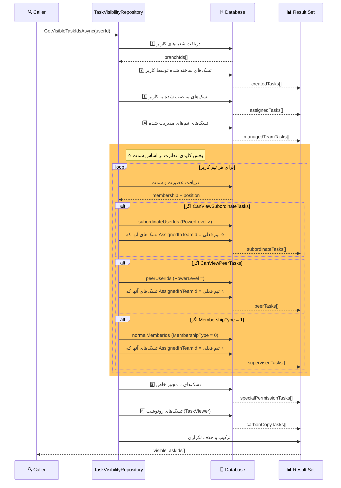

### ساختار جداول نظارت

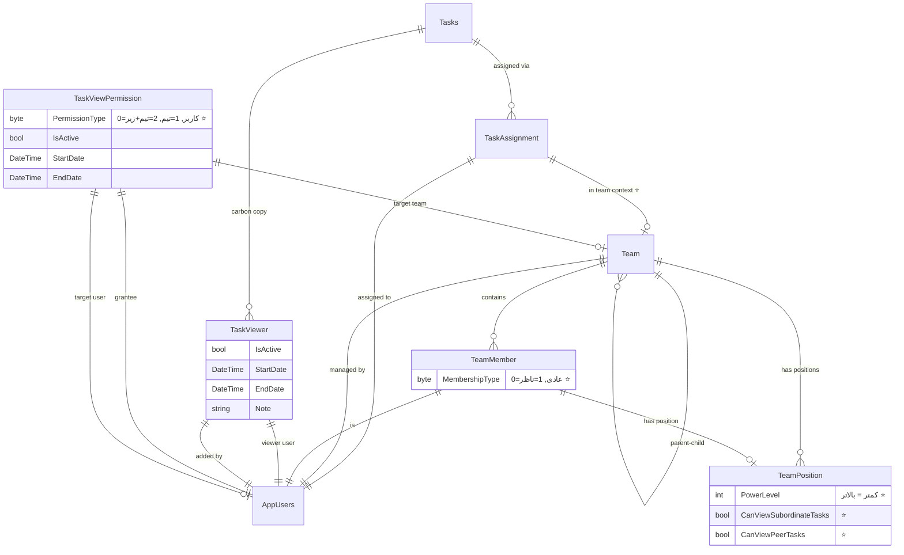

### مثال عملی: نظارت بر اساس سمت

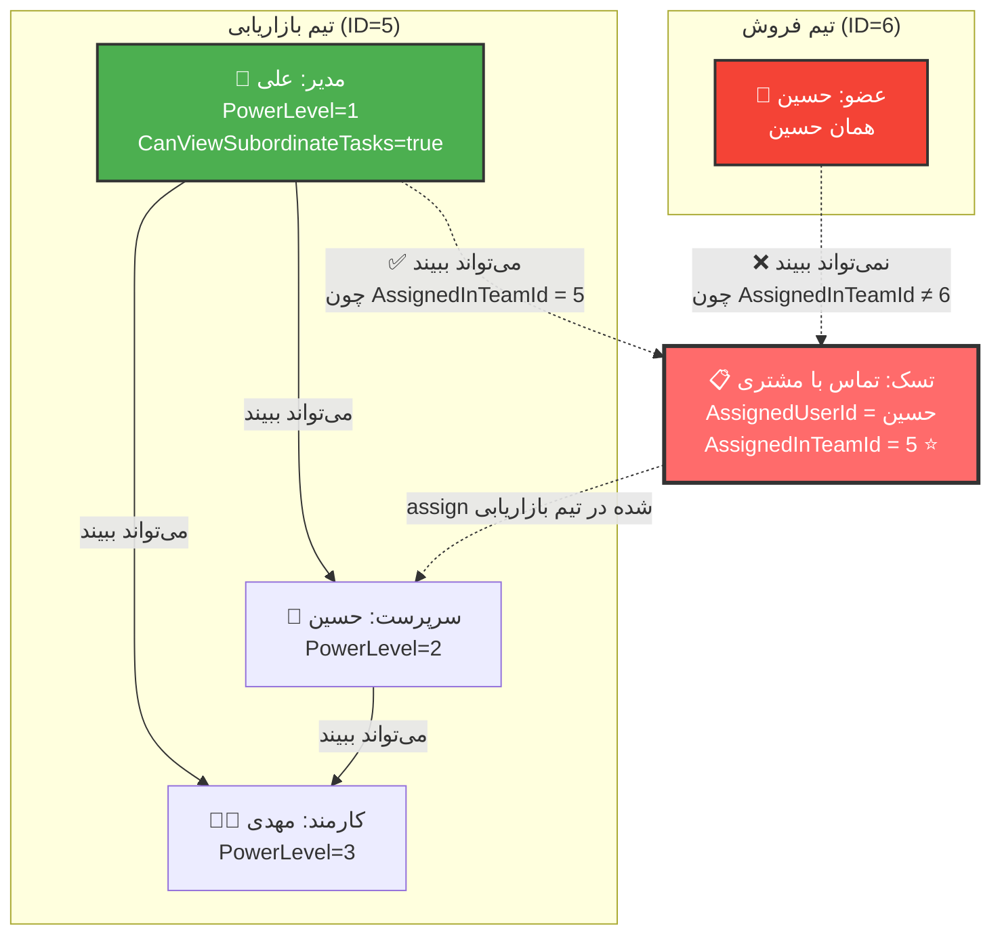

---

## 🔔 نمودار سیستم اعلان‌رسانی

### جریان ارسال اعلان

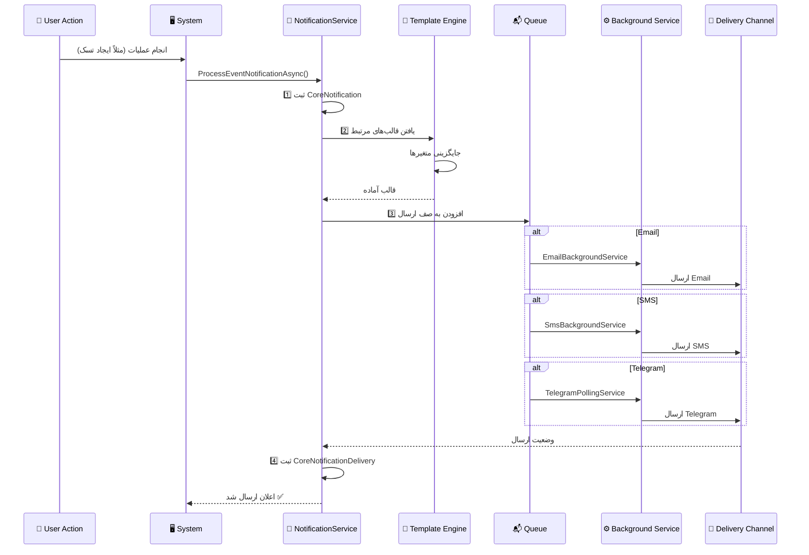

### انواع اعلان‌ها

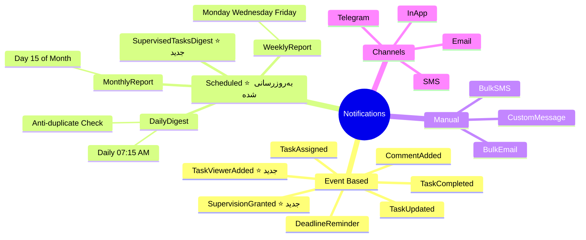

---

## ⏰ نمودار Background Services و زمان‌بندی

### معماری Background Services

```mermaid
graph TB
    subgraph "Background Services Layer"
        NotifProcessing[NotificationProcessingBackgroundService<br/>⏱️ هر 10 ثانیه]
        ScheduledNotif[ScheduledNotificationBackgroundService<br/>⏱️ هر 1 دقیقه ⭐]
        EmailBG[EmailBackgroundService<br/>⏱️ هر 30 ثانیه]
        SmsBG[SmsBackgroundService<br/>⏱️ هر 20 ثانیه]
        TelegramBG[TelegramPollingBackgroundService<br/>⏱️ هر 5 ثانیه]
        ModuleTracking[ModuleTrackingBackgroundService<br/>⏱️ هر 5 دقیقه]
        RoleCleanup[ExpiredRoleCleanupBackgroundService<br/>⏱️ روزانه 02:00]
    end
    
    subgraph "Database Tables"
        CoreNotif[(CoreNotification_Tbl)]
        NotifTemplate[(NotificationTemplate_Tbl)]
        EmailQueue[(EmailQueue_Tbl)]
        SmsQueue[(SmsQueue_Tbl)]
    end
    
    subgraph "External Services"
        Email[📧 SMTP Server]
        SMS[📱 SMS Provider]
        Telegram[✈️ Telegram API]
    end
    
    NotifProcessing --> CoreNotif
    ScheduledNotif --> NotifTemplate
    EmailBG --> EmailQueue
    SmsBG --> SmsQueue
    
    EmailBG --> Email
    SmsBG --> SMS
    TelegramBG --> Telegram
    
    ScheduledNotif -.->|ارسال مستقیم| Email
    ScheduledNotif -.->|ارسال مستقیم| SMS
    ScheduledNotif -.->|ارسال مستقیم| Telegram
    
    style ScheduledNotif fill:#FF9800,stroke:#333,stroke-width:3px,color:#fff
    style NotifTemplate fill:#4CAF50,stroke:#333,stroke-width:2px,color:#fff
```

### جریان اجرای Scheduled Notification

```mermaid
flowchart TD
    Start([Background Service<br/>هر 1 دقیقه]) --> GetIranTime[دریافت زمان ایران<br/>TimeZoneInfo.ConvertTimeFromUtc]
    
    GetIranTime --> QueryTemplates[Query از دیتابیس]
    
    QueryTemplates --> CheckConditions{شرط‌های Query}
    
    CheckConditions --> Condition1[✅ IsScheduled = true]
    CheckConditions --> Condition2[✅ IsScheduleEnabled = true]
    CheckConditions --> Condition3[✅ IsActive = true]
    CheckConditions --> Condition4[✅ NextExecutionDate <= Now]
    CheckConditions --> Condition5[⭐ LastExecutionDate فاصله >= 1 دقیقه]
    
    Condition1 --> FindTemplates
    Condition2 --> FindTemplates
    Condition3 --> FindTemplates
    Condition4 --> FindTemplates
    Condition5 --> FindTemplates[یافت قالب‌های آماده]
    
    FindTemplates --> AnyTemplates{قالبی وجود دارد؟}
    
    AnyTemplates -->|خیر| WaitNextMinute([صبر تا دقیقه بعد])
    AnyTemplates -->|بله| LoopTemplates[حلقه روی قالب‌ها]
    
    LoopTemplates --> DoubleCheck{⭐ Double-check<br/>در حافظه}
    
    DoubleCheck -->|فاصله < 1 دقیقه| SkipTemplate[Skip - اجرا شده]
    DoubleCheck -->|فاصله >= 1 دقیقه| GetRecipients[دریافت دریافت‌کنندگان]
    
    SkipTemplate --> NextTemplate{قالب بعدی؟}
    
    GetRecipients --> CheckRecipients{کاربری وجود دارد؟}
    
    CheckRecipients -->|خیر| UpdateNext[بروزرسانی NextExecutionDate]
    CheckRecipients -->|بله| SendNotifications[ارسال به کاربران]
    
    SendNotifications --> BuildVariables[⭐ ساخت متغیرهای پویا<br/>{{PendingTasks}}, {{RecipientFullName}}, ...]
    
    BuildVariables --> SendViaChannel{کانال ارسال}
    
    SendViaChannel -->|Email| SendEmail[📧 ارسال Email]
    SendViaChannel -->|SMS| SendSMS[📱 ارسال SMS]
    SendViaChannel -->|Telegram| SendTelegram[✈️ ارسال Telegram]
    
    SendEmail --> UpdateTemplate
    SendSMS --> UpdateTemplate
    SendTelegram --> UpdateTemplate[⭐ بروزرسانی قالب]
    
    UpdateTemplate --> UpdateFields[LastExecutionDate = Now<br/>UsageCount++<br/>NextExecutionDate = Calculate]
    
    UpdateFields --> CalculateNext[⭐ محاسبه NextExecutionDate]
    
    CalculateNext --> CheckScheduleType{نوع زمان‌بندی}
    
    CheckScheduleType -->|Daily| DailyCalc[همان ساعت فردا]
    CheckScheduleType -->|Weekly| WeeklyCalc[روز بعدی در هفته]
    CheckScheduleType -->|Monthly| MonthlyCalc[همان روز ماه بعد]
    
    DailyCalc --> SaveChanges
    WeeklyCalc --> SaveChanges
    MonthlyCalc --> SaveChanges[ذخیره تغییرات]
    
    SaveChanges --> LogSuccess[✅ لاگ موفقیت]
    
    LogSuccess --> NextTemplate
    UpdateNext --> NextTemplate
    
    NextTemplate -->|بله| DoubleCheck
    NextTemplate -->|خیر| End([پایان - صبر تا دقیقه بعد])
    
    WaitNextMinute --> End
    
    %% Styling
    style Start fill:#4CAF50,stroke:#333,stroke-width:2px,color:#fff
    style DoubleCheck fill:#FF9800,stroke:#333,stroke-width:2px,color:#fff
    style BuildVariables fill:#2196F3,stroke:#333,stroke-width:2px,color:#fff
    style CalculateNext fill:#9C27B0,stroke:#333,stroke-width:2px,color:#fff
    style End fill:#4CAF50,stroke:#333,stroke-width:2px,color:#fff
```

### الگوریتم محاسبه NextExecutionDate

```mermaid
flowchart TD
    Start([محاسبه NextExecutionDate]) --> CheckTime{ScheduledTime معتبر؟}
    
    CheckTime -->|خیر ❌| ReturnNull[return null]
    CheckTime -->|بله ✅| GetNow[دریافت زمان ایران]
    
    GetNow --> ParseTime[Parse ساعت و دقیقه<br/>از ScheduledTime]
    
    ParseTime --> CheckType{نوع زمان‌بندی}
    
    CheckType -->|Daily = 1| CalcDaily[محاسبه روزانه]
    CheckType -->|Weekly = 2| CalcWeekly[محاسبه هفتگی]
    CheckType -->|Monthly = 3| CalcMonthly[محاسبه ماهانه]
    
    %% Daily Calculation
    CalcDaily --> CreateToday[ایجاد DateTime امروز<br/>با ساعت تنظیم شده]
    CreateToday --> CheckIfPassed{⭐ آیا گذشته؟<br/>nextExecution <= now}
    CheckIfPassed -->|بله| AddDay[nextExecution.AddDays(1)]
    CheckIfPassed -->|خیر| ReturnDaily[return nextExecution]
    AddDay --> ReturnDaily
    
    %% Weekly Calculation
    CalcWeekly --> ParseDays[Parse روزهای هفته<br/>ScheduledDaysOfWeek]
    ParseDays --> CheckToday{امروز در لیست؟}
    CheckToday -->|بله + زمان نگذشته| ReturnWeekly[return امروز با ساعت]
    CheckToday -->|خیر| FindNextDay[پیدا کردن روز بعدی<br/>در 7 روز آینده]
    FindNextDay --> ReturnWeekly
    
    %% Monthly Calculation
    CalcMonthly --> GetDayOfMonth[دریافت ScheduledDayOfMonth]
    GetDayOfMonth --> CheckThisMonth{این ماه گذشته؟}
    CheckThisMonth -->|خیر| ReturnThisMonth[return این ماه]
    CheckThisMonth -->|بله| CalcNextMonth[محاسبه ماه بعد<br/>با توجه به تعداد روز]
    CalcNextMonth --> ReturnMonthly[return ماه بعد]
    
    ReturnDaily --> LogResult[⭐ لاگ نتیجه]
    ReturnWeekly --> LogResult
    ReturnMonthly --> LogResult
    ReturnNull --> End([پایان])
    
    LogResult --> End
    
    %% Styling
    style Start fill:#4CAF50,stroke:#333,stroke-width:2px,color:#fff
    style CheckIfPassed fill:#FF9800,stroke:#333,stroke-width:2px,color:#fff
    style AddDay fill:#F44336,stroke:#333,stroke-width:2px,color:#fff
    style LogResult fill:#2196F3,stroke:#333,stroke-width:2px,color:#fff
```

### مثال عملی: اجرای Daily Digest

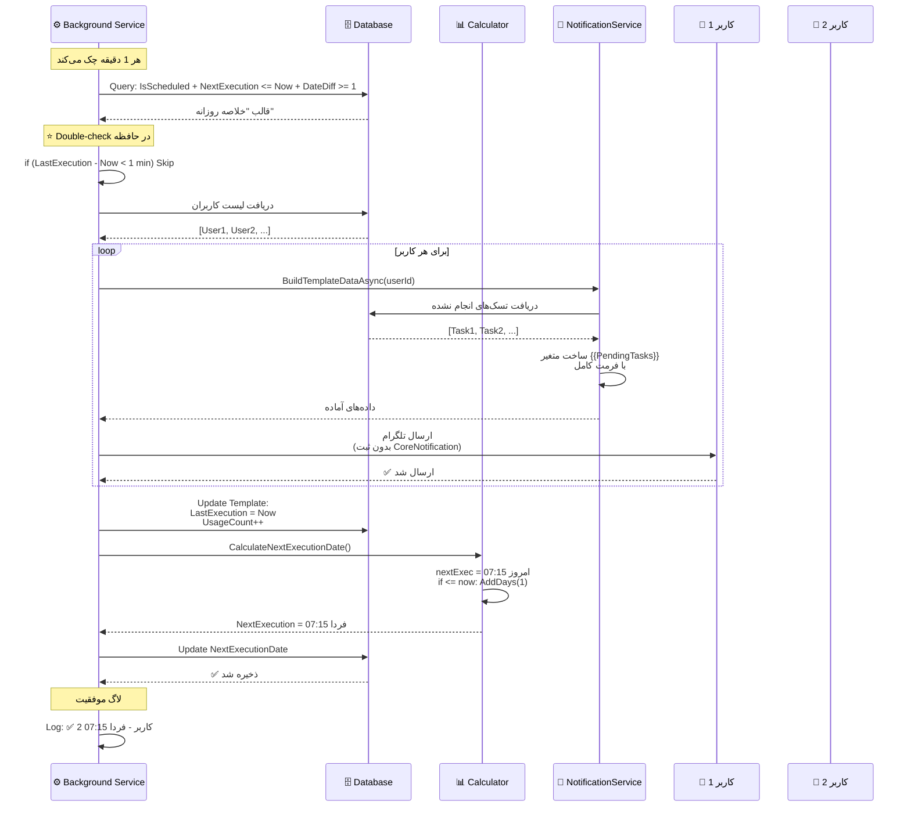

---

## 🔄 Background Services - نمودار Gantt

```mermaid
gantt
    title Background Services زمان‌بندی (24 ساعته)
    dateFormat HH:mm
    axisFormat %H:%M
    
    section Email
    EmailBackgroundService :active, email, 00:00, 24h
    
    section SMS
    SmsBackgroundService :active, sms, 00:00, 24h
    SmsDeliveryCheckService :active, check, 00:00, 24h
    
    section Telegram
    TelegramPollingService :active, telegram, 00:00, 24h
    
    section Notifications
    NotificationProcessing :active, notify, 00:00, 24h
    ScheduledNotifications :crit, scheduled, 00:00, 24h
    
    section Maintenance
    ExpiredRoleCleanup :done, cleanup, 02:00, 1h
    ModuleTracking :active, track, 00:00, 24h
    
    section ⭐ مثال Daily Digest
    FirstExecution :milestone, first, 07:15, 0
    SecondExecution :milestone, second, 07:15, 0
```

---

## 📈 نمودارهای آماری

### توزیع استفاده از ماژول‌ها

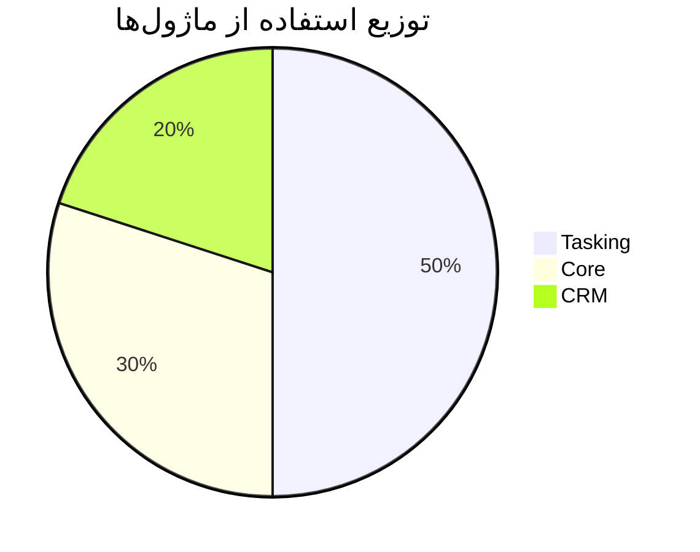

### کانال‌های ارسال اعلان

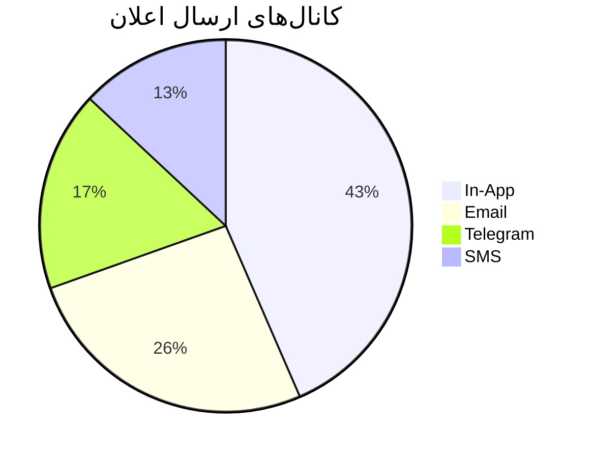

### انواع نظارت بر تسک‌ها ⭐ جدید

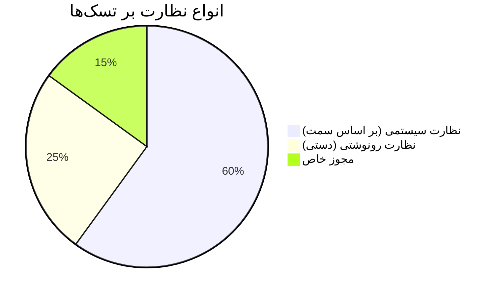

### ⭐ نوع زمان‌بندی قالب‌ها (جدید)

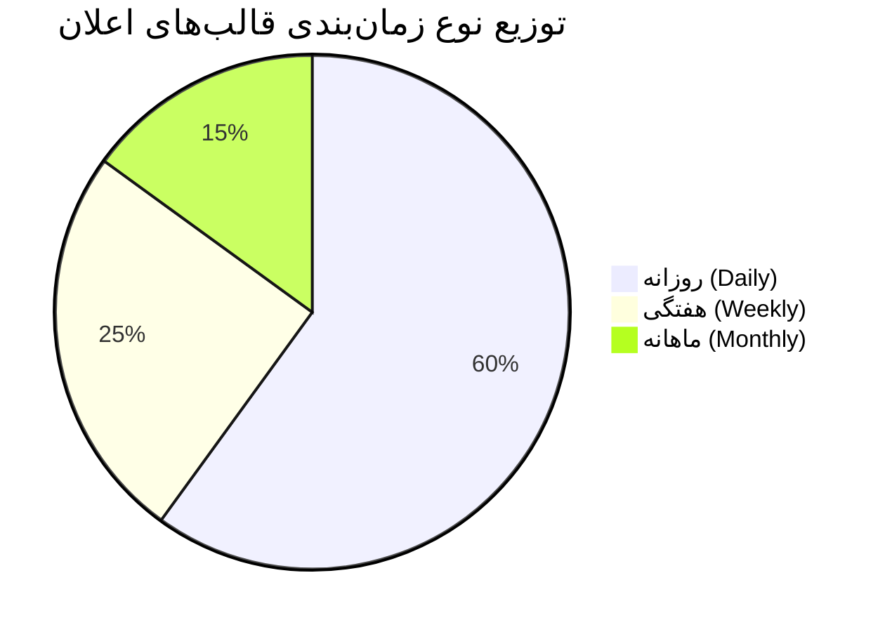

---

## 🐛 نمودار رفع مشکلات (Troubleshooting)

### جریان دیباگ: اجرای مکرر اعلان

```mermaid
flowchart TD
    Start([مشکل: اعلان هر دقیقه ارسال می‌شود]) --> CheckLogs[بررسی لاگ‌های Background Service]
    
    CheckLogs --> LogPattern{الگوی لاگ}
    
    LogPattern -->|📤 اجرای قالب هر دقیقه| CheckDB[بررسی دیتابیس]
    LogPattern -->|⚠️ Skip پیام| ProblemSolved[✅ مشکل حل شده]
    
    CheckDB --> QueryDB[اجرای Query تست]
    
    QueryDB --> CheckFields{بررسی فیلدها}
    
    CheckFields --> CheckLastExec{LastExecutionDate<br/>بروزرسانی می‌شود؟}
    
    CheckLastExec -->|خیر ❌| FixUpdate[🔧 اصلاح بروزرسانی<br/>در ExecuteScheduledTemplateAsync]
    CheckLastExec -->|بله ✅| CheckNextExec{NextExecutionDate<br/>در آینده است؟}
    
    CheckNextExec -->|خیر ❌| FixCalculation[🔧 اصلاح محاسبه<br/>در CalculateNextExecutionDate]
    CheckNextExec -->|بله ✅| CheckQuery{Query شرط<br/>DateDiffMinute دارد؟}
    
    CheckQuery -->|خیر ❌| AddCondition[🔧 اضافه کردن شرط<br/>DateDiffMinute >= 1]
    CheckQuery -->|بله ✅| CheckDoubleCheck{Double-check<br/>در کد وجود دارد؟}
    
    CheckDoubleCheck -->|خیر ❌| AddDoubleCheck[🔧 اضافه کردن<br/>if TotalMinutes < 1]
    CheckDoubleCheck -->|بله ✅| DeepDebug[🔍 دیباگ عمیق<br/>با Breakpoint]
    
    FixUpdate --> TestAgain[تست مجدد]
    FixCalculation --> TestAgain
    AddCondition --> TestAgain
    AddDoubleCheck --> TestAgain
    
    TestAgain --> Solved{مشکل حل شد؟}
    
    Solved -->|بله ✅| ProblemSolved
    Solved -->|خیر ❌| DeepDebug
    
    DeepDebug --> ContactSupport[📞 تماس با پشتیبانی<br/>با ارسال لاگ‌ها]
    
    ProblemSolved --> End([✅ سیستم عادی شد])
    ContactSupport --> End
    
    %% Styling
    style Start fill:#F44336,stroke:#333,stroke-width:2px,color:#fff
    style ProblemSolved fill:#4CAF50,stroke:#333,stroke-width:3px,color:#fff
    style FixUpdate fill:#FF9800,stroke:#333,stroke-width:2px,color:#fff
    style FixCalculation fill:#FF9800,stroke:#333,stroke-width:2px,color:#fff
    style AddCondition fill:#FF9800,stroke:#333,stroke-width:2px,color:#fff
    style AddDoubleCheck fill:#FF9800,stroke:#333,stroke-width:2px,color:#fff
```

### Query تست برای دیباگ

```sql
-- بررسی وضعیت قالب‌های زمان‌بندی شده
SELECT 
    Id,
    TemplateName,
    ScheduleType,
    ScheduledTime,
    LastExecutionDate,
    NextExecutionDate,
    DATEDIFF(MINUTE, LastExecutionDate, GETDATE()) AS MinutesSinceLastExecution,
    CASE 
        WHEN NextExecutionDate IS NULL THEN '⚠️ NextExecution خالی'
        WHEN NextExecutionDate <= GETDATE() THEN '⚡ آماده اجرا'
        ELSE '⏳ در انتظار'
    END AS Status,
    CASE 
        WHEN LastExecutionDate IS NULL THEN '⚠️ هرگز اجرا نشده'
        WHEN DATEDIFF(MINUTE, LastExecutionDate, GETDATE()) < 1 THEN '✅ اخیراً اجرا شده'
        WHEN DATEDIFF(MINUTE, LastExecutionDate, GETDATE()) < 60 THEN '🟡 در ساعت گذشته'
        ELSE '🔴 مدت زیادی گذشته'
    END AS LastExecutionStatus
FROM NotificationTemplate_Tbl
WHERE IsScheduled = 1
ORDER BY NextExecutionDate;
```

---

## 📝 نتیجه‌گیری

این دیاگرام‌ها نشان‌دهنده **ساختار پیچیده و جامع سیستم MahERP** هستند. نکات کلیدی:

✅ معماری لایه‌ای (Layered Architecture)
✅ جداسازی نگرانی‌ها (Separation of Concerns)
✅ استفاده از الگوهای طراحی (Repository, Unit of Work)
✅ **سیستم نظارت هوشمند بر تسک‌ها** ⭐ **جدید**
✅ سیستم اعلان‌رسانی چندکاناله
✅ **پشتیبانی از Background Services با Anti-duplicate** ⭐ **به‌روزرسانی شده**
✅ مدل داده مدرن (Contact/Organization جایگزین Stakeholder)
✅ **فیلتر محدود به تیم (Team-scoped)** ⭐ **جدید**
✅ **سیستم زمان‌بندی پیشرفته با TimeZone ایران** ⭐ **جدید**

---

**نسخه مستند:** 2.1.0 ⭐ **(به‌روزرسانی شده با دیاگرام‌های کامل Background Services)**
**تاریخ:** دی 1403 (اضافه شدن نمودارهای زمان‌بندی و رفع باگ اجرای مکرر)
