# 📊 نمودارها و دیاگرام‌های سیستم MahERP

## 📋 فهرست
1. [نمودار ERD کلی دیتابیس](#نمودار-erd-کلی)
2. [نمودار سیستم دسترسی](#نمودار-سیستم-دسترسی)
3. [نمودار سیستم تسک](#نمودار-سیستم-تسک)
4. [نمودار سیستم نظارت بر تسک‌ها](#نمودار-سیستم-نظارت-بر-تسکها) ⭐ **جدید**
5. [نمودار سیستم تسک‌های زمان‌بندی شده](#نمودار-سیستم-تسکهای-زمانبندی-شده) 🆕 **جدیدترین**
6. [نمودار سیستم اعلان‌رسانی](#نمودار-سیستم-اعلانرسانی)
7. [نمودار Background Services و زمان‌بندی](#نمودار-background-services-و-زمانبندی) ⭐ **به‌روزرسانی شده**
8. [نمودار جریان کاربر](#نمودار-جریان-کاربر)

---

## 🗄️ نمودار ERD کلی

### ساختار کلی جداول

```mermaid
erDiagram
    %% ========== Users & Authentication ==========
    AppUsers ||--o{ UserRole : has
    AppUsers ||--o{ UserPermission : has
    AppUsers ||--o{ BranchUser : "works in"
    AppUsers ||--o{ TeamMember : "member of"
    AppUsers ||--o{ Tasks : creates
    AppUsers ||--o{ TaskAssignment : "assigned to"
    AppUsers ||--o{ CoreNotification : receives
    
    %% ========== Permissions ==========
    Permission ||--o{ Permission : "parent-child"
    Permission ||--o{ RolePermission : "used in"
    Permission ||--o{ UserPermission : "assigned to"
    
    Role ||--o{ RolePermission : contains
    Role ||--o{ UserRole : "assigned via"
    
    %% ========== Organization Structure ==========
    Branch ||--o{ BranchUser : employs
    Branch ||--o{ BranchContact : has
    Branch ||--o{ BranchOrganization : has
    Branch ||--o{ Tasks : manages
    
    Team ||--o{ Team : "parent-child (sub-teams)"
    Team ||--|| AppUsers : "managed by"
    Team ||--o{ TeamMember : contains
    Team ||--o{ TeamPosition : has
    Team ||--o{ Tasks : owns
    
    TeamMember ||--|| AppUsers : is
    TeamMember ||--o| TeamPosition : "has position"
    
    TeamPosition ||--o{ TeamMember : fills
    
    %% ========== Contacts & Organizations (NEW) ==========
    Contact ||--o{ ContactPhone : has
    Contact ||--o{ ContactGroupMember : "member of"
    Contact ||--o{ BranchContact : "in branch"
    Contact ||--o{ OrganizationContact : "works at"
    Contact ||--o{ Tasks : "related to"
    
    Organization ||--o{ OrganizationDepartment : has
    Organization ||--o{ OrganizationContact : employs
    Organization ||--o{ OrganizationGroupMember : "member of"
    Organization ||--o{ BranchOrganization : "in branch"
    Organization ||--o{ Tasks : "related to"
    
    OrganizationDepartment ||--o{ DepartmentPosition : has
    DepartmentPosition ||--o{ DepartmentMember : fills
    
    ContactGroup ||--o{ ContactGroupMember : contains
    OrganizationGroup ||--o{ OrganizationGroupMember : contains
    
    %% ========== Tasks & Supervision (UPDATED) ==========
    Tasks ||--o{ TaskAssignment : "assigned via"
    Tasks ||--o{ TaskOperation : contains
    Tasks ||--o{ TaskComment : has
    Tasks ||--o{ TaskAttachment : has
    Tasks ||--o{ TaskReminder : has
    Tasks ||--o{ TaskWorkLog : tracks
    Tasks ||--o{ TaskViewer : "visible to (carbon copy)"
    Tasks ||--o{ CoreNotification : generates
    
    Tasks ||--o| ScheduledTaskCreation : "created by schedule 🆕"
    
    TaskAssignment ||--|| AppUsers : "assigned to"
    TaskAssignment ||--o| Team : "in team context"
    
    TaskViewer ||--|| AppUsers : "viewer user"
    TaskViewer ||--|| AppUsers : "added by user"
    
    TaskViewPermission ||--|| AppUsers : "grantee user"
    TaskViewPermission ||--o| AppUsers : "target user"
    TaskViewPermission ||--o| Team : "target team"
    
    TaskOperation ||--o{ TaskOperationWorkLog : tracks
    
    TaskCategory ||--o{ Tasks : categorizes
    TaskSchedule ||--o{ Tasks : "generates automatically"
    
    %% ========== Scheduled Task Creation (NEW) 🆕 ==========
    ScheduledTaskCreation ||--|| AppUsers : "created by"
    ScheduledTaskCreation ||--|| AppUsers : "modified by"
    ScheduledTaskCreation ||--o{ Tasks : "generates tasks 🆕"
    
    %% ========== Notifications ==========
    CoreNotification ||--o{ CoreNotificationDetail : "has details"
    CoreNotification ||--o{ CoreNotificationDelivery : "delivered via"
    
    NotificationTemplate ||--o{ NotificationTemplateRecipient : "sent to"
    NotificationTemplate ||--o{ NotificationTemplateVariable : uses
    NotificationTemplate ||--o{ NotificationTemplateHistory : tracks
    
    %% ========== Communication ==========
    EmailQueue ||--|| EmailLog : "logged as"
    SmsQueue ||--|| SmsLog : "logged as"
    
    EmailTemplate ||--o{ EmailTemplateRecipient : "sent to"
    SmsTemplate ||--o{ SmsTemplateRecipient : "sent to"
    
    SmsProvider ||--o{ SmsQueue : "sends via"
    
    %% ========== CRM ==========
    CRMInteraction ||--o{ CRMComment : has
    CRMInteraction ||--o{ CRMAttachment : has
    CRMInteraction ||--o{ CRMParticipant : involves
    CRMInteraction ||--o{ CRMTeam : "managed by"
```

---

## 🔐 نمودار سیستم دسترسی

### نحوه کارکرد Permission System

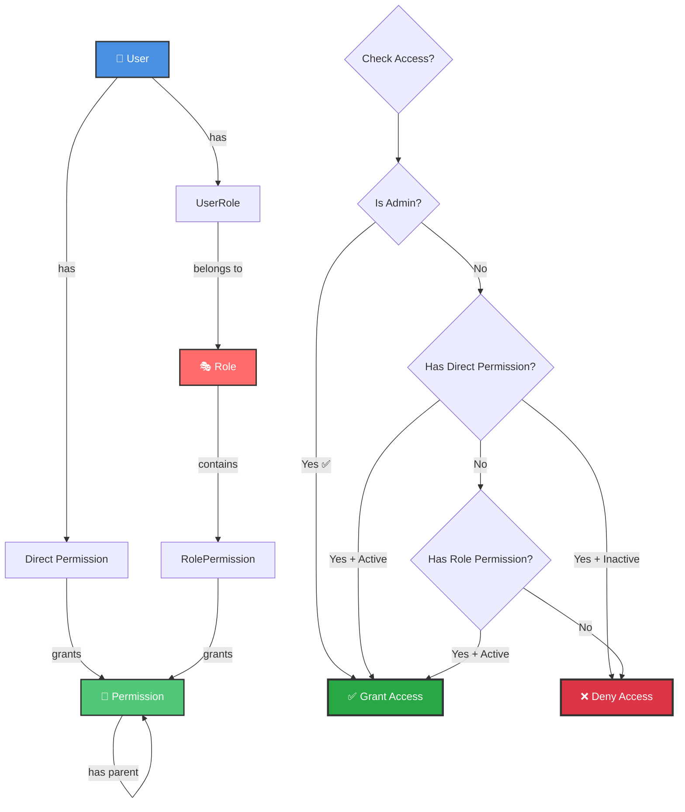

### ساختار درختی Permissions

```
CORE (هسته مرکزی)
├── CORE.VIEW (مشاهده)
├── CORE.PERMISSION (مدیریت دسترسی‌ها)
│   ├── CORE.PERMISSION.VIEW
│   ├── CORE.PERMISSION.CREATE
│   ├── CORE.PERMISSION.EDIT
│   └── CORE.PERMISSION.DELETE
├── CORE.ROLE (مدیریت نقش‌ها)
│   ├── CORE.ROLE.VIEW
│   ├── CORE.ROLE.CREATE
│   └── ...
├── CORE.USER (مدیریت کاربران)
│   └── ...
└── CORE.BRANCH (مدیریت شعب)
    └── ...

TASK (تسکینگ)
├── TASK.VIEW
├── TASK.CREATE
├── TASK.EDIT
├── TASK.DELETE
├── TASK.ASSIGN (اختصاص تسک)
├── TASK.COMPLETE (تکمیل تسک)
├── TASK.SUPERVISE ⭐ (نظارت بر تسک‌های دیگران) - جدید
└── TASK.OPERATION
    ├── TASK.OPERATION.CREATE
    └── ...

CRM (مدیریت ارتباط با مشتری)
├── CRM.VIEW
├── CRM.CREATE
├── CRM.EDIT
└── ...
```

---

## 📋 نمودار سیستم تسک

### جریان ایجاد و مدیریت تسک


### رابطه Task با Entities دیگر

```mermaid
graph LR
    Task[📋 Task] --> Creator[👤 Creator User]
    Task --> Branch[🏢 Branch]
    Task --> Team[👥 Team]
    Task --> Category[📁 Category]
    Task --> Contact[👤 Contact NEW]
    Task --> Organization[🏢 Organization NEW]
    Task --> Contract[📄 Contract]
    
    Task --> Assignments[👥 Assignments]
    Assignments --> AssignedUser1[User 1]
    Assignments --> AssignedUser2[User 2]
    Assignments -.->|in team| AssignedInTeam[⭐ Team Context]
    
    Task --> Viewers[👁️ Viewers Carbon Copy] ⭐
    Viewers --> Viewer1[Viewer 1]
    Viewers --> Viewer2[Viewer 2]
    
    Task --> ViewPermissions[🔑 View Permissions] ⭐
    ViewPermissions --> SpecialPermission1[Permission 1]
    ViewPermissions --> SpecialPermission2[Permission 2]
    
    Task --> Operations[⚙️ Operations]
    Operations --> WorkLogs[📝 Work Logs]
    
    Task --> Comments[💬 Comments]
    Task --> Attachments[📎 Attachments]
    Task --> Reminders[⏰ Reminders]
    Task --> Notifications[🔔 Notifications]
    
    %% Styling
    style Task fill:#FF6B6B,stroke:#333,stroke-width:3px,color:#fff
    style Contact fill:#50C878,stroke:#333,stroke-width:2px,color:#fff
    style Organization fill:#50C878,stroke:#333,stroke-width:2px,color:#fff
    style Viewers fill:#FF9800,stroke:#333,stroke-width:2px,color:#fff
    style ViewPermissions fill:#9C27B0,stroke:#333,stroke-width:2px,color:#fff
    style AssignedInTeam fill:#2196F3,stroke:#333,stroke-width:2px,color:#fff
```

---

## 👁️ نمودار سیستم نظارت بر تسک‌ها

### انواع نظارت

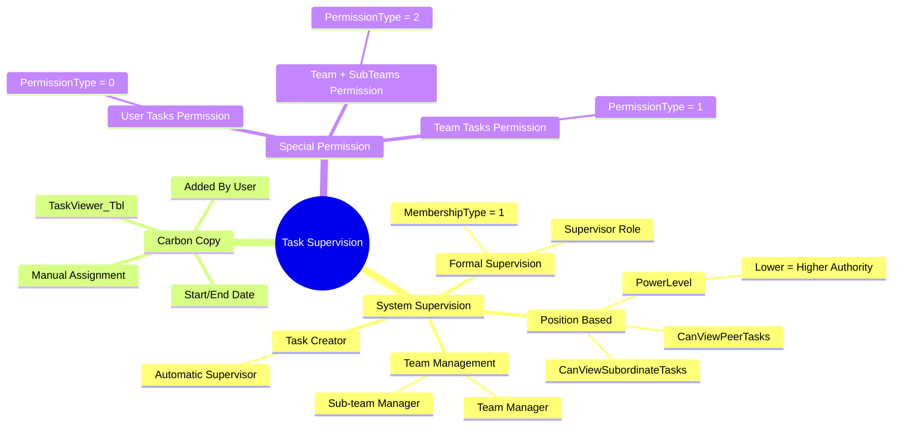

### جریان بررسی قابلیت مشاهده تسک

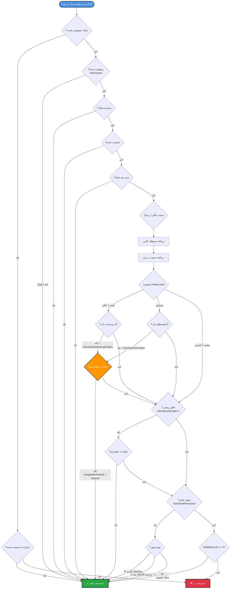

### الگوریتم GetVisibleTaskIdsAsync

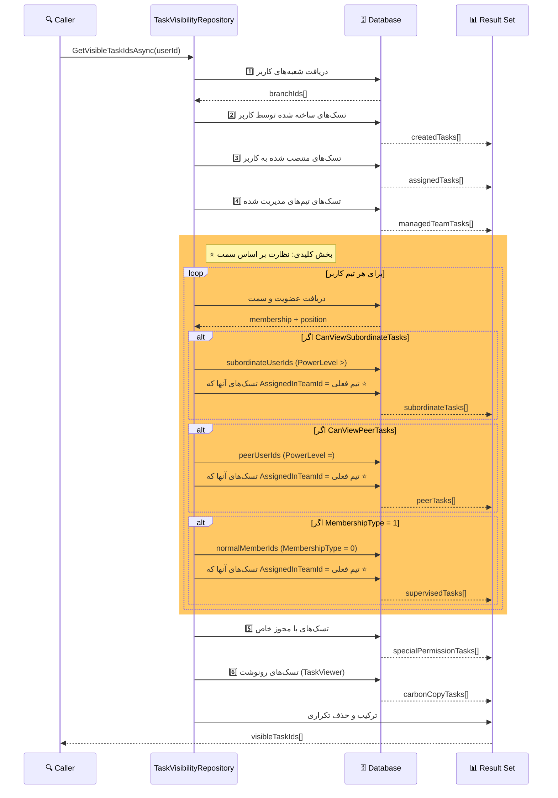

### ساختار جداول نظارت

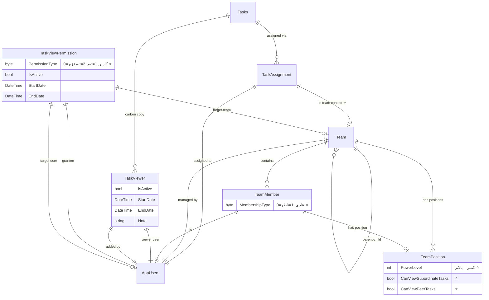

### مثال عملی: نظارت بر اساس سمت

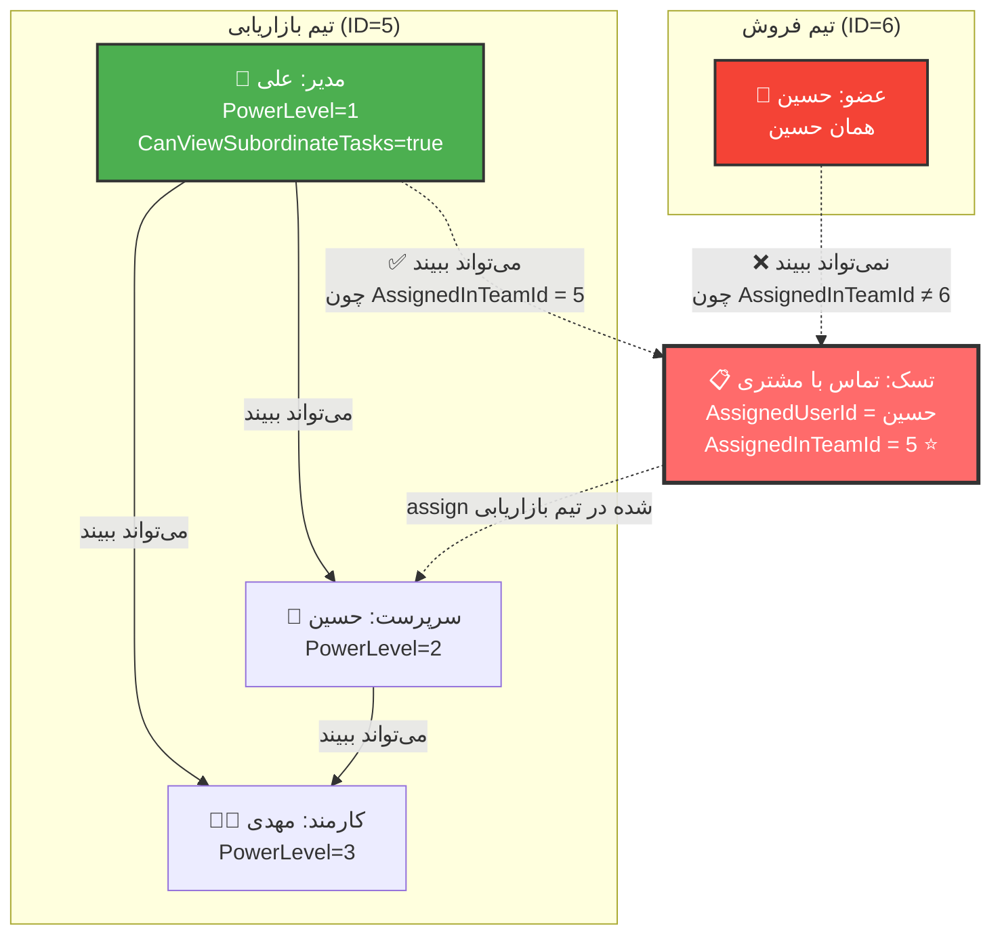

---

## 🕐 نمودار سیستم تسک‌های زمان‌بندی شده

### جریان کامل Scheduled Task Creation

```mermaid
flowchart TD
    Start([👤 کاربر می‌خواهد<br/>تسک تکرارشونده بسازد]) --> OpenForm[باز کردن فرم<br/>Create Scheduled Task]
    
    OpenForm --> FillBasicInfo[📝 وارد کردن اطلاعات پایه]
    
    FillBasicInfo --> BasicFields[• عنوان زمان‌بندی<br/>• توضیحات<br/>• تاریخ شروع/پایان<br/>• حداکثر تعداد اجرا]
    
    BasicFields --> SelectScheduleType{نوع زمان‌بندی}
    
    SelectScheduleType -->|یکبار| OneTime[📅 ScheduleType = 0<br/>• فقط یک بار اجرا<br/>• تاریخ و ساعت مشخص]
    SelectScheduleType -->|روزانه| Daily[📅 ScheduleType = 1<br/>• هر روز<br/>• ساعت اجرا]
    SelectScheduleType -->|هفتگی| Weekly[📅 ScheduleType = 2<br/>• روزهای هفته<br/>• ساعت اجرا]
    SelectScheduleType -->|ماهانه| Monthly[📅 ScheduleType = 3<br/>• روز ماه<br/>• ساعت اجرا]
    
    OneTime --> FillTaskTemplate
    Daily --> FillTaskTemplate
    Weekly --> FillTaskTemplate
    Monthly --> FillTaskTemplate[📋 پر کردن قالب تسک]
    
    FillTaskTemplate --> TaskFields[• عنوان تسک<br/>• توضیحات<br/>• اولویت<br/>• برآورد زمان<br/>• شعبه<br/>• دسته‌بندی]
    
    TaskFields --> AddOperations[➕ افزودن عملیات‌ها]
    AddOperations --> OperationsList[لیست عملیات:<br/>1. عملیات 1<br/>2. عملیات 2<br/>3. ...]
    
    OperationsList --> AddAssignments[👥 اختصاص کاربران]
    AddAssignments --> AssignmentsList[• کاربر 1 در تیم A<br/>• کاربر 2 در تیم B<br/>• ...]
    
    AssignmentsList --> AddCarbonCopy{رونوشت؟}
    AddCarbonCopy -->|بله| AddViewers[👁️ افزودن ناظران]
    AddCarbonCopy -->|خیر| SaveSchedule
    
    AddViewers --> SaveSchedule[💾 ذخیره زمان‌بندی]
    
    SaveSchedule --> CreateJSON[ساخت TaskTemplateJson]
    CreateJSON --> CalculateNext[⏰ محاسبه NextExecutionDate]
    
    CalculateNext --> SaveToDB[(💾 ذخیره در دیتابیس<br/>ScheduledTaskCreation_Tbl)]
    
    SaveToDB --> ScheduleSaved([✅ زمان‌بندی ذخیره شد])
    
    ScheduleSaved --> WaitForExecution[⏳ در انتظار اجرا...]
    
    WaitForExecution --> BGServiceCheck[⚙️ Background Service<br/>هر 1 دقیقه چک می‌کند]
    
    BGServiceCheck --> CheckTime{زمان رسیده؟<br/>NextExecutionDate <= Now}
    
    CheckTime -->|خیر| WaitForExecution
    CheckTime -->|بله| ExecuteSchedule[🚀 اجرای زمان‌بندی]
    
    ExecuteSchedule --> ParseJSON[Parse TaskTemplateJson]
    ParseJSON --> ReplaceVariables[جایگزینی متغیرهای پویا<br/>{{Date}}, {{DateTime}}, ...]
    
    ReplaceVariables --> CreateTask[📋 ساخت تسک جدید]
    CreateTask --> SaveTask[(💾 ذخیره در Tasks_Tbl<br/>ScheduleId = schedule.Id)]
    
    SaveTask --> CreateOps[⚙️ ثبت عملیات‌ها<br/>TaskOperation_Tbl]
    CreateOps --> CreateAssigns[👥 ثبت اختصاص‌ها<br/>TaskAssignment_Tbl]
    CreateAssigns --> CreateViewers[👁️ ثبت ناظران<br/>TaskViewer_Tbl]
    
    CreateViewers --> SendNotif[📧 ارسال اعلان به<br/>انجام‌دهندگان]
    
    SendNotif --> UpdateSchedule[🔄 بروزرسانی زمان‌بندی]
    
    UpdateSchedule --> UpdateFields[• LastExecutionDate = Now<br/>• ExecutionCount++<br/>• NextExecutionDate = محاسبه بعدی]
    
    UpdateFields --> CheckConditions{بررسی شرایط}
    
    CheckConditions -->|ExecutionCount >= MaxOccurrences| Disable1[IsScheduleEnabled = false]
    CheckConditions -->|Now >= EndDate| Disable2[IsScheduleEnabled = false]
    CheckConditions -->|ScheduleType = 0| Disable3[IsScheduleEnabled = false<br/>یکبار بود]
    CheckConditions -->|ادامه دارد| SaveUpdate
    
    Disable1 --> SaveUpdate
    Disable2 --> SaveUpdate
    Disable3 --> SaveUpdate[(💾 ذخیره تغییرات)]
    
    SaveUpdate --> LogSuccess[📝 ثبت لاگ موفقیت]
    
    LogSuccess --> CheckEnabled{IsScheduleEnabled?}
    
    CheckEnabled -->|بله| WaitForExecution
    CheckEnabled -->|خیر| EndSchedule([⏹️ زمان‌بندی متوقف شد])
    
    %% Styling
    style Start fill:#4CAF50,stroke:#333,stroke-width:2px,color:#fff
    style ScheduleSaved fill:#2196F3,stroke:#333,stroke-width:2px,color:#fff
    style ExecuteSchedule fill:#FF9800,stroke:#333,stroke-width:3px,color:#fff
    style CreateTask fill:#9C27B0,stroke:#333,stroke-width:2px,color:#fff
    style EndSchedule fill:#F44336,stroke:#333,stroke-width:2px,color:#fff
```

### ساختار Entity: ScheduledTaskCreation

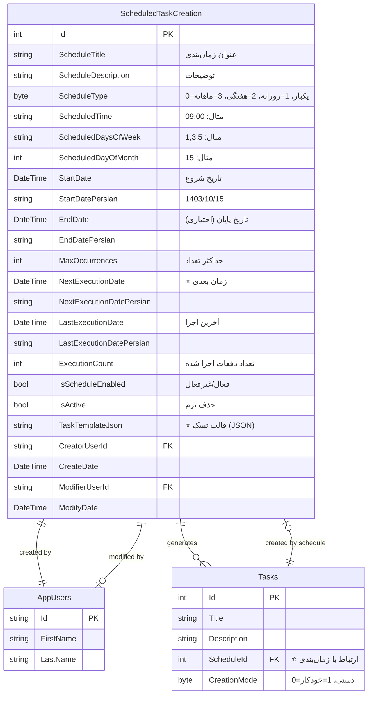

### الگوریتم محاسبه NextExecutionDate

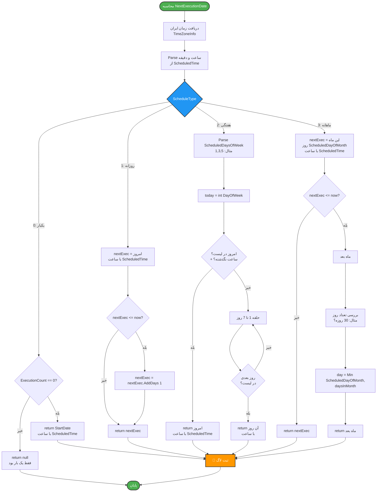

### نمونه TaskTemplateJson

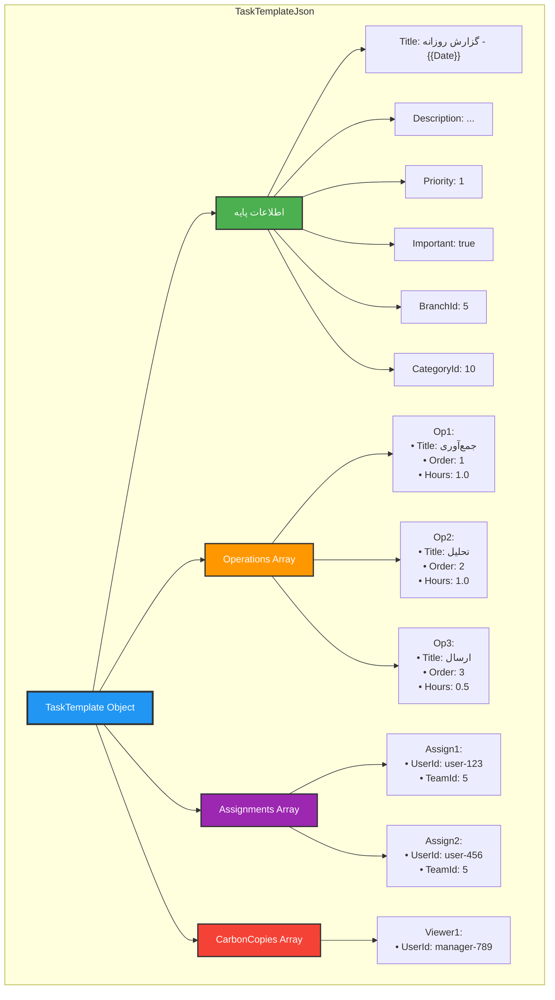

### مقایسه انواع زمان‌بندی

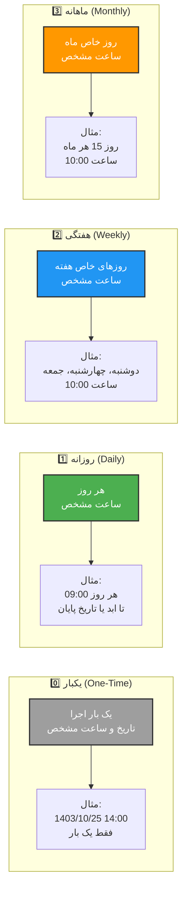

### Sequence Diagram: اجرای Background Service

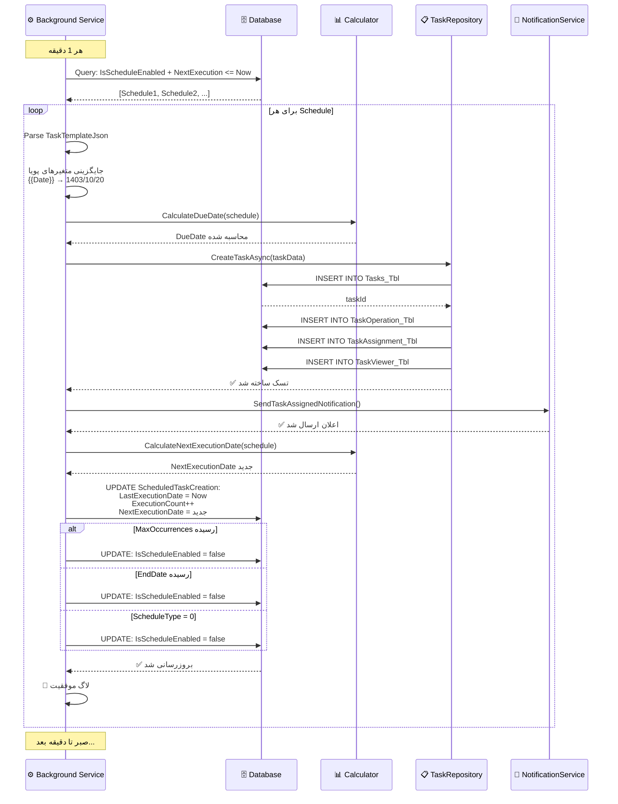

---

## ⏰ نمودار Background Services و زمان‌بندی

### معماری Background Services

```mermaid
graph TB
    subgraph "Background Services Layer"
        NotifProcessing[NotificationProcessingBackgroundService<br/>⏱️ هر 10 ثانیه]
        ScheduledNotif[ScheduledNotificationBackgroundService<br/>⏱️ هر 1 دقیقه ⭐]
        ScheduledTask[ScheduledTaskCreationBackgroundService<br/>⏱️ هر 1 دقیقه 🆕]
        EmailBG[EmailBackgroundService<br/>⏱️ هر 30 ثانیه]
        SmsBG[SmsBackgroundService<br/>⏱️ هر 20 ثانیه]
        TelegramBG[TelegramPollingBackgroundService<br/>⏱️ هر 5 ثانیه]
        ModuleTracking[ModuleTrackingBackgroundService<br/>⏱️ هر 5 دقیقه]
        RoleCleanup[ExpiredRoleCleanupBackgroundService<br/>⏱️ روزانه 02:00]
    end
    
    subgraph "Database Tables"
        CoreNotif[(CoreNotification_Tbl)]
        NotifTemplate[(NotificationTemplate_Tbl)]
        ScheduledTaskTbl[(ScheduledTaskCreation_Tbl 🆕)]
        TasksTbl[(Tasks_Tbl)]
        EmailQueue[(EmailQueue_Tbl)]
        SmsQueue[(SmsQueue_Tbl)]
    end
    
    subgraph "External Services"
        Email[📧 SMTP Server]
        SMS[📱 SMS Provider]
        Telegram[✈️ Telegram API]
    end
    
    NotifProcessing --> CoreNotif
    ScheduledNotif --> NotifTemplate
    ScheduledTask --> ScheduledTaskTbl
    ScheduledTask --> TasksTbl
    EmailBG --> EmailQueue
    SmsBG --> SmsQueue
    
    EmailBG --> Email
    SmsBG --> SMS
    TelegramBG --> Telegram
    
    ScheduledNotif -.->|ارسال مستقیم| Email
    ScheduledNotif -.->|ارسال مستقیم| SMS
    ScheduledNotif -.->|ارسال مستقیم| Telegram
    
    ScheduledTask -.->|ارسال اعلان| CoreNotif
    
    style ScheduledNotif fill:#FF9800,stroke:#333,stroke-width:3px,color:#fff
    style ScheduledTask fill:#4CAF50,stroke:#333,stroke-width:3px,color:#fff
    style NotifTemplate fill:#4CAF50,stroke:#333,stroke-width:2px,color:#fff
    style ScheduledTaskTbl fill:#2196F3,stroke:#333,stroke-width:2px,color:#fff
```

### نمودار Gantt: زمان‌بندی Background Services

```mermaid
gantt
    title Background Services زمان‌بندی (24 ساعته)
    dateFormat HH:mm
    axisFormat %H:%M
    
    section Email
    EmailBackgroundService :active, email, 00:00, 24h
    
    section SMS
    SmsBackgroundService :active, sms, 00:00, 24h
    
    section Telegram
    TelegramPollingService :active, telegram, 00:00, 24h
    
    section Notifications
    NotificationProcessing :active, notify, 00:00, 24h
    ScheduledNotifications :crit, scheduled, 00:00, 24h
    
    section Scheduled Tasks 🆕
    ScheduledTaskCreation :crit, schtask, 00:00, 24h
    
    section Maintenance
    ExpiredRoleCleanup :done, cleanup, 02:00, 1h
    ModuleTracking :active, track, 00:00, 24h
    
    section ⭐ مثال Daily Task
    FirstExecution :milestone, first, 09:00, 0
    SecondExecution :milestone, second, 09:00, 0
    ThirdExecution :milestone, third, 09:00, 0
```

### مقایسه: Scheduled Notification vs Scheduled Task

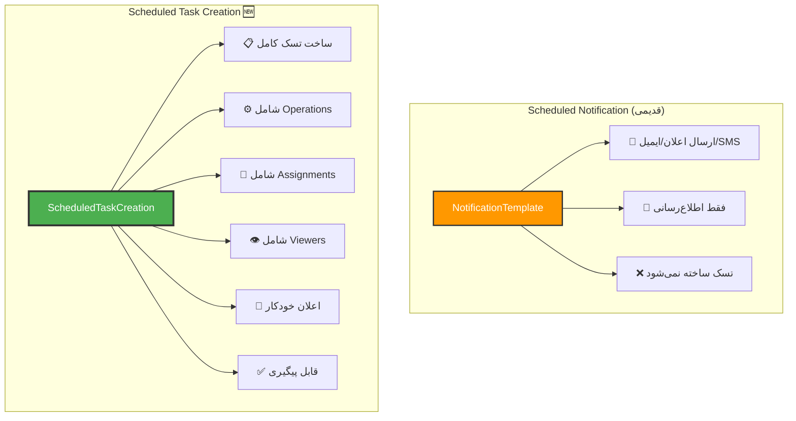

---

## 📈 نمودارهای آماری

### توزیع استفاده از ماژول‌ها

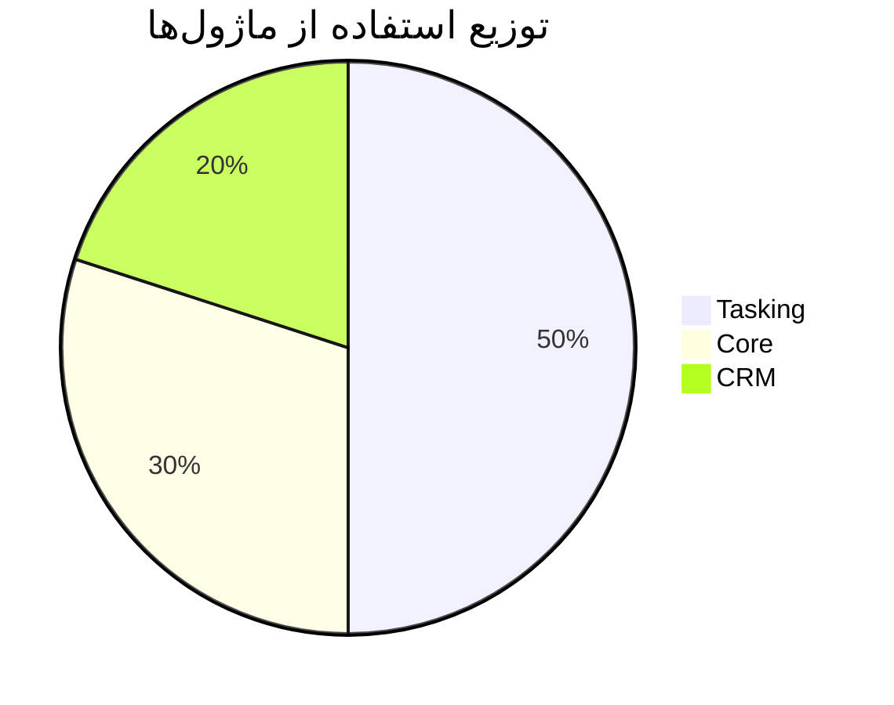

### کانال‌های ارسال اعلان

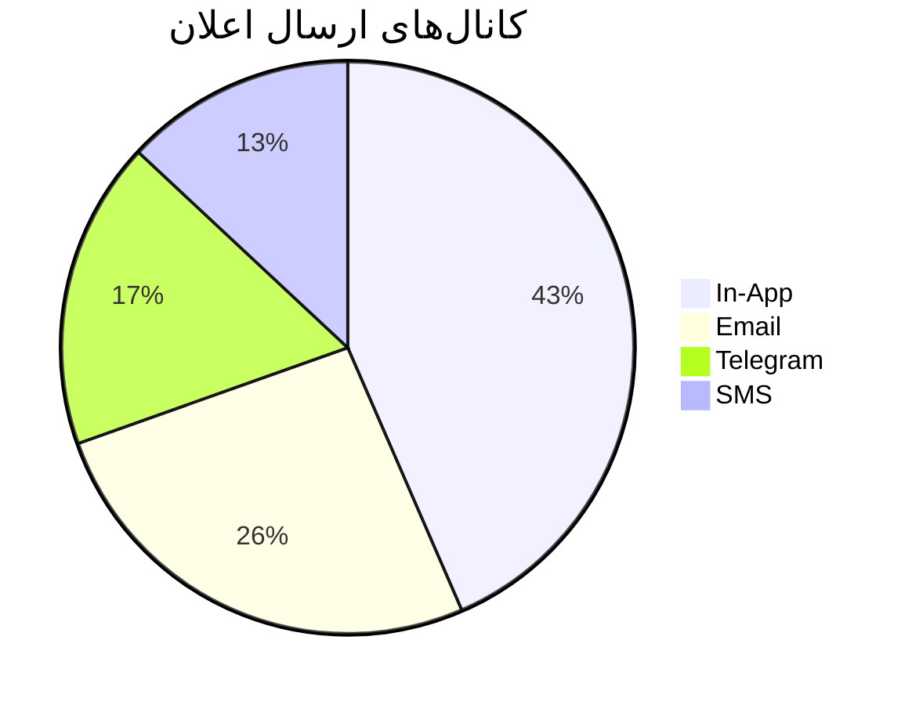

### انواع نظارت بر تسک‌ها ⭐

```mermaid
pie title انواع نظارت بر تسک‌ها
    "نظارت سیستمی (بر اساس سمت)" : 60
    "نظارت رونوشتی (دستی)" : 25
    "مجوز خاص" : 15
```

### ⭐ نوع زمان‌بندی قالب‌های اعلان

```mermaid
pie title توزیع نوع زمان‌بندی قالب‌های اعلان
    "روزانه (Daily)" : 60
    "هفتگی (Weekly)" : 25
    "ماهانه (Monthly)" : 15
```

### 🆕 نوع زمان‌بندی تسک‌ها (جدید)

```mermaid
pie title توزیع نوع زمان‌بندی تسک‌ها
    "روزانه (Daily)" : 50
    "هفتگی (Weekly)" : 30
    "ماهانه (Monthly)" : 15
    "یکبار (One-Time)" : 5
```

### 🆕 مقایسه تسک‌های دستی vs خودکار

```mermaid
graph LR
    subgraph "تسک‌های دستی"
        M1[👤 کاربر ایجاد می‌کند]
        M2[CreationMode = 0]
        M3[ScheduleId = null]
    end
    
    subgraph "تسک‌های خودکار 🆕"
        A1[🤖 Background Service ایجاد می‌کند]
        A2[CreationMode = 1]
        A3[ScheduleId = X]
        A4[قابل ردیابی به زمان‌بندی]
    end
    
    style M1 fill:#2196F3,stroke:#333,stroke-width:2px,color:#fff
    style A1 fill:#4CAF50,stroke:#333,stroke-width:2px,color:#fff
```

---

## 🐛 نمودار رفع مشکلات (Troubleshooting)

### جریان دیباگ: تسک خودکار ساخته نمی‌شود 🆕

```mermaid
flowchart TD
    Start([مشکل: تسک خودکار ساخته نمی‌شود]) --> CheckLogs[بررسی لاگ‌های<br/>ScheduledTaskCreationBackgroundService]
    
    CheckLogs --> LogPattern{الگوی لاگ}
    
    LogPattern -->|❌ خطا در Parse JSON| CheckJSON[بررسی TaskTemplateJson]
    LogPattern -->|⚠️ زمان‌بندی یافت نشد| CheckDB[بررسی دیتابیس]
    LogPattern -->|✅ اجرا موفق| ProblemSolved[✅ مشکل حل شده]
    
    CheckJSON --> ValidateJSON{JSON معتبر است؟}
    ValidateJSON -->|خیر ❌| FixJSON[🔧 اصلاح JSON<br/>استفاده از JSON Validator]
    ValidateJSON -->|بله ✅| CheckDB
    
    CheckDB --> QueryDB[اجرای Query تست]
    
    QueryDB --> CheckFields{بررسی فیلدها}
    
    CheckFields --> CheckEnabled{IsScheduleEnabled?}
    CheckEnabled -->|false ❌| EnableIt[🔧 فعال کردن زمان‌بندی]
    CheckEnabled -->|true ✅| CheckActive{IsActive?}
    
    CheckActive -->|false ❌| ActivateIt[🔧 فعال کردن رکورد]
    CheckActive -->|true ✅| CheckNext{NextExecutionDate<br/>در گذشته است؟}
    
    CheckNext -->|خیر ❌| WaitMore[⏳ صبر تا زمان رسیدن]
    CheckNext -->|بله ✅| CheckBGService{Background Service<br/>در حال اجرا است؟}
    
    CheckBGService -->|خیر ❌| RestartApp[🔄 Restart اپلیکیشن]
    CheckBGService -->|بله ✅| ManualExecute[⚙️ اجرای دستی<br/>ExecuteScheduleAsync]
    
    FixJSON --> TestAgain[تست مجدد]
    EnableIt --> TestAgain
    ActivateIt --> TestAgain
    RestartApp --> TestAgain
    ManualExecute --> TestAgain
    
    TestAgain --> Solved{مشکل حل شد؟}
    
    Solved -->|بله ✅| ProblemSolved
    Solved -->|خیر ❌| DeepDebug[🔍 دیباگ عمیق<br/>با Breakpoint در Background Service]
    
    DeepDebug --> ContactSupport[📞 تماس با پشتیبانی<br/>با ارسال لاگ‌ها]
    
    ProblemSolved --> End([✅ سیستم عادی شد])
    WaitMore --> End
    ContactSupport --> End
    
    %% Styling
    style Start fill:#F44336,stroke:#333,stroke-width:2px,color:#fff
    style ProblemSolved fill:#4CAF50,stroke:#333,stroke-width:3px,color:#fff
    style FixJSON fill:#FF9800,stroke:#333,stroke-width:2px,color:#fff
    style RestartApp fill:#2196F3,stroke:#333,stroke-width:2px,color:#fff
```

### Query تست برای دیباگ 🆕

```sql
-- بررسی وضعیت زمان‌بندی‌های تسک
SELECT 
    Id,
    ScheduleTitle,
    ScheduleType,
    CASE ScheduleType
        WHEN 0 THEN 'یکبار'
        WHEN 1 THEN 'روزانه'
        WHEN 2 THEN 'هفتگی'
        WHEN 3 THEN 'ماهانه'
    END AS ScheduleTypeText,
    ScheduledTime,
    LastExecutionDate,
    NextExecutionDate,
    DATEDIFF(MINUTE, LastExecutionDate, GETDATE()) AS MinutesSinceLastExecution,
    ExecutionCount,
    MaxOccurrences,
    IsScheduleEnabled,
    IsActive,
    CASE 
        WHEN NextExecutionDate IS NULL THEN '⚠️ NextExecution خالی'
        WHEN NOT IsScheduleEnabled THEN '⏹️ غیرفعال'
        WHEN NOT IsActive THEN '🗑️ حذف شده'
        WHEN NextExecutionDate <= GETDATE() THEN '⚡ آماده اجرا'
        ELSE '⏳ در انتظار'
    END AS Status,
    CASE 
        WHEN MaxOccurrences IS NOT NULL AND ExecutionCount >= MaxOccurrences THEN '🛑 به حداکثر رسیده'
        WHEN GETDATE() >= EndDate THEN '🛑 تاریخ پایان رسیده'
        ELSE '✅ در حال اجرا'
    END AS ExecutionStatus
FROM ScheduledTaskCreation_Tbl
ORDER BY NextExecutionDate;

-- بررسی تسک‌های ساخته شده توسط زمان‌بندی
SELECT 
    t.Id AS TaskId,
    t.TaskCode,
    t.Title,
    t.CreationMode,
    t.ScheduleId,
    s.ScheduleTitle,
    t.CreateDate
FROM Tasks_Tbl t
LEFT JOIN ScheduledTaskCreation_Tbl s ON t.ScheduleId = s.Id
WHERE t.CreationMode = 1  -- خودکار
ORDER BY t.CreateDate DESC;
```

---

## 📝 نتیجه‌گیری

این دیاگرام‌ها نشان‌دهنده **ساختار پیچیده و جامع سیستم MahERP** هستند. نکات کلیدی:

✅ معماری لایه‌ای (Layered Architecture)
✅ جداسازی نگرانی‌ها (Separation of Concerns)
✅ استفاده از الگوهای طراحی (Repository, Unit of Work)
✅ **سیستم نظارت هوشمند بر تسک‌ها** ⭐ **جدید**
✅ **سیستم تسک‌های زمان‌بندی شده با قابلیت‌های پیشرفته** 🆕 **جدیدترین**
✅ سیستم اعلان‌رسانی چندکاناله
✅ **پشتیبانی از Background Services با Anti-duplicate** ⭐ **به‌روزرسانی شده**
✅ مدل داده مدرن (Contact/Organization جایگزین Stakeholder)
✅ **فیلتر محدود به تیم (Team-scoped)** ⭐ **جدید**
✅ **سیستم زمان‌بندی پیشرفته با TimeZone ایران** ⭐ **جدید**
✅ **محاسبه خودکار NextExecutionDate** 🆕 **جدیدترین**
✅ **پشتیبانی از متغیرهای پویا در قالب‌ها** 🆕 **جدیدترین**

---

**نسخه مستند:** 3.0.0 🆕 **(به‌روزرسانی شده با دیاگرام‌های کامل Scheduled Task Creation)**
**تاریخ:** آذر 1403 (اضافه شدن نمودارهای سیستم تسک‌های زمان‌بندی شده)
