# 📊 نمودارها و دیاگرام‌های سیستم MahERP

## 📋 فهرست
1. [نمودار ERD کلی دیتابیس](#نمودار-erd-کلی)
2. [نمودار سیستم دسترسی](#نمودار-سیستم-دسترسی)
3. [نمودار سیستم تسک](#نمودار-سیستم-تسک)
4. [نمودار سیستم نظارت بر تسک‌ها](#نمودار-سیستم-نظارت-بر-تسکها) ⭐ **جدید**
5. [نمودار سیستم اعلان‌رسانی](#نمودار-سیستم-اعلانرسانی)
6. [نمودار جریان کاربر](#نمودار-جریان-کاربر)

---

## 🗄️ نمودار ERD کلی

### ساختار کلی جداول

```mermaid
erDiagram
    %% ========== Users & Authentication ==========
    AppUsers ||--o{ UserRole : has
    AppUsers ||--o{ UserPermission : has
    AppUsers ||--o{ BranchUser : "works in"
    AppUsers ||--o{ TeamMember : "member of"
    AppUsers ||--o{ Tasks : creates
    AppUsers ||--o{ TaskAssignment : "assigned to"
    AppUsers ||--o{ CoreNotification : receives
    
    %% ========== Permissions ==========
    Permission ||--o{ Permission : "parent-child"
    Permission ||--o{ RolePermission : "used in"
    Permission ||--o{ UserPermission : "assigned to"
    
    Role ||--o{ RolePermission : contains
    Role ||--o{ UserRole : "assigned via"
    
    %% ========== Organization Structure ==========
    Branch ||--o{ BranchUser : employs
    Branch ||--o{ BranchContact : has
    Branch ||--o{ BranchOrganization : has
    Branch ||--o{ Tasks : manages
    
    Team ||--o{ Team : "parent-child (sub-teams)"
    Team ||--|| AppUsers : "managed by"
    Team ||--o{ TeamMember : contains
    Team ||--o{ TeamPosition : has
    Team ||--o{ Tasks : owns
    
    TeamMember ||--|| AppUsers : is
    TeamMember ||--o| TeamPosition : "has position"
    
    TeamPosition ||--o{ TeamMember : fills
    
    %% ========== Contacts & Organizations (NEW) ==========
    Contact ||--o{ ContactPhone : has
    Contact ||--o{ ContactGroupMember : "member of"
    Contact ||--o{ BranchContact : "in branch"
    Contact ||--o{ OrganizationContact : "works at"
    Contact ||--o{ Tasks : "related to"
    
    Organization ||--o{ OrganizationDepartment : has
    Organization ||--o{ OrganizationContact : employs
    Organization ||--o{ OrganizationGroupMember : "member of"
    Organization ||--o{ BranchOrganization : "in branch"
    Organization ||--o{ Tasks : "related to"
    
    OrganizationDepartment ||--o{ DepartmentPosition : has
    DepartmentPosition ||--o{ DepartmentMember : fills
    
    ContactGroup ||--o{ ContactGroupMember : contains
    OrganizationGroup ||--o{ OrganizationGroupMember : contains
    
    %% ========== Tasks & Supervision (UPDATED) ==========
    Tasks ||--o{ TaskAssignment : "assigned via"
    Tasks ||--o{ TaskOperation : contains
    Tasks ||--o{ TaskComment : has
    Tasks ||--o{ TaskAttachment : has
    Tasks ||--o{ TaskReminder : has
    Tasks ||--o{ TaskWorkLog : tracks
    Tasks ||--o{ TaskViewer : "visible to (carbon copy)"
    Tasks ||--o{ CoreNotification : generates
    
    TaskAssignment ||--|| AppUsers : "assigned to"
    TaskAssignment ||--o| Team : "in team context"
    
    TaskViewer ||--|| AppUsers : "viewer user"
    TaskViewer ||--|| AppUsers : "added by user"
    
    TaskViewPermission ||--|| AppUsers : "grantee user"
    TaskViewPermission ||--o| AppUsers : "target user"
    TaskViewPermission ||--o| Team : "target team"
    
    TaskOperation ||--o{ TaskOperationWorkLog : tracks
    
    TaskCategory ||--o{ Tasks : categorizes
    TaskSchedule ||--o{ Tasks : "generates automatically"
    
    %% ========== Notifications ==========
    CoreNotification ||--o{ CoreNotificationDetail : "has details"
    CoreNotification ||--o{ CoreNotificationDelivery : "delivered via"
    
    NotificationTemplate ||--o{ NotificationTemplateRecipient : "sent to"
    NotificationTemplate ||--o{ NotificationTemplateVariable : uses
    NotificationTemplate ||--o{ NotificationTemplateHistory : tracks
    
    %% ========== Communication ==========
    EmailQueue ||--|| EmailLog : "logged as"
    SmsQueue ||--|| SmsLog : "logged as"
    
    EmailTemplate ||--o{ EmailTemplateRecipient : "sent to"
    SmsTemplate ||--o{ SmsTemplateRecipient : "sent to"
    
    SmsProvider ||--o{ SmsQueue : "sends via"
    
    %% ========== CRM ==========
    CRMInteraction ||--o{ CRMComment : has
    CRMInteraction ||--o{ CRMAttachment : has
    CRMInteraction ||--o{ CRMParticipant : involves
    CRMInteraction ||--o{ CRMTeam : "managed by"
```

---

## 🔐 نمودار سیستم دسترسی

### نحوه کارکرد Permission System

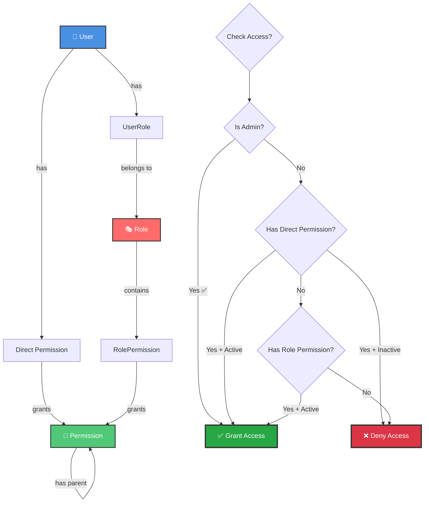

### ساختار درختی Permissions

```
CORE (هسته مرکزی)
├── CORE.VIEW (مشاهده)
├── CORE.PERMISSION (مدیریت دسترسی‌ها)
│   ├── CORE.PERMISSION.VIEW
│   ├── CORE.PERMISSION.CREATE
│   ├── CORE.PERMISSION.EDIT
│   └── CORE.PERMISSION.DELETE
├── CORE.ROLE (مدیریت نقش‌ها)
│   ├── CORE.ROLE.VIEW
│   ├── CORE.ROLE.CREATE
│   └── ...
├── CORE.USER (مدیریت کاربران)
│   └── ...
└── CORE.BRANCH (مدیریت شعب)
    └── ...

TASK (تسکینگ)
├── TASK.VIEW
├── TASK.CREATE
├── TASK.EDIT
├── TASK.DELETE
├── TASK.ASSIGN (اختصاص تسک)
├── TASK.COMPLETE (تکمیل تسک)
├── TASK.SUPERVISE ⭐ (نظارت بر تسک‌های دیگران) - جدید
└── TASK.OPERATION
    ├── TASK.OPERATION.CREATE
    └── ...

CRM (مدیریت ارتباط با مشتری)
├── CRM.VIEW
├── CRM.CREATE
├── CRM.EDIT
└── ...
```

---

## 📋 نمودار سیستم تسک

### جریان ایجاد و مدیریت تسک

```mermaid
flowchart TD
    Start([شروع]) --> CreateTask[ایجاد تسک]
    
    CreateTask --> SelectType{نوع تسک؟}
    
    SelectType -->|Individual| AssignUser[اختصاص به کاربر]
    SelectType -->|Team| AssignTeam[اختصاص به تیم]
    SelectType -->|Multiple| AssignMultiple[اختصاص به چند نفر]
    
    AssignUser --> SetDetails[تنظیم جزئیات]
    AssignTeam --> SetDetails
    AssignMultiple --> SetDetails
    
    SetDetails --> AddOperations{عملیات دارد؟}
    AddOperations -->|بله| CreateOperations[ایجاد عملیات‌ها]
    AddOperations -->|خیر| AddReminders
    
    CreateOperations --> AddReminders{یادآور دارد؟}
    AddReminders -->|بله| CreateReminders[ایجاد یادآورها]
    AddReminders -->|خیر| AddCarbonCopy
    
    CreateReminders --> AddCarbonCopy{افزودن رونوشت؟}
    AddCarbonCopy -->|بله| AddViewers[👁️ افزودن ناظران رونوشتی]
    AddCarbonCopy -->|خیر| SaveTask
    
    AddViewers --> SaveTask[ذخیره تسک]
    
    SaveTask --> SendNotification[ارسال اعلان]
    
    SendNotification --> TaskSaved([تسک ذخیره شد])
    
    %% Task Execution Flow
    TaskSaved --> UserReceives[کاربر اعلان دریافت می‌کند]
    UserReceives --> StartWork[شروع کار روی تسک]
    
    StartWork --> CompleteOperations{عملیات‌ها}
    CompleteOperations -->|در حال انجام| LogWork[ثبت گزارش کار]
    CompleteOperations -->|تکمیل شده| CheckCompletion{همه عملیات تکمیل شد؟}
    
    LogWork --> CompleteOperations
    
    CheckCompletion -->|بله| CompleteTask[تکمیل تسک]
    CheckCompletion -->|خیر| CompleteOperations
    
    CompleteTask --> NeedApproval{نیاز به تایید؟}
    
    NeedApproval -->|بله| SupervisorApproval[👁️ تایید ناظر/سرپرست]
    NeedApproval -->|خیر| TaskCompleted
    
    SupervisorApproval --> ManagerApproval[تایید مدیر]
    ManagerApproval --> TaskCompleted([تسک تکمیل و تایید شد])
    
    %% Styling
    style Start fill:#4CAF50,stroke:#333,stroke-width:2px,color:#fff
    style TaskSaved fill:#2196F3,stroke:#333,stroke-width:2px,color:#fff
    style TaskCompleted fill:#4CAF50,stroke:#333,stroke-width:3px,color:#fff
    style AddViewers fill:#FF9800,stroke:#333,stroke-width:2px,color:#fff
    style SupervisorApproval fill:#FF9800,stroke:#333,stroke-width:2px,color:#fff
```

### رابطه Task با Entities دیگر

```mermaid
graph LR
    Task[📋 Task] --> Creator[👤 Creator User]
    Task --> Branch[🏢 Branch]
    Task --> Team[👥 Team]
    Task --> Category[📁 Category]
    Task --> Contact[👤 Contact NEW]
    Task --> Organization[🏢 Organization NEW]
    Task --> Contract[📄 Contract]
    
    Task --> Assignments[👥 Assignments]
    Assignments --> AssignedUser1[User 1]
    Assignments --> AssignedUser2[User 2]
    Assignments -.->|in team| AssignedInTeam[⭐ Team Context]
    
    Task --> Viewers[👁️ Viewers Carbon Copy] ⭐
    Viewers --> Viewer1[Viewer 1]
    Viewers --> Viewer2[Viewer 2]
    
    Task --> ViewPermissions[🔑 View Permissions] ⭐
    ViewPermissions --> SpecialPermission1[Permission 1]
    ViewPermissions --> SpecialPermission2[Permission 2]
    
    Task --> Operations[⚙️ Operations]
    Operations --> WorkLogs[📝 Work Logs]
    
    Task --> Comments[💬 Comments]
    Task --> Attachments[📎 Attachments]
    Task --> Reminders[⏰ Reminders]
    Task --> Notifications[🔔 Notifications]
    
    %% Styling
    style Task fill:#FF6B6B,stroke:#333,stroke-width:3px,color:#fff
    style Contact fill:#50C878,stroke:#333,stroke-width:2px,color:#fff
    style Organization fill:#50C878,stroke:#333,stroke-width:2px,color:#fff
    style Viewers fill:#FF9800,stroke:#333,stroke-width:2px,color:#fff
    style ViewPermissions fill:#9C27B0,stroke:#333,stroke-width:2px,color:#fff
    style AssignedInTeam fill:#2196F3,stroke:#333,stroke-width:2px,color:#fff
```

---

## 👁️ نمودار سیستم نظارت بر تسک‌ها

### انواع نظارت

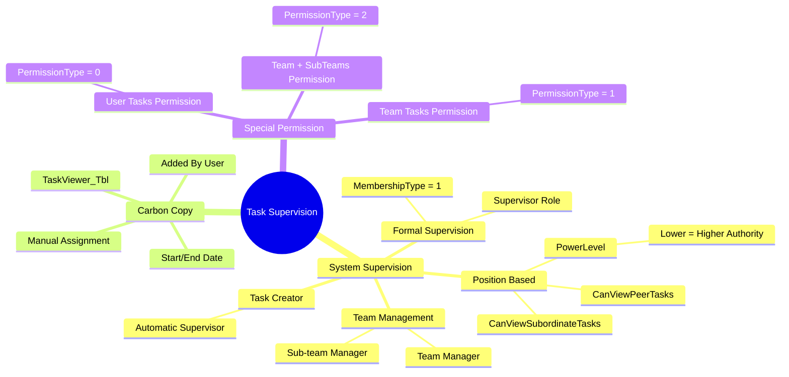

### جریان بررسی قابلیت مشاهده تسک

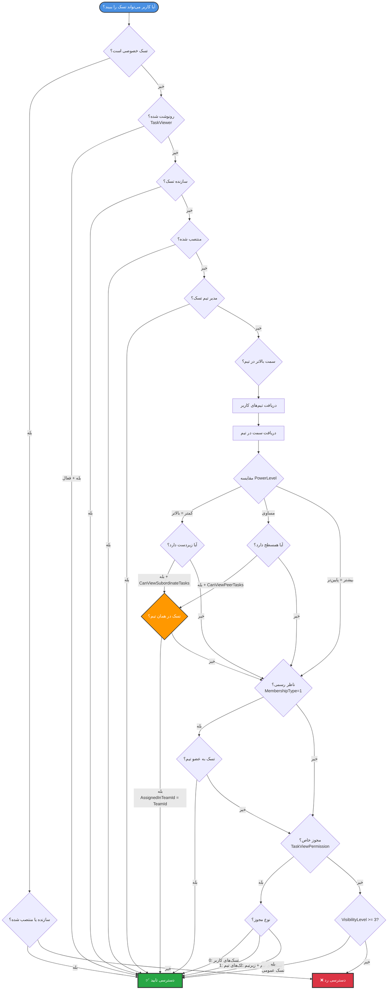

### الگوریتم GetVisibleTaskIdsAsync

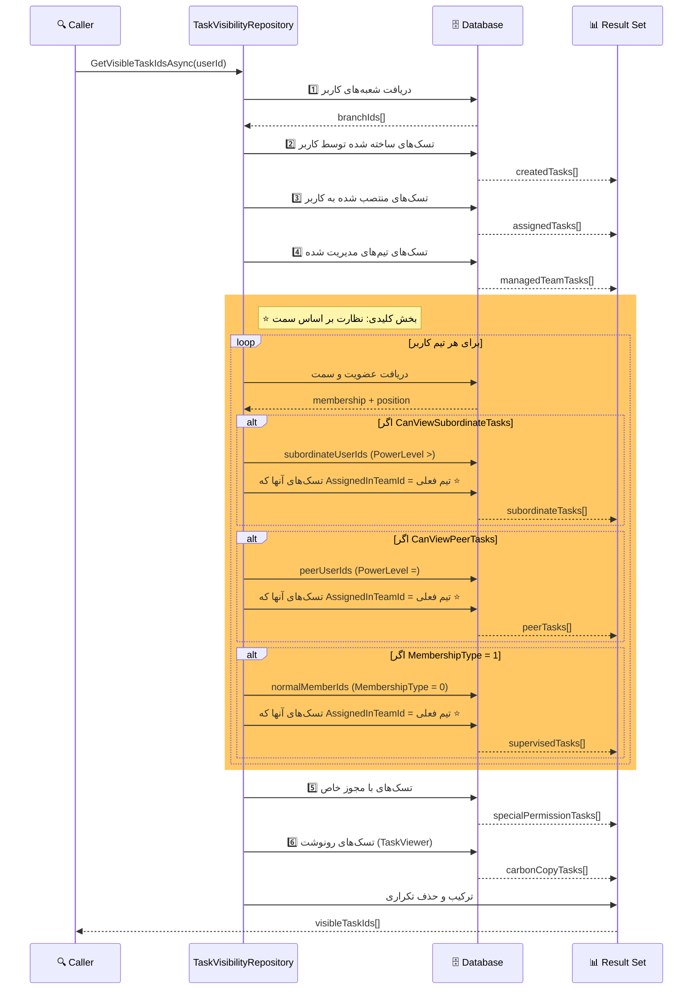

### ساختار جداول نظارت

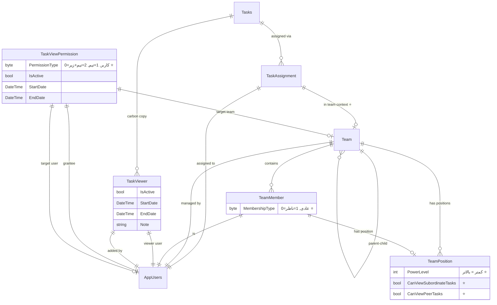

### مثال عملی: نظارت بر اساس سمت

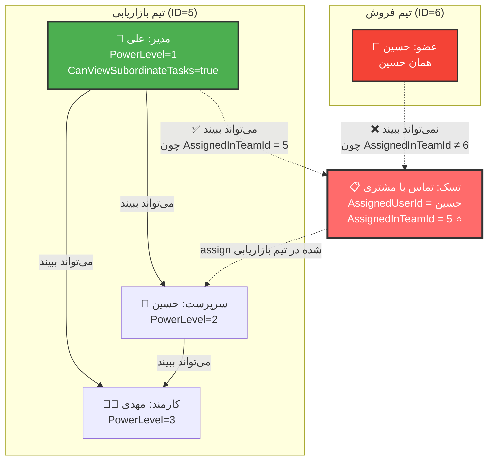

---

## 🔔 نمودار سیستم اعلان‌رسانی

### جریان ارسال اعلان

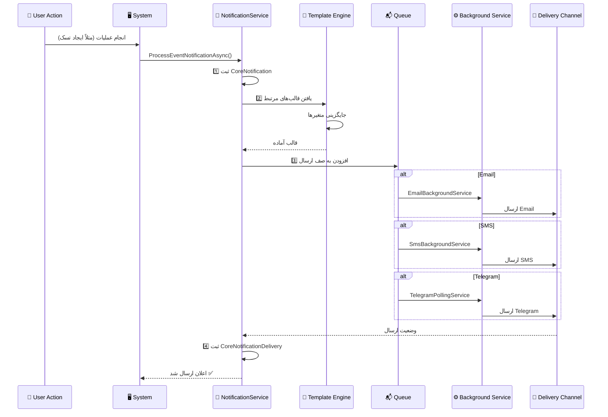

### انواع اعلان‌ها

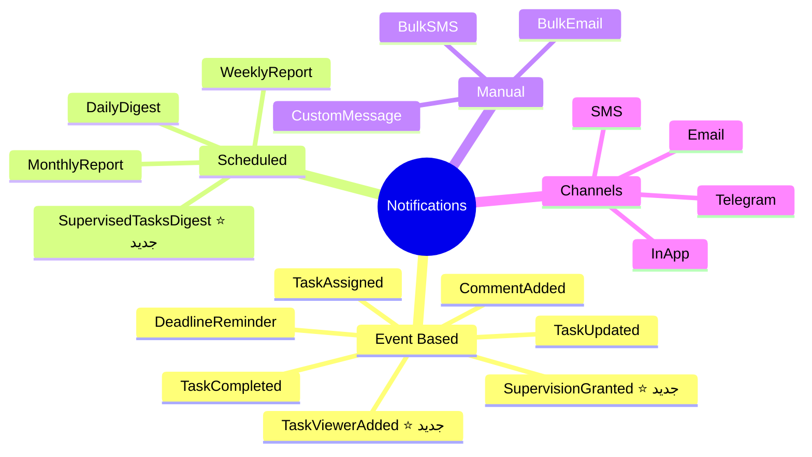

---

## 👤 نمودار جریان کاربر

### جریان ورود کاربر

```mermaid
flowchart TD
    Start([کاربر وارد سیستم می‌شود]) --> Login[صفحه Login]
    
    Login --> ValidateUser{اعتبارسنجی}
    
    ValidateUser -->|نامعتبر ❌| ShowError[نمایش خطا]
    ShowError --> Login
    
    ValidateUser -->|معتبر ✅| CheckModuleAccess{بررسی دسترسی به ماژول‌ها}
    
    CheckModuleAccess -->|دسترسی ندارد| NoAccessPage[صفحه عدم دسترسی]
    CheckModuleAccess -->|دسترسی دارد| SelectModule{انتخاب ماژول}
    
    SelectModule -->|Core| CoreDashboard[📊 Core Dashboard]
    SelectModule -->|Tasking| TaskingDashboard[📋 Tasking Dashboard]
    SelectModule -->|CRM| CRMDashboard[📞 CRM Dashboard]
    
    CoreDashboard --> CoreFeatures[امکانات Core]
    TaskingDashboard --> TaskingFeatures[امکانات Tasking]
    CRMDashboard --> CRMFeatures[امکانات CRM]
    
    CoreFeatures --> ManageUsers[مدیریت کاربران]
    CoreFeatures --> ManagePermissions[مدیریت دسترسی‌ها]
    CoreFeatures --> ManageContacts[مدیریت افراد]
    CoreFeatures --> ManageOrganizations[مدیریت سازمان‌ها]
    
    TaskingFeatures --> ViewTasks[مشاهده تسک‌ها]
    TaskingFeatures --> CreateTask[ایجاد تسک]
    TaskingFeatures --> ManageTasks[مدیریت تسک‌ها]
    TaskingFeatures --> SupervisedTasks[👁️ تسک‌های نظارتی] ⭐
    TaskingFeatures --> TaskReports[گزارش‌گیری]
    
    SupervisedTasks --> ViewSupervisionReason[مشاهده دلیل نظارت]
    SupervisedTasks --> FilterByTeam[فیلتر بر اساس تیم]
    
    CRMFeatures --> ManageInteractions[مدیریت تعاملات]
    CRMFeatures --> SendBulkMessages[ارسال دسته‌جمعی]
    CRMFeatures --> CRMReports[گزارش‌های CRM]
    
    %% Real-time Updates
    CoreFeatures -.->|SignalR| Notifications[🔔 اعلان‌های لحظه‌ای]
    TaskingFeatures -.->|SignalR| Notifications
    CRMFeatures -.->|SignalR| Notifications
    
    %% Styling
    style Start fill:#4CAF50,stroke:#333,stroke-width:2px,color:#fff
    style NoAccessPage fill:#F44336,stroke:#333,stroke-width:2px,color:#fff
    style CoreDashboard fill:#2196F3,stroke:#333,stroke-width:2px,color:#fff
    style TaskingDashboard fill:#4CAF50,stroke:#333,stroke-width:2px,color:#fff
    style CRMDashboard fill:#FF9800,stroke:#333,stroke-width:2px,color:#fff
    style SupervisedTasks fill:#9C27B0,stroke:#333,stroke-width:2px,color:#fff
```

### جریان مشاهده تسک‌های نظارتی

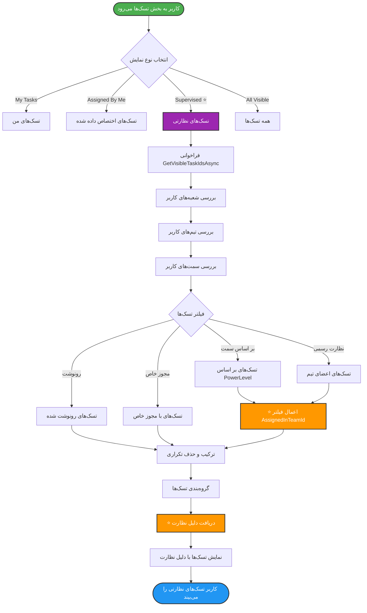

---

## 📱 نمودار ارتباطات

### ارسال دسته‌جمعی

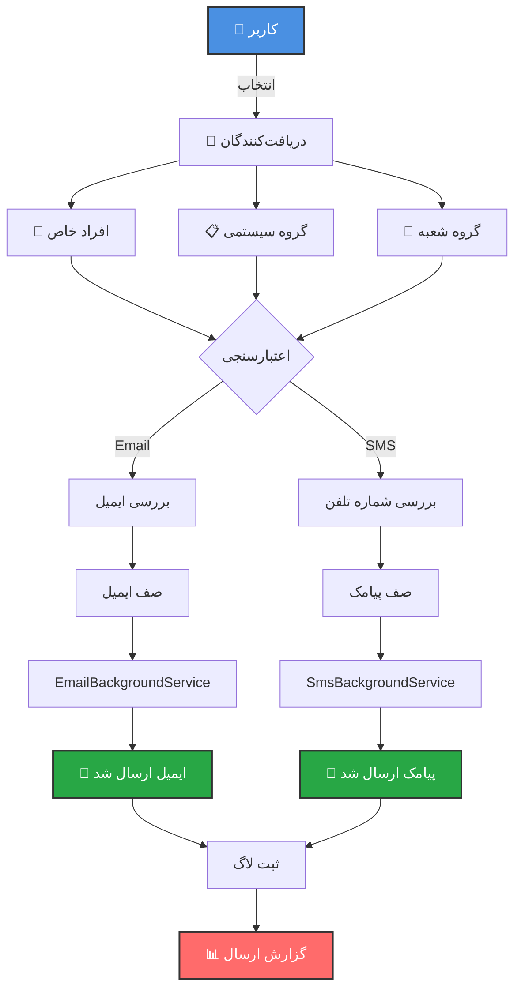

---

## 🏗️ معماری لایه‌ای

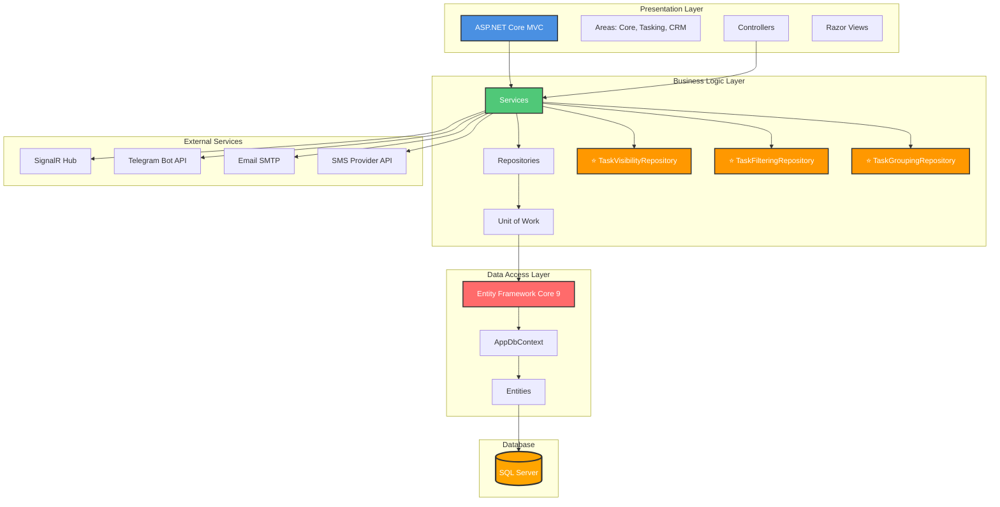

---

## 📊 مدل داده Contact/Organization (جدید)

### تفاوت با ساختار قدیمی (Stakeholder)

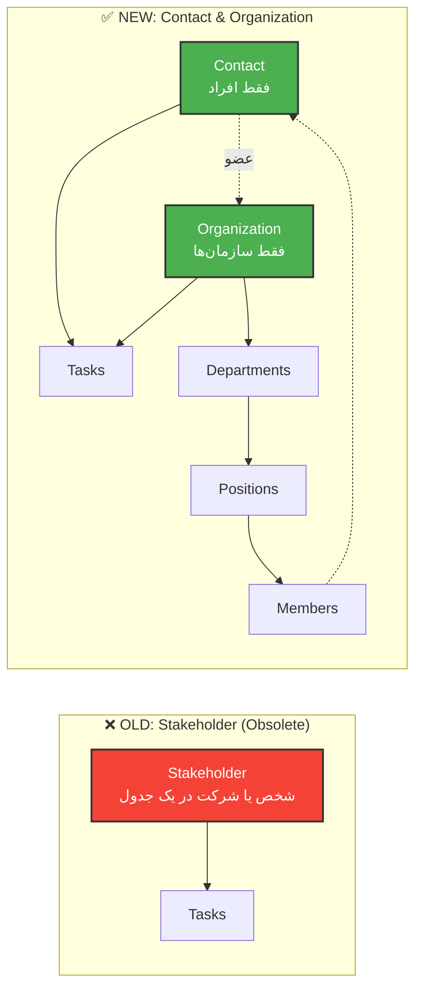

---

## 🔄 Background Services

```mermaid
gantt
    title Background Services زمان‌بندی
    dateFormat HH:mm
    axisFormat %H:%M
    
    section Email
    EmailBackgroundService :active, email, 00:00, 24h
    
    section SMS
    SmsBackgroundService :active, sms, 00:00, 24h
    SmsDeliveryCheckService :active, check, 00:00, 24h
    
    section Telegram
    TelegramPollingService :active, telegram, 00:00, 24h
    
    section Notifications
    NotificationProcessing :active, notify, 00:00, 24h
    ScheduledNotifications :crit, scheduled, 09:00, 1h
    
    section Maintenance
    ExpiredRoleCleanup :done, cleanup, 02:00, 1h
    ModuleTracking :active, track, 00:00, 24h
```

---

## 📈 نمودار آماری استفاده

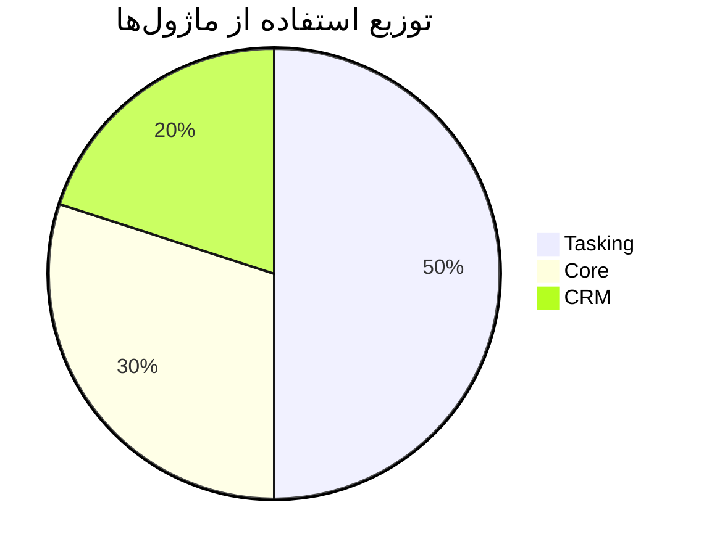

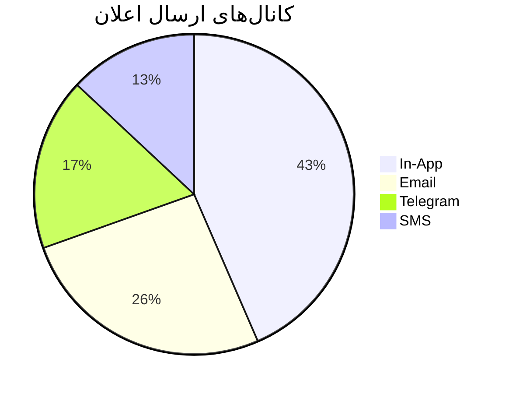

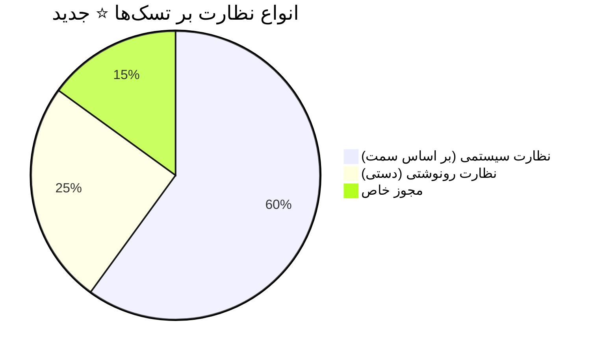

---

## 📝 نتیجه‌گیری

این دیاگرام‌ها نشان‌دهنده **ساختار پیچیده و جامع سیستم MahERP** هستند. نکات کلیدی:

✅ معماری لایه‌ای (Layered Architecture)
✅ جداسازی نگرانی‌ها (Separation of Concerns)
✅ استفاده از الگوهای طراحی (Repository, Unit of Work)
✅ **سیستم نظارت هوشمند بر تسک‌ها** ⭐ **جدید**
✅ سیستم اعلان‌رسانی چندکاناله
✅ پشتیبانی از Background Services
✅ مدل داده مدرن (Contact/Organization جایگزین Stakeholder)
✅ **فیلتر محدود به تیم (Team-scoped)** ⭐ **جدید**

---

**نسخه مستند:** 2.0.0 ⭐ **(به‌روزرسانی شده با سیستم نظارت)**
**تاریخ:** دی 1403 (اضافه شدن نمودارهای سیستم نظارت)
